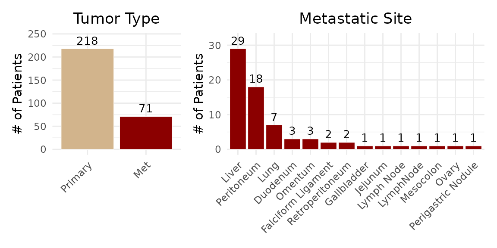
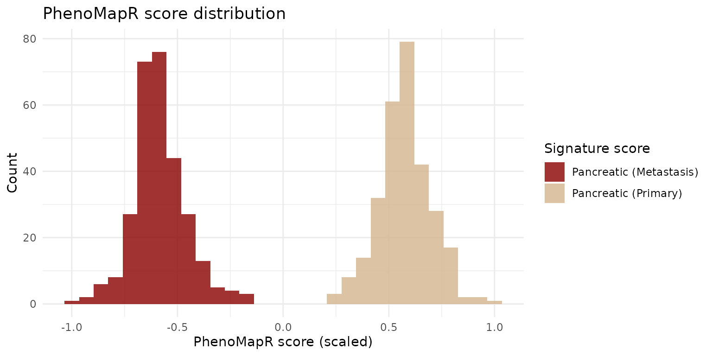
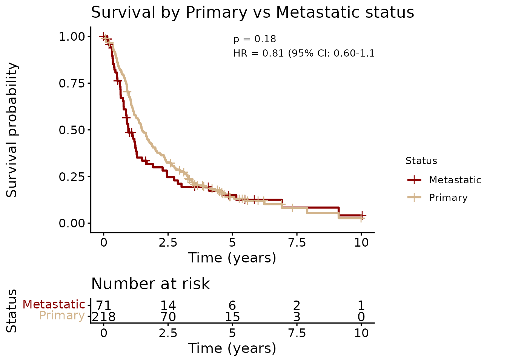
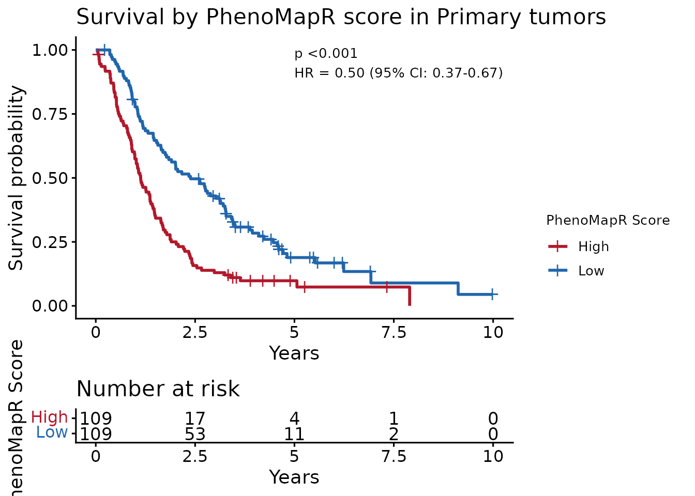
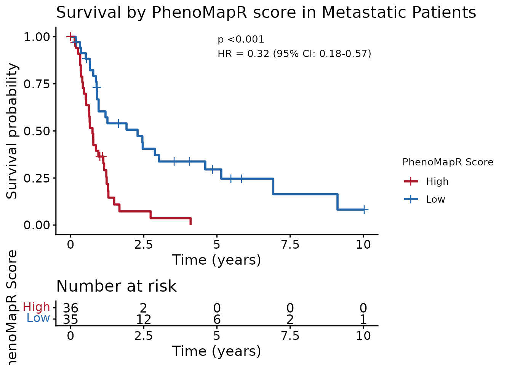

# Scoring bulk gene expression samples with PhenoMapR

## Overview

This vignette shows how to **apply PhenoMapR to score bulk RNA-seq
samples** using the built-in pan-cancer outcomes meta-z score signatures
from [PRECOG](https://precog.stanford.edu/) [\[1\]](#ref1). We use the
[GSE205154](https://www.ncbi.nlm.nih.gov/geo/query/acc.cgi?acc=GSE205154)
dataset: **289 primary and metastatic pancreatic ductal adenocarcinoma
(PAAD)** samples with gene expression and overall survival (Link et al.)
[\[2\]](#ref2). After scoring samples with **`PhenoMapR`**’s built-in
PRECOG references, we stratify by **`PhenoMapR`** score and demonstrate
that this separates survival in both primary and metastatic groups.

**Data used for vignette**:

- `GSE205154_GPL20301_expression.rds` — normalized expression (genes ×
  samples)
- `GSE205154_info.rds` — sample annotations (Tumor_Type: Primary / Met,
  OS_Time, OS_Status, Specimen_Site when available)

## 1. Load bulk expression and clinical annotations for GSE205154

We use `GSE205154` because it’s a fairly large PAAD dataset that also
includes metastatic samples, which we can score separately using the
Primary and Metastatic meta-z scores from PRECOG.

``` r
suppressPackageStartupMessages(library(PhenoMapR))
suppressPackageStartupMessages(library(patchwork))
suppressPackageStartupMessages(library(ggplot2))

# Vignette data, downloaded from Google Drive.
googledrive::drive_deauth()
options(googledrive_quiet = TRUE)    

# Patient annotations
googledrive::drive_download(googledrive::as_id("1c0GUMVzAr6K44Z7CfVRz-dy6jIvb0nNo"), "GSE205154_info.rds", overwrite = TRUE)
pheno <- readRDS("GSE205154_info.rds")
    
# Expression matrix
googledrive::drive_download(googledrive::as_id("16P-rfXD734seGl_xxTQuSDGMStQk9G7B"), "GSE205154_GPL20301_expression.rds", overwrite = TRUE)
bulk_mat <- readRDS("GSE205154_GPL20301_expression.rds")

message("Expression: ", nrow(bulk_mat), " genes × ", ncol(bulk_mat), " samples")
message("Phenotype: ", nrow(pheno), " samples (Primary: ", sum(pheno$tumor_type == "Primary"), ", Met: ", sum(pheno$tumor_type == "Met"), ")")

p_type <-  ggplot(pheno, aes(x = reorder(Tumor_Type, Tumor_Type, function(x) -length(x)),
                  fill = Tumor_Type)) +  # Add fill mapping
  geom_bar(color = "white", linewidth = 0.2) +
  scale_fill_manual(values = c("Primary" = "tan", "Met" = "darkred")) +  # Set colors
  geom_text(stat = 'count', aes(label = after_stat(count)), 
            vjust = -0.5, size = 3.5, color = "black") +
  theme_minimal() +
  theme(plot.title = element_text(hjust = 0.5),
        axis.text.x = element_text(angle = 45, hjust = 1),
        legend.position = "none") +  # Hide legend since it's obvious from x-axis
  labs(x = NULL, y = "# of Patients", title = "Tumor Type") +
  ylim(0, max(table(pheno$Tumor_Type)) * 1.1)

p_site <- ggplot(subset(pheno, Tumor_Type == "Met"), aes(x = reorder(Specimen_Site, Specimen_Site, function(x) -length(x)))) +
  geom_bar(fill = "darkred", color = "white", linewidth = 0.2) +
  geom_text(stat = 'count', aes(label = after_stat(count)), vjust = -0.5, size = 3.5, color = "black") +
  theme_minimal() +
  theme(plot.title = element_text(hjust = 0.5),
        axis.text.x = element_text(angle = 45, hjust = 1)) +
  labs(x = NULL, y = "# of Patients", title = "Metastatic Site") +
  ylim(0, max(table(pheno$Specimen_Site[pheno$Tumor_Type == "Met"])) * 1.1)

# plot both side-by-side
print(p_type + p_site + patchwork::plot_layout(widths = c(1, 2)))
```



## 2. Score bulk samples with PhenoMapR

Here, we score all samples with **`PhenoMapR`** using the built-in Adult
PRECOG meta-z score signatures for primary and metastatic PAAD. By
assigning a prognostic risk score to the samples, we should be able to
identify patients expressing more adversely prognostic signatures as
well as more favorably prognostic signatures and this should stratify
outcomes.

``` r
# To assign a PhenoMap score to each sample, pass the bulk gene expression matrix
# to the expression argument, select the reference database to score against (can
# be one of: precog, tcga, pediatric_precog, or ici_precog, and specify the cancer
# type to score against (use list_cancer_types(reference = "precog") to see available
# cancer types)

# Score all samples using the Primary PAAD signature
scores_primary <- PhenoMap(
  expression = bulk_mat,
  reference = "precog",
  cancer_type = "Pancreatic",
  verbose = TRUE
)
```

    ## 7376 genes used for scoring against Pancreatic
    ## Calculating scores...
    ## Completed scoring for Pancreatic

``` r
# Score all samples using the Metastatic PAAD signature
scores_met <- PhenoMap(
  expression = bulk_mat,
  reference = "precog",
  cancer_type = "Pancreatic_Metastasis",
  verbose = TRUE
)
```

    ## 2997 genes used for scoring against Pancreatic_Metastasis
    ## Calculating scores...
    ## Completed scoring for Pancreatic_Metastasis

``` r
# make a combined dataframe of sample clinical annotations and PhenoMap scores 
col_pan <- grep("Pancreatic$", colnames(scores_primary), value = TRUE)[1]
col_met <- grep("Pancreatic_Metastasis", colnames(scores_met), value = TRUE)[1]
scores_df <- data.frame(
  sample_id = rownames(scores_primary),
  score_Pancreatic = if (!is.na(col_pan)) scores_primary[[col_pan]] else NA_real_,
  score_Pancreatic_Metastasis = if (!is.na(col_met)) scores_met[[col_met]] else NA_real_,
  stringsAsFactors = FALSE
)
dat <- merge(pheno, scores_df, by = "sample_id")
```

``` r
# Summary histogram: Primary and Metastatic PhenoMapR scores (scaled)
score_long <- data.frame(
  score = c(dat$score_Pancreatic, dat$score_Pancreatic_Metastasis),
  type = rep(c("Pancreatic (Primary)", "Pancreatic (Metastasis)"), each = nrow(dat))
)


scale_preserve_sign <- function(x) {
  # Scale negative values: -1 to 0
  neg_idx <- x < 0
  if (any(neg_idx)) {
    x[neg_idx] <- x[neg_idx] / abs(min(x, na.rm = TRUE))
  }
  # Scale positive values: 0 to 1
  pos_idx <- x > 0
  if (any(pos_idx)) {
    x[pos_idx] <- x[pos_idx] / max(x, na.rm = TRUE)
  }
  return(x)
}

score_long$score_scale = scale_preserve_sign(score_long$score)

ggplot(score_long, aes(x = score_scale, fill = type)) +
  geom_histogram(alpha = 0.8, position = "identity", bins = 30) +
  scale_fill_manual(values = c("Pancreatic (Primary)" = "tan", "Pancreatic (Metastasis)" = "darkred")) +
  labs(x = "PhenoMapR score (scaled)", y = "Count", fill = "Signature score", title = "PhenoMapR score distribution") +
  theme_minimal()
```


Interestingly, it appears that the metastatic PAAD patients are scoring
with a more favorable **`PhenoMapR`** score based on the metastatic PAAD
signature used. The primary PAAD patients are all scoring more adversely
prognostic based on the primary PAAD PRECOG signature. This suggests
that the metastatic patient population in this dataset might be less
adversely prognostic than the average metastatic PAAD population.

## 3. Primary vs Metastatic outcomes

Before seeing if PhenoMapR scores stratify outcomes, let’s see if the
primary and metastatic patients in the study show differences in
outcomes. Based on the **`PhenoMapR`** score distributions above, the
metastatic population might be less adversely prognostic than normal.

``` r
suppressPackageStartupMessages(library(survival))
suppressPackageStartupMessages(library(survminer))
# Unnamed vector: order matches strata (Met first, then Primary). Named palettes trigger scale warnings.
pal_tumor <- c("darkred", "tan")  # Metastatic, Primary
fit_primary <- survfit(Surv(survival_time, survival_event) ~ tumor_type, data = dat)
lr_primary <- survdiff(Surv(survival_time, survival_event) ~ tumor_type, data = dat)
pval_primary <- 1 - pchisq(lr_primary$chisq, 1)
cox_primary <- coxph(Surv(survival_time, survival_event) ~ tumor_type, data = dat)
hr_primary <- exp(coef(cox_primary))[1]
ci_primary <- as.vector(exp(confint(cox_primary)))
label_primary <- sprintf("p = %s\nHR = %.2f (95%% CI: %.2f-%.2f)",
  format.pval(pval_primary, digits = 2, eps = 0.001), hr_primary, ci_primary[1], ci_primary[2])
max_time_primary <- max(dat$survival_time, na.rm = TRUE)

suppressWarnings(ggsurvplot(
  fit_primary, 
  data = dat, 
  palette = pal_tumor, 
  risk.table = TRUE,
  title = "Survival by Primary vs Metastatic status",
  xlab = "Time (years)", 
  ylab = "Survival probability",
  legend = "right",  # Just position
  legend.labs = c("Metastatic", "Primary"),
  legend.title = "Status",  # This actually works in newer versions
  pval = label_primary, 
  pval.coord = c(max_time_primary * 0.5, 0.95), 
  pval.size = 3.5
))
```



It seems like patients with metastatic disease trend towards worse
outcomes but it’s not statistically significant, in line with the
results of the **`PhenoMapR`** score distributions in Section 2.

## 4. Primary tumors: PhenoMapR stratifies outcome

The weighted-sum scoring approach of **`PhenoMapR`** scores patients
based on their overall expression signature skew towards more adversely
or favorably prognostic signatures. This should theoretically be able to
stratify patients in survival analysis. Here, we stratify primary
samples by PhenoMapR score (high vs low median split) and show that the
**`PhenoMapR`** score stratifies survival.

``` r
# Unnamed vector: order matches strata (High first, then Low). Named palettes can trigger scale warnings.
pal_km <- c("#B2182B", "#2166AC")  # High (adverse), Low (favorable)
dat_primary <- dat[dat$tumor_type == "Primary", ]
dat_primary$score_grp <- ifelse(
  dat_primary$score_Pancreatic >= median(dat_primary$score_Pancreatic, na.rm = TRUE),
  "High", "Low"
)
fit_primary <- survfit(Surv(survival_time, survival_event) ~ score_grp, data = dat_primary)
lr_primary <- survdiff(Surv(survival_time, survival_event) ~ score_grp, data = dat_primary)
pval_primary <- 1 - pchisq(lr_primary$chisq, 1)
cox_primary <- coxph(Surv(survival_time, survival_event) ~ score_grp, data = dat_primary)
hr_primary <- exp(coef(cox_primary))[1]
ci_primary <- as.vector(exp(confint(cox_primary)))
label_primary <- sprintf("p %s\nHR = %.2f (95%% CI: %.2f-%.2f)",
  format.pval(pval_primary, digits = 2, eps = 0.001), hr_primary, ci_primary[1], ci_primary[2])
max_time_primary <- max(dat_primary$survival_time, na.rm = TRUE)
ggsurvplot(fit_primary, data = dat_primary, palette = pal_km, risk.table = TRUE,
           title = "Survival by PhenoMapR score in Primary tumors",
           xlab = "Years", ylab = "Survival probability", legend.title = "PhenoMapR Score",
           legend.labs = c("High", "Low"), legend = "right",
           pval = label_primary, pval.coord = c(max_time_primary * 0.5, 0.95), pval.size = 3.5)
```

 Indeed, primary
PAAD patients are significantly stratified by median **PhenoMapR**
score.

## 5. Metastatic samples: PhenoMapR stratifies outcome

Stratify metastatic samples by **`PhenoMapR`** score (high vs low median
split) and show that the score stratifies survival in this subset.

``` r
dat_met <- dat[dat$tumor_type == "Met", ]
dat_met$score_grp <- ifelse(
  dat_met$score_Pancreatic_Metastasis >= median(dat_met$score_Pancreatic_Metastasis, na.rm = TRUE),
  "High", "Low"
)
fit_met <- survfit(Surv(survival_time, survival_event) ~ score_grp, data = dat_met)
lr_met <- survdiff(Surv(survival_time, survival_event) ~ score_grp, data = dat_met)
pval_met <- 1 - pchisq(lr_met$chisq, 1)
cox_met <- coxph(Surv(survival_time, survival_event) ~ score_grp, data = dat_met)
hr_met <- exp(coef(cox_met))[1]
ci_met <- as.vector(exp(confint(cox_met)))
label_met <- sprintf("p %s\nHR = %.2f (95%% CI: %.2f-%.2f)",
  format.pval(pval_met, digits = 2, eps = 0.001), hr_met, ci_met[1], ci_met[2])
max_time_met <- max(dat_met$survival_time, na.rm = TRUE)
ggsurvplot(fit_met, data = dat_met, palette = pal_km, risk.table = TRUE,
           title = "Survival by PhenoMapR score in Metastatic Patients",
           xlab = "Time (years)", ylab = "Survival probability", legend.title = "PhenoMapR Score",
           legend.labs = c("High", "Low"), legend = "right",
           pval = label_met, pval.coord = c(max_time_met * 0.5, 0.95), pval.size = 3.5)
```

 Indeed,
metastatic PAAD patients are significantly stratified by median
**PhenoMapR** score.

## 6. Summary

**`PhenoMapR`** can take a bulk expression dataset and assign prognostic
risk scores which significantly stratify outcomes in both primary and
metastatic disease in this example PAAD dataset. In this case, we had
access to outcomes annotations for prognostic validation but it is
reasonable to assume many datasets profiled with bulk gene expression do
not have outcomes data available or reported. In these cases, as long as
TCGA/PRECOG contain an appropriate reference signature, **`PhenoMapR`**
can nominate samples that are on the extremes of the phenotype space
(e.g. survival) and help define sample groupings.

## 7. References

**\[1\]** Benard, B. A. et al. PRECOG update: an augmented resource of
clinical outcome associations with gene expression for adult, pediatric,
and immunotherapy cohorts. Nucleic Acids Res. 54, D1579–D1589 (2026).

**\[2\]** Link, J. M. et al. Ongoing replication stress tolerance and
clonal T cell responses distinguish liver and lung recurrence and
outcomes in pancreatic cancer. Nat. Cancer 6, 123–144 (2025).

## Session Info

``` r
sessionInfo()
```

    ## R version 4.5.3 (2026-03-11)
    ## Platform: x86_64-pc-linux-gnu
    ## Running under: Ubuntu 24.04.3 LTS
    ## 
    ## Matrix products: default
    ## BLAS:   /usr/lib/x86_64-linux-gnu/openblas-pthread/libblas.so.3 
    ## LAPACK: /usr/lib/x86_64-linux-gnu/openblas-pthread/libopenblasp-r0.3.26.so;  LAPACK version 3.12.0
    ## 
    ## locale:
    ##  [1] LC_CTYPE=C.UTF-8       LC_NUMERIC=C           LC_TIME=C.UTF-8       
    ##  [4] LC_COLLATE=C.UTF-8     LC_MONETARY=C.UTF-8    LC_MESSAGES=C.UTF-8   
    ##  [7] LC_PAPER=C.UTF-8       LC_NAME=C              LC_ADDRESS=C          
    ## [10] LC_TELEPHONE=C         LC_MEASUREMENT=C.UTF-8 LC_IDENTIFICATION=C   
    ## 
    ## time zone: UTC
    ## tzcode source: system (glibc)
    ## 
    ## attached base packages:
    ## [1] stats     graphics  grDevices utils     datasets  methods   base     
    ## 
    ## other attached packages:
    ## [1] survminer_0.5.2 ggpubr_0.6.3    survival_3.8-6  ggplot2_4.0.2  
    ## [5] patchwork_1.3.2 PhenoMapR_0.1.0
    ## 
    ## loaded via a namespace (and not attached):
    ##  [1] gtable_0.3.6       xfun_0.56          bslib_0.10.0       htmlwidgets_1.6.4 
    ##  [5] rstatix_0.7.3      gargle_1.6.1       lattice_0.22-9     vctrs_0.7.1       
    ##  [9] tools_4.5.3        generics_0.1.4     curl_7.0.0         tibble_3.3.1      
    ## [13] pkgconfig_2.0.3    Matrix_1.7-4       RColorBrewer_1.1-3 S7_0.2.1          
    ## [17] desc_1.4.3         lifecycle_1.0.5    stringr_1.6.0      compiler_4.5.3    
    ## [21] farver_2.1.2       textshaping_1.0.5  carData_3.0-6      litedown_0.9      
    ## [25] htmltools_0.5.9    sass_0.4.10        yaml_2.3.12        Formula_1.2-5     
    ## [29] pillar_1.11.1      pkgdown_2.2.0      car_3.1-5          jquerylib_0.1.4   
    ## [33] tidyr_1.3.2        cachem_1.1.0       abind_1.4-8        commonmark_2.0.0  
    ## [37] tidyselect_1.2.1   digest_0.6.39      stringi_1.8.7      dplyr_1.2.0       
    ## [41] purrr_1.2.1        labeling_0.4.3     splines_4.5.3      fastmap_1.2.0     
    ## [45] grid_4.5.3         cli_3.6.5          magrittr_2.0.4     broom_1.0.12      
    ## [49] withr_3.0.2        scales_1.4.0       backports_1.5.0    googledrive_2.1.2 
    ## [53] rmarkdown_2.30     httr_1.4.8         otel_0.2.0         ggtext_0.1.2      
    ## [57] gridExtra_2.3      ggsignif_0.6.4     ragg_1.5.1         evaluate_1.0.5    
    ## [61] knitr_1.51         markdown_2.0       rlang_1.1.7        gridtext_0.1.6    
    ## [65] Rcpp_1.1.1         glue_1.8.0         xml2_1.5.2         jsonlite_2.0.0    
    ## [69] R6_2.6.1           systemfonts_1.3.2  fs_1.6.7
