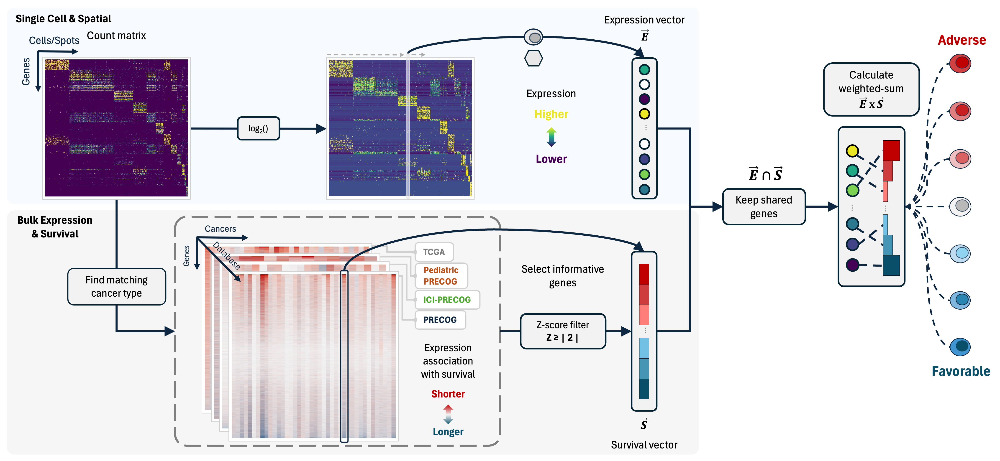

# Overview

## Introduction


Single-cell and spatial transcriptomics methods provide an improved
resolution and understanding of the cell types and spatial organization
underlying healthy and malignant biology. However, many single-cell and
spatial studies lack sufficient sample size for robust associations
between a sample phenotype (e.g. overall survival) and cell types or
spatial locations. In contrast, lower resolution methods such as bulk
gene expression profiling have been applied at scale in large,
clinically-annotated datasets, providing robust signatures for phenotype
associations such as outcomes across cancers (e.g. [PRECOG
2.0](https://precog.stanford.edu/)). **PhenoMapR bridges this gap
between the improved resolution of single-cell/spatial approaches and
the robust phenotype signals identified across bulk expression studies
by mapping the phenotypic signal directly onto individual cells and
spatial locations**. Although developed with a cancer-centric focus,
`PhenoMapR` can be used to map any phenotypic signal associated with
bulk expression datasets across transcriptomic data modalities.

------------------------------------------------------------------------

## Features

`PhenoMapR` is intended to be a flexible framework for mapping
phenotypic signal between gene expression data acquired and stored in
different formats. Some of the main features are:

| Feature                                       | Description                                                                                                             |
|:----------------------------------------------|:------------------------------------------------------------------------------------------------------------------------|
| **Works with Multiple Input Formats**         | Supports matrices, data.frames, Seurat, SingleCellExperiment, SpatialExperiment, and AnnData objects                    |
| **Built-in Bulk Cancer Phenotype References** | Pre-calculated gene expression meta-z scores for outcomes across TCGA & Adult/Pediatric/Immunotherapy PRECOG datasets   |
| **Flexible Scoring**                          | Score bulk, single-cell, and spatial inputs. For single-cell and spatial data, pseudobulk scoring can also be performed |
| **Custom Signatures**                         | Not interested in cancer? Generate and/or use your own z-score phenotype references                                     |
| **Marker Gene Identification**                | Automated marker gene identification of phenotype associated cells/spots                                                |
| **Visualization**                             | Summary plots for dataset results (marker gene heatmaps, cell type score enrichment, etc.)                              |
| **Efficient**                                 | Optimized approach for ultra-fast scoring                                                                               |

------------------------------------------------------------------------

## Getting Started

The primary function of PhenoMapR is
**[`PhenoMap()`](https://brooksbenard.github.io/PhenoMapR/reference/PhenoMap.md)**.
The basic use of this function takes a gene expression file **+** a
reference phenotype signature and generates a PhenoMapR score per
sample/cell/spot. For single-cell and spatial inputs, a sample-level
PhenoMapR score can be generated using the pseudobulk argument.

**[`PhenoMap()`](https://brooksbenard.github.io/PhenoMapR/reference/PhenoMap.md)
arguments:**

| Argument           | Description                                               |
|:-------------------|:----------------------------------------------------------|
| **expression**     | Expression data (matrix, Seurat, SCE, etc.)               |
| **reference**      | Reference dataset name or custom data.frame               |
| **cancer_type**    | Cancer type label (required for built-in references)      |
| **z_score_cutoff** | Absolute z-score threshold (default: 2)                   |
| **pseudobulk**     | Aggregate samples/slices before scoring? (default: FALSE) |
| **group_by**       | Grouping variable for pseudobulk                          |
| **assay**          | Assay name for Seurat/SCE objects                         |
| **slot**           | Seurat slot (“data”, “counts”, “scale.data”)              |
| **verbose**        | Print progress messages                                   |

For the simplest use case of PhenoMapR, implement the following:

``` r
# Download PhenoMapR using the following:
if (!require(devtools)) install.packages("devtools")
devtools::install_github("brooksbenard/PhenoMapR")

# Load PhenoMapR in your R session:
library(PhenoMapR)

# Score samples in a bulk expression matrix
scores <- PhenoMap(
  expression = bulk_matrix,     # genes (rownames) x samples (colnames)
  reference = "precog",         # can be one of precog, pediatric_precog, ici_precog, or tcga
  cancer_type = "BRCA"          # use list_cancer_types(reference) to see avaliable options
)

# Score single-cell/spatial data
scores <- PhenoMap(
  expression = seurat_obj,
  reference = "tcga",
  cancer_type = "LUAD",
  assay = if ("Spatial" %in% names(seurat_obj@assays)) "Spatial" else "RNA",
  slot = if ("Spatial" %in% names(seurat_obj@assays)) "counts" else "data"
)
```

------------------------------------------------------------------------

## Supported Input Types

`PhenoMapR` is designed to work on a range of gene expression input
formats. The primary requirement, regardless of input type, is that the
expression data takes the form of
`Genes (rownames) x Samples/Cells/Spots (colnames)`.

**Matrix/Data.frame**

Expression matrix: genes (rows) x samples/cells (columns).

``` r
expression_matrix <- matrix(...)
rownames(expression_matrix) <- gene_names
colnames(expression_matrix) <- cell_names

scores <- PhenoMap(expression_matrix, reference = "precog", cancer_type = "BRCA")
```

**Seurat Objects**

Single-cell and spatial Seurat objects; use `assay` and `slot` to match
your data.

``` r
library(Seurat)

# Single-cell
scores <- PhenoMap(
  seurat_obj,
  reference = "tcga",
  cancer_type = "LUAD",
  assay = "RNA",
  slot = "data"
)

# Add scores back to Seurat object
seurat_obj <- add_scores_to_seurat(seurat_obj, scores)

# Spatial
scores <- PhenoMap(
  spatial_seurat,
  reference = "precog",
  cancer_type = "BRCA",
  assay = "Spatial",
  slot = "counts"
)
```

**SingleCellExperiment Objects**

Use the assay name that holds your (e.g. log-normalized) expression.

``` r
library(SingleCellExperiment)

scores <- PhenoMap(
  sce_obj,
  reference = "pediatric_precog",
  cancer_type = "Neuroblastoma",
  assay = "logcounts"
)

# Add scores to colData
sce_obj <- add_scores_to_sce(sce_obj, scores)
```

**AnnData Objects**

PhenoMapR can score AnnData objects via `reticulate` (e.g. from Scanpy).

``` r
library(reticulate)

adata <- import("scanpy")$read_h5ad("data.h5ad")

scores <- PhenoMap(
  adata,
  reference = "precog",
  cancer_type = "BRCA"
)
```

------------------------------------------------------------------------

## Built-in Reference Datasets

`PhenoMapR` comes pre-loaded with a comprehensive suite of pan-cancer
meta-z signatures for gene expression and outcomes across adult,
pediatric, and immunotherapy-treated cohorts. These databases are
sourced from **PRECOG 2.0** ([Benard et al., *Nucleic Acids Research*
2026](https://academic.oup.com/nar/article/54/D1/D1579/8324954)). PRECOG
2.0 includes 335 cancer datasets with survival or response data for
\>46,000 patients, covering ~55 malignancies.

To see cancer types available for scoring in each built-in database
(TCGA, Adult PRECOG, Pediatric PRECOG, ICI PRECOG), use
**`list_cancer_types("precog")`** (or `"tcga"`, `"pediatric_precog"`,
`"ici_precog"`) to see cancer labels for your reference of choice.


Reference coverage by database and cancer type

------------------------------------------------------------------------

## Under the hood

At a high level, `PhenoMapR`:

- **Processes the input gene expression data** into a cleaned format by
  updating gene IDs and normalizing the expression (if needed).
- **Selects pan-cancer prognostic meta-z score signatures** from
  PRECOG/TCGA based on input cancer type.
- **Filters to strongly prognostic genes** (by \|z-score\|) and keeps
  intersecting genes between reference and query data.
- **Computes weighted-sum scores** per sample/cell/spot, where weights
  are prognostic z-scores. Scores are computed almost instantly by
  taking the cross product of the expression matrix and z-score
  signature vector.
- **Optionally defines prognostic groups and markers** by slicing the
  score distribution (e.g. top/bottom 5%) and running
  `Seurat::FindAllMArkers()`.



PhenoMapR schematic

------------------------------------------------------------------------

## Advanced Usage

`PhenoMapR` was built with the primary goal of helping to quickly
identify samples, cells, and spatial locations that might be most
therapeutically relevant in cancer. It accomplishes this, in part, by
incorporating the most comprehensive databases of gene expression
associations with outcomes across cancers (TCGA and PRECOG). However,
rare cancer types not included in TCGA/PRECOG and emerging immunotherapy
datasets will provide valuable resources from which to derive robust
prognostic signatures. To remain flexible in this evolving landscape, we
provide functionality in `PhenoMapR` to use and derive custom reference
signatures from proprietary and emerging bulk expression datasets.

*Additionally, although developed with a cancer-centric focus*,
`PhenoMapR` has some broad functionality that can be applied outside of
cancer.

### Custom Reference Data

Maybe you have a specific gene signature or pre-computed gene z-score
phenotype reference you would like to score against. Simply upload your
custom reference signature (rownames are HUGO IDs and columns are
z-scores) and score your input expression data.

``` r
# Create custom z-score reference
custom_ref <- data.frame(
  row.names = c("TP53", "MYC", "EGFR", "BRCA1"),
  my_signature = c(3.2, -2.5, 2.8, 1.9)
)

scores <- PhenoMap(
  expression = my_data,
  reference = custom_ref,
  z_score_cutoff = 1.5
)
```

### Derive reference from bulk expression and phenotype

If you have bulk expression (**genes as rows, samples as columns**) and
a phenotype (e.g. clinical response (R/NR), time-to-survival (with
censor), or any other continuous phenotype), the `PhenoMapR`
**[`derive_reference_from_bulk()`](https://brooksbenard.github.io/PhenoMapR/reference/derive_reference_from_bulk.md)**
function derives gene-level z-scores for use as the reference when
scoring bulk, single-cell, or spatial data. The function expects genes
as rows and samples as columns; if the matrix appears to be the
opposite, it will transpose and message. It then cleans gene names to
approved HUGO symbols (if `HGNChelper` is installed), checks/normalizes
expression, and computes gene association z-scores (Cox for survival,
logistic regression for binary, correlation for continuous).

``` r
# Bulk: genes (rows) x samples (columns); sample IDs = colnames
bulk_expr <- matrix(...)   # e.g. 5000 genes x 50 samples
pheno <- data.frame(
  sample_id = colnames(bulk_expr),   # must match expression column names
  response = c("R", "NR", ...)       # or time + event for survival
)

# Derive reference z-scores
ref <- derive_reference_from_bulk(
  bulk_expression = bulk_expr,
  phenotype = pheno,
  sample_id_column = "sample_id",
  phenotype_column = "response",
  phenotype_type = "binary"   # or "survival", "continuous", "auto"
)

# Score single-cell or spatial data with the derived reference
scores <- PhenoMap(expression = my_seurat, reference = ref)
```

For survival, provide `survival_time` and `survival_event` column names
and set `phenotype_type = "survival"`. Optional: install `HGNChelper`
for HUGO symbol cleaning and `survival` for Cox models.

### Pseudobulk Aggregation and Scoring

Many single-cell and spatial datasets include multiple samples. It is
fair to assume that the cell/spot score distribution across a dataset
might be heavily skewed by the sample from which they came. To rank
samples in a dataset based on their overall phenotype score, set
**`pseudobulk = TRUE`** and select the sample/patient metadata label to
perform pseudobulking of cells/spots. The
**[`PhenoMap()`](https://brooksbenard.github.io/PhenoMapR/reference/PhenoMap.md)**
function will then score the aggregate expression profile of each sample
in the dataset. **`plot_pseudobulk_scores()`** can be used to visualize
the sample score distribution for your dataset. This may help identify
if the most phenotypically relevant cells/spots in the dataset are
enriched in samples with a phenotype skew (e.g. more adverse cells being
enriched in more adversely prognostic patients).

``` r
# Aggregate single cells by sample to score samples rather than cells/spots
scores <- PhenoMap(
  seurat_obj,
  reference = "tcga",
  cancer_type = "LUAD",
  pseudobulk = TRUE,
  group_by = "patient_id"
)
```

### Normalize Scores

The weighted-sum scoring approach of `PhenoMapR` generates absolute
values as output. Negative scores reflect an overall favorable signature
while positive scores reflect a more adverse signature. The
**[`normalize_scores()`](https://brooksbenard.github.io/PhenoMapR/reference/normalize_scores.md)**
function converts PhenoMap scores to z-scores for sample-level relative
comparisons.

``` r
scores_df <- PhenoMap(...)

# Convert to z-scores
scores_df$score_zscore <- normalize_scores(scores_df[, 1])
```

### Phenotype Groups and Marker Genes

A major advantage of `PhenoMapR` is the ability to rank-order all
samples/cells/locations based on their PhenoMap score. To help
characterize the samples/cells/spots that are most phenotypically
relevant, we provide some high-level analysis functions:

The
**[`define_phenotype_groups()`](https://brooksbenard.github.io/PhenoMapR/reference/define_phenotype_groups.md)**
function uses a heuristic threshold that defines the top and bottom n%
phenotype cells per dataset (adverse = highest scores, favorable =
lowest). This function defaults to selecting the top and bottom 5th
percentile to label as “adverse” and “favoable”, however the user can
dynamically set this threshold based on their desired stringency.

The
**[`find_phenotype_markers()`](https://brooksbenard.github.io/PhenoMapR/reference/find_phenotype_markers.md)**
function takes the group labels from
**[`define_phenotype_groups()`](https://brooksbenard.github.io/PhenoMapR/reference/define_phenotype_groups.md)**
and finds unique marker genes for those populations using **Seurat’s
FindMarkers** (requires Seurat):

``` r
# Score and define groups (top 5% = adverse, bottom 5% = favorable)
scores <- PhenoMap(seurat_obj, reference = "precog", cancer_type = "BRCA")
groups <- define_phenotype_groups(scores, percentile = 0.05)

# One group column per score; values: "adverse", "favorable", "other"
table(groups$phenotype_group_weighted_sum_score_precog_BRCA)

# Find marker genes via Seurat::FindMarkers (adverse vs rest, favorable vs rest)
markers <- find_phenotype_markers(
  seurat_obj,
  group_labels = groups,
  group_column = "phenotype_group_weighted_sum_score_precog_BRCA",
  cell_id_column = "cell_id"
)
head(markers$adverse_markers)   # genes enriched in top 5% (worst prognosis)
head(markers$favorable_markers) # genes enriched in bottom 5% (best prognosis)
```

------------------------------------------------------------------------

## Vignettes

Detailed walkthroughs for the main uses of `PhenoMapR` (on the [pkgdown
site](https://brooksbenard.github.io/PhenoMapR/articles/index.html) and
in the repo under `vignettes/`
[here](https://github.com/brooksbenard/PhenoMapR/tree/main/vignettes)):

| Vignette                                                                                                                   | Description                                                                                                                                                                                                                               |
|----------------------------------------------------------------------------------------------------------------------------|-------------------------------------------------------------------------------------------------------------------------------------------------------------------------------------------------------------------------------------------|
| **[Score Single-cell data](https://brooksbenard.github.io/PhenoMapR/articles/single-cell.md)**                             | Score a pancreatic cancer single cell dataset (CRA001160) with **TCGA** and **PRECOG** Pancreatic references; scatterplot and boxplots by cell type; prognostic markers and proportion by sample.                                         |
| **[Score Spatial transcriptomics data](https://brooksbenard.github.io/PhenoMapR/articles/spatial-transcriptomics.md)**     | Process a spatial transcriptomics sample from HTAN with PRECOG **Pancreatic**; score distributions, prognostic groups, and spatial maps of score and group on the tissue image.                                                           |
| **[Score bulk expression data](https://brooksbenard.github.io/PhenoMapR/articles/bulk-survival.md)**                       | Score 289 primary/metastatic bulk samples with PhenoMapR PRECOG references; stratify by primary vs metastatic; **Kaplan–Meier** survival by prognostic score.                                                                             |
| **[Generate and use a custom reference signature](https://brooksbenard.github.io/PhenoMapR/articles/custom-reference.md)** | Build a custom gene z-score reference from bulk expression and survival using [`derive_reference_from_bulk()`](https://brooksbenard.github.io/PhenoMapR/reference/derive_reference_from_bulk.md), then score samples with that reference. |

------------------------------------------------------------------------

## Citation

If you use `PhenoMapR`, please cite the software and the reference
datasets you use.

**PhenoMapR (software)**  
Benard B. PhenoMapR: Phenotype mapping from bulk gene expression onto
single cell, spatial, and bulk transcriptomics. *R package*.
<https://github.com/brooksbenard/PhenoMapR>. See also `CITATION.cff` in
the repository for machine-readable citation.

**Reference datasets**

- **PRECOG 2.0 (meta-z scores)**: Benard B et al. PRECOG 2.0: an updated
  resource of pan-cancer gene-level prognostic meta-z scores. *Nucleic
  Acids Research* (2026).
  <https://academic.oup.com/nar/article/54/D1/D1579/8324954>
- **PRECOG / TCGA**: Gentles AJ et al. The prognostic landscape of genes
  and infiltrating immune cells across human cancers. *Nature Medicine*
  21, 938–945 (2015). <https://www.nature.com/articles/nm.3909>
- **Pediatric PRECOG**: Stahl et al. *Cancers* 13(4), 854 (2021).
  <https://www.mdpi.com/2072-6694/13/4/854>
