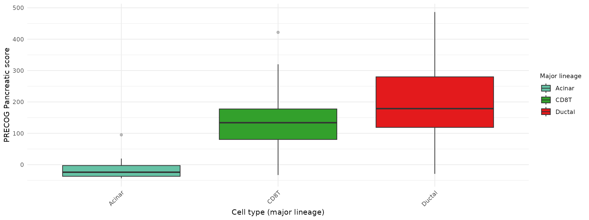
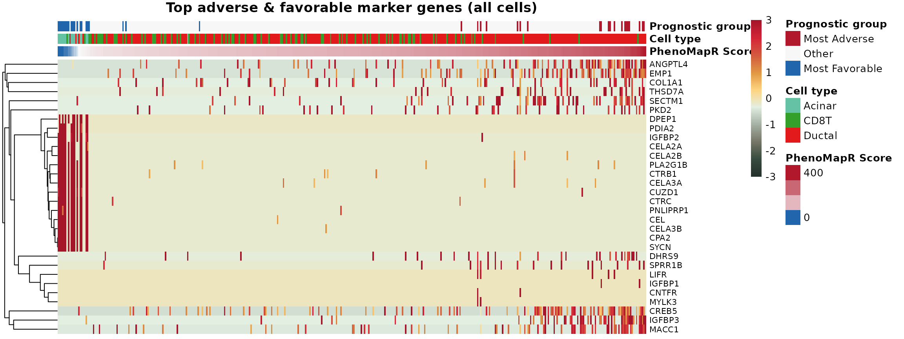
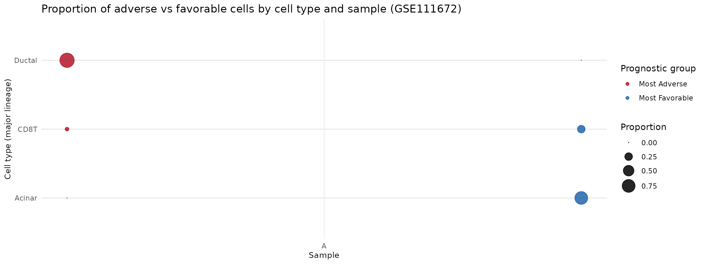
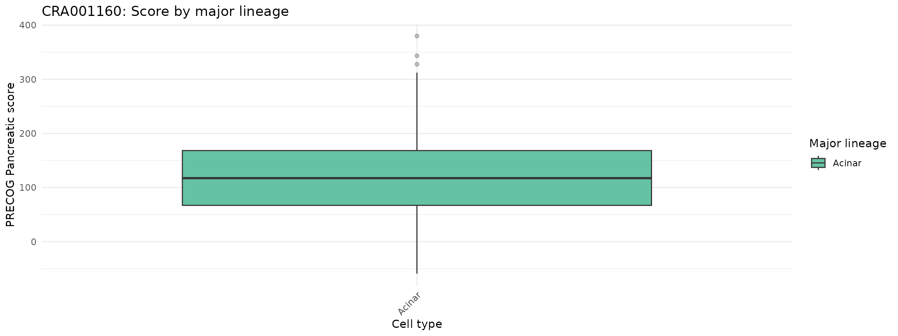
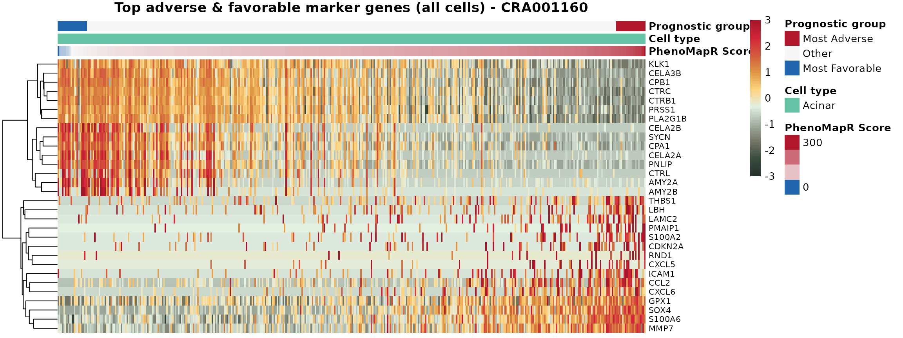
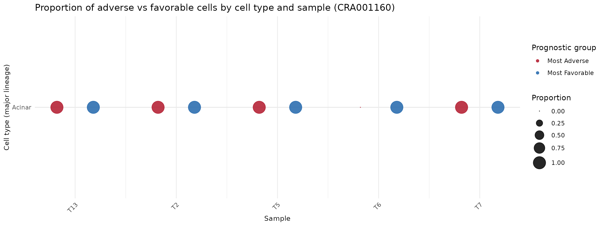

# Scoring single-cell data with PhenoMapR

## Overview

This vignette demonstrates using PhenoMapR on single-cell pancreatic
adenocarcinoma (PAAD) data. It uses the PRECOG primary pancreatic
reference to score cells for prognostic expression, defines adverse
vs. favorable prognostic groups, identifies marker genes of the most
prognostic cells, and visualizes results by cell type and sample. The
workflow is shown for two datasets: **GSE111672** and **CRA001160**.

## Example 1: PAAD GSE111672 (~6k cells)

**GSE111672** integrates microarray-based spatial transcriptomics and
single-cell RNA-seq from the same pancreatic tumor samples to reveal
tissue architecture in pancreatic ductal adenocarcinomas (Moncada et
al., *Nature Biotechnology* 2020). The dataset combines spatial
transcriptomics (arrays of spots capturing gene expression from multiple
adjacent cells) with scRNA-seq to map cellular composition across tissue
regions. The preprocessed Seurat object includes ~6k cells with
annotations such as major lineage, sample, and cluster.

### Load and setup

Load PhenoMapR and set consistent cell type colors between the two
datsets.

``` r
suppressPackageStartupMessages(library(PhenoMapR))
suppressPackageStartupMessages(library(Seurat))
knitr::opts_chunk$set(fig.width = 12, out.width = "100%")

# Timing and memory helper
report_timing <- function(step_name, t0, obj = NULL) {
  elapsed <- as.numeric(difftime(Sys.time(), t0, units = "secs"))
  mem_mb <- if (!is.null(obj)) format(object.size(obj), units = "MB") else "-"
  message(sprintf("[%s] Runtime: %.2f s | Memory: %s", step_name, elapsed, mem_mb))
}

# Vignette data: local paths, then Google Drive (https://drive.google.com/drive/folders/1rKGZBX7sa_Iq8AJb1wcxiRc3oD6v6B5n)
rds_subset <- system.file("extdata/vignette_subsets/PAAD_GSE111672_seurat_subset.rds", package = "PhenoMapR")
use_subset <- nzchar(Sys.getenv("CI", "")) || nzchar(Sys.getenv("PKGDOWN_DEV_MODE", ""))
rds_path <- if (use_subset && file.exists(rds_subset)) rds_subset else "vignettes/PAAD_GSE111672_seurat.rds"
if (!file.exists(rds_path)) rds_path <- "Vignettes/PAAD_GSE111672_seurat.rds"
if (!file.exists(rds_path)) rds_path <- "PAAD_GSE111672_seurat.rds"
if (!file.exists(rds_path) && !nzchar(Sys.getenv("CI", "")) && requireNamespace("googledrive", quietly = TRUE)) {
  googledrive::drive_deauth()
  googledrive::drive_download(googledrive::as_id("1vJxIlW_kvqFXOPw9qn1L7D6QbMpe-P0c"), rds_path, overwrite = TRUE)
}
if (!file.exists(rds_path)) {
  url <- Sys.getenv("PHENOMAPR_GSE111672_RDS_URL", "")
  if (nzchar(url)) tryCatch({ download.file(url, rds_path, mode = "wb", quiet = TRUE) }, error = function(e) NULL)
}
has_data <- file.exists(rds_path)
knitr::opts_chunk$set(eval = has_data)
if (!has_data) {
  message("PAAD_GSE111672_seurat.rds not found. See Vignettes/README.md for download instructions.")
} else {
  t0 <- Sys.time()
  seurat <- PhenoMapR::load_rds_fast(rds_path)
  report_timing("Load GSE111672", t0, seurat)

  # Load CRA001160 early if available (for shared cell type palette alignment)
  rds_subset2 <- system.file("extdata/vignette_subsets/PAAD_CRA001160_seurat_subset.rds", package = "PhenoMapR")
  rds_path2 <- if (use_subset && file.exists(rds_subset2)) rds_subset2 else "vignettes/PAAD_CRA001160_seurat.rds"
  if (!file.exists(rds_path2)) rds_path2 <- "Vignettes/PAAD_CRA001160_seurat.rds"
  if (!file.exists(rds_path2)) rds_path2 <- "PAAD_CRA001160_seurat.rds"
  if (!file.exists(rds_path2) && !nzchar(Sys.getenv("CI", "")) && requireNamespace("googledrive", quietly = TRUE)) {
    googledrive::drive_deauth()
    googledrive::drive_download(googledrive::as_id("14p_fYIFeuuRdXBF3J-5ZsXElq_mduSzb"), rds_path2, overwrite = TRUE)
  }
  if (!file.exists(rds_path2)) {
    url2 <- Sys.getenv("PHENOMAPR_CRA001160_RDS_URL", "")
    if (nzchar(url2)) tryCatch({ download.file(url2, rds_path2, mode = "wb", quiet = TRUE) }, error = function(e) NULL)
  }
  if (file.exists(rds_path2)) {
    seurat2 <- PhenoMapR::load_rds_fast(rds_path2)
  } else {
    seurat2 <- NULL
  }

  # Shared cell type palette: same colors for same cell types across both datasets
  celltype_col <- "Celltype..major.lineage."
  all_celltypes <- sort(unique(c(
    as.character(seurat@meta.data[[celltype_col]]),
    if (!is.null(seurat2)) as.character(seurat2@meta.data[[celltype_col]]) else character(0)
  )))
  shared_pal_lineage <- PhenoMapR::get_celltype_palette(all_celltypes)

  n_genes <- nrow(seurat)
  n_cells <- ncol(seurat)
  n_samples <- if ("Sample" %in% names(seurat@meta.data)) length(unique(seurat@meta.data$Sample)) else NA
  message(sprintf("Genes: %d | Cells: %d | Samples: %s", n_genes, n_cells, if (is.na(n_samples)) "N/A" else n_samples))
}
```

    ## [Load GSE111672] Runtime: 0.42 s | Memory: 24.1 Mb

    ## Genes: 1500 | Cells: 6122 | Samples: 3

### Score cells

Apply PhenoMapR to the GSE111672 Seurat object using the built-in
Pancreatic Primary Meta-z scores from PRECOG 2.0. THen add these scores
as metadata to the original Seurat object.

``` r
# Score with PRECOG primary pancreatic reference
scores_primary <- PhenoMap(
  expression = seurat,
  reference = "precog",
  cancer_type = "Pancreatic",
  assay = "RNA",
  slot = "data",
  verbose = TRUE
)
```

    ## Detected input type: seurat

    ## 624 genes used for scoring against PancreaticCalculating scores...
    ## Completed scoring for Pancreatic

``` r
seurat <- add_scores_to_seurat(seurat, scores_primary)
```

    ## Added 1 score column(s) to Seurat metadata

``` r
# Sanity check: malignant cells should score higher (more adverse) than Acinar
score_col <- grep("weighted_sum_score", names(scores_primary), value = TRUE)[1]
mal_cells <- rownames(seurat@meta.data)[seurat@meta.data[[celltype_col]] == "Malignant"]
acin_cells <- rownames(seurat@meta.data)[seurat@meta.data[[celltype_col]] == "Acinar"]
med_mal <- median(scores_primary[mal_cells, score_col], na.rm = TRUE)
med_acin <- median(scores_primary[acin_cells, score_col], na.rm = TRUE)
if (!is.na(med_mal) && !is.na(med_acin) && med_mal < med_acin) {
  warning("Score direction may be inverted: Malignant median (", round(med_mal, 1),
    ") < Acinar median (", round(med_acin, 1),
    "). Reinstall PhenoMapR from source.")
}
```

### Score by cell type

PhenoMapR score distribution across the different cell types reported in
the study. We see that the Malignant calls and Proliferating T-cells are
the most associated with an adverse prognostic signature in PAAD, while
Acinar cells are by far the most associated with more favorable outcomes
signatures in PAAD.

``` r
suppressPackageStartupMessages(library(ggplot2))
t0 <- Sys.time()

df <- seurat@meta.data
score_col <- "weighted_sum_score_Pancreatic"
pal_lineage <- shared_pal_lineage[intersect(names(shared_pal_lineage), unique(as.character(df[[celltype_col]])))]

# Boxplot of Pancreatic score by major lineage
if (celltype_col %in% names(df)) {
  ggplot(df, aes(
    x = reorder(.data[[celltype_col]], .data[[score_col]], FUN = median),
    y = .data[[score_col]],
    fill = .data[[celltype_col]]
  )) +
    geom_boxplot(outlier.alpha = 0.3) +
    scale_fill_manual(values = pal_lineage, name = "Major lineage") +
    theme_minimal() +
    theme(
      axis.text.x = element_text(angle = 45, hjust = 1),
      legend.position = "right",
      legend.title = element_text(size = 9)
    ) +
    labs(y = "PRECOG Pancreatic score", x = "Cell type (major lineage)")
} else {
  ggplot(df, aes(x = seurat_clusters, y = .data[[score_col]], fill = factor(seurat_clusters))) +
    geom_boxplot(outlier.alpha = 0.3) +
    scale_fill_brewer(palette = "Set3", name = "Cluster") +
    theme_minimal() +
    theme(axis.text.x = element_text(angle = 45, hjust = 1), legend.position = "none") +
    labs(y = "PRECOG Pancreatic score", x = "Cluster")
}
```



### Prognostic markers

We next identify the marker genes for the most phenotypically associated
cell types nominated by PhenoMapR:

``` r
# Optional: install presto for much faster FindMarkers (Seurat uses it automatically)
if (!requireNamespace("presto", quietly = TRUE) && requireNamespace("devtools", quietly = TRUE)) {
  devtools::install_github("immunogenomics/presto")
}
t0 <- Sys.time()
scores_df <- seurat@meta.data[, grep("weighted_sum_score", names(seurat@meta.data)), drop = FALSE]
# Define groups by 5th/95th percentile: Most Adverse (top 5%), Most Favorable (bottom 5%), Other
groups <- define_prognostic_groups(scores_df, percentile = 0.05)
seurat <- AddMetaData(seurat, groups)

group_col <- grep("prognostic_group", names(seurat@meta.data), value = TRUE)[1]
markers <- NULL
if (!is.na(group_col)) {
  markers <- find_prognostic_markers(
    seurat,
    group_labels = seurat@meta.data[[group_col]],
    group_column = NULL,
    assay = "RNA",
    slot = "data"
  )
  if (!is.null(markers)) {
    head(markers$adverse_markers)
    head(markers$favorable_markers)
  }
}
```

    ## Using Seurat FindMarkers: Most Adverse n=307, Most Favorable n=307

    ## Subsampled Other from 5508 to 5000 cells (memory limit)

    ##          p_val avg_log2FC pct_in_group pct_rest    gene        p_adj
    ## 1 1.696027e-40  -1.833010        0.283    0.711  TM4SF1 2.544040e-37
    ## 2 5.184862e-38  -2.338469        0.156    0.581 TACSTD2 7.777293e-35
    ## 3 6.879721e-30  -1.758484        0.208    0.578  GPRC5A 1.031958e-26
    ## 4 4.257881e-29  -1.356076        0.329    0.700    SAT1 6.386822e-26
    ## 5 2.345627e-28  -1.731971        0.352    0.685   CLDN4 3.518441e-25
    ## 6 2.953036e-28  -2.190502        0.088    0.431   PLAUR 4.429555e-25

``` r
report_timing("Marker analysis GSE111672", t0)
```

    ## [Marker analysis GSE111672] Runtime: 0.93 s | Memory: -

### Marker heatmap

Here we visualize the top 15 marker genes per adverse and favorable
phenotypes. Columns are ordered by increasing PhenoMapR score.

``` r
n_top <- 15
# GetAssayData: use 'layer' in Seurat v5+, 'slot' in v4
expr <- tryCatch(
  Seurat::GetAssayData(seurat, layer = "data", assay = "RNA"),
  error = function(e) Seurat::GetAssayData(seurat, slot = "data", assay = "RNA")
)

# Top 15 positively expressed marker genes for adverse and favorable (avg_log2FC > 0)
adverse_pos <- markers$adverse_markers[markers$adverse_markers$avg_log2FC > 0, ]
favorable_pos <- markers$favorable_markers[markers$favorable_markers$avg_log2FC > 0, ]
top_genes <- c(
  head(adverse_pos$gene[order(adverse_pos$p_adj)], n_top),
  head(favorable_pos$gene[order(favorable_pos$p_adj)], n_top)
)
top_genes <- unique(top_genes[top_genes %in% rownames(expr)])
if (length(top_genes) == 0) top_genes <- head(rownames(expr), 20)

mat <- as.matrix(expr[top_genes, , drop = FALSE])
# Row-scale for visualization; clip to [-3, 3] for consistent color scale
mat_scaled <- t(scale(t(mat)))
mat_scaled[mat_scaled < -3] <- -3
mat_scaled[mat_scaled > 3] <- 3

# Order columns: smallest PhenoMapR score on left, largest on right
meta <- seurat@meta.data
meta$cell_id <- colnames(seurat)
ord <- order(meta[[score_col]])
mat_scaled <- mat_scaled[, ord, drop = FALSE]
meta_ord <- meta[ord, ]

# Column annotations: PhenoMapR Score (continuous), cell type, prognostic group
score_vals <- meta_ord[[score_col]]
ann_col <- data.frame(
  `PhenoMapR Score` = score_vals,
  `Cell type` = factor(meta_ord[["Celltype..major.lineage."]]),
  `Prognostic group` = factor(meta_ord[[group_col]], levels = c("Most Adverse", "Other", "Most Favorable")),
  check.names = FALSE
)
rownames(ann_col) <- colnames(mat_scaled)

# PhenoMapR Score palette: blue only for negative, red only for positive, white at 0
score_min <- min(score_vals)
score_max <- max(score_vals)
n <- 100
if (score_min >= 0) {
  pal_score <- colorRampPalette(c("#F7F7F7", "#B2182B"))(n)
} else if (score_max <= 0) {
  pal_score <- colorRampPalette(c("#2166AC", "#F7F7F7"))(n)
} else {
  total_range <- score_max - score_min
  n_neg <- max(1, round(n * (0 - score_min) / total_range))
  n_pos <- n - n_neg + 1
  pal_score <- c(
    colorRampPalette(c("#2166AC", "#F7F7F7"))(n_neg),
    colorRampPalette(c("#F7F7F7", "#B2182B"))(n_pos)[-1]
  )
}
pal_group <- c(`Most Adverse` = "#B2182B", Other = "#F7F7F7", `Most Favorable` = "#2166AC")
pal_celltype <- shared_pal_lineage[intersect(names(shared_pal_lineage), as.character(ann_col$`Cell type`))]
ann_colors <- list(
  `PhenoMapR Score` = pal_score,
  `Cell type` = pal_celltype,
  `Prognostic group` = pal_group
)

# Plot heatmap (genes = rows, cells = columns): Vendedora fill, scale limits ±3
heatmap_breaks <- seq(-3, 3, length.out = 101)
heatmap_colors <- if (requireNamespace("paletteer", quietly = TRUE)) {
  colorRampPalette(paletteer::paletteer_d("MexBrewer::Vendedora"))(100)
} else {
  colorRampPalette(c("#2166AC", "#F7F7F7", "#B2182B"))(100)
}
if (requireNamespace("pheatmap", quietly = TRUE)) {
  pheatmap::pheatmap(
    mat_scaled,
    scale = "none",
    cluster_cols = FALSE,
    cluster_rows = TRUE,
    show_colnames = FALSE,
    annotation_col = ann_col,
    annotation_colors = ann_colors,
    color = heatmap_colors,
    breaks = heatmap_breaks,
    main = "Top adverse & favorable marker genes (all cells)",
    fontsize_row = 8
  )
} else {
  heatmap(mat_scaled, scale = "none", Colv = NA, col = heatmap_colors,
          labCol = FALSE, main = "Top marker genes (all cells)")
}
```



``` r
report_timing("Heatmap GSE111672", t0)
```

    ## [Heatmap GSE111672] Runtime: 1.88 s | Memory: -

### Proportion by sample and cell type

Because many datasets are composed of multiple samples with potentially
different attributes, we can look at if the phenotype-relevant cells
from the dataset are enriched in a specific sample. Additionally, we can
determine the proportion of PhenoMapR identified cells per sample are
skewed to specific cell types:

``` r
# Use Sample as sample ID (or Patient if Sample missing)
sample_col <- if ("Sample" %in% names(seurat@meta.data)) "Sample" else "Patient"
meta_plot <- seurat@meta.data
meta_plot$sample <- meta_plot[[sample_col]]
meta_plot$cell_type <- meta_plot[[celltype_col]]
meta_plot$prognostic_grp <- meta_plot[[group_col]]

# Restrict to Most Adverse and Most Favorable
meta_plot <- meta_plot[meta_plot$prognostic_grp %in% c("Most Adverse", "Most Favorable"), ]
meta_plot$sample <- factor(meta_plot$sample)
meta_plot$cell_type <- factor(meta_plot$cell_type)

if (nrow(meta_plot) > 0) {
  counts <- as.data.frame(table(meta_plot$sample, meta_plot$cell_type, meta_plot$prognostic_grp, dnn = c("sample", "cell_type", "pg")))
  totals <- aggregate(counts$Freq, by = list(sample = counts$sample, pg = counts$pg), FUN = sum)
  names(totals)[3] <- "total"
  counts <- merge(counts, totals, by = c("sample", "pg"))
  counts$proportion <- counts$Freq / counts$total
  counts$proportion[counts$total == 0] <- 0
  sample_lev <- levels(counts$sample)
  counts$x_num <- as.numeric(counts$sample) + ifelse(counts$pg == "Most Adverse", -0.18, 0.18)
  print(ggplot(counts, aes(x = x_num, y = cell_type, size = proportion, color = pg)) +
    geom_point(alpha = 0.85) +
    scale_color_manual(values = c(`Most Adverse` = "#B2182B", `Most Favorable` = "#2166AC"), name = "Prognostic group") +
    scale_size_continuous(range = c(0, 8), name = "Proportion") +
    scale_x_continuous(breaks = seq_along(sample_lev), labels = sample_lev) +
    theme_minimal() +
    theme(panel.grid.major.y = element_line(color = "grey90"), axis.title = element_text(size = 10), legend.position = "right") +
    labs(x = "Sample", y = "Cell type (major lineage)", title = "Proportion of adverse vs favorable cells by cell type and sample (GSE111672)"))
} else {
  message("No Most Adverse or Most Favorable cells found; proportion plot skipped")
}
```



``` r
report_timing("Proportion plot GSE111672", t0)
```

    ## [Proportion plot GSE111672] Runtime: 2.80 s | Memory: -

------------------------------------------------------------------------

## Example 2: PAAD CRA001160 (~57k cells)

**CRA001160** (GSA/CNCB-NGDC) is a single-cell RNA-seq dataset of
pancreatic ductal adenocarcinoma from Peng et al. (*Cell Research*
2019). It profiles ~57k cells from primary PDAC tumors and control
pancreases, highlighting intra-tumoral heterogeneity and malignant
progression. The larger cohort enables robust prognostic group and
marker analyses across cell types.

### Load CRA001160 dataset

``` r
if (is.null(seurat2)) {
  rds_path2 <- "vignettes/PAAD_CRA001160_seurat.rds"
  if (!file.exists(rds_path2)) rds_path2 <- "Vignettes/PAAD_CRA001160_seurat.rds"
  if (!file.exists(rds_path2)) rds_path2 <- "PAAD_CRA001160_seurat.rds"
  if (!file.exists(rds_path2) && !nzchar(Sys.getenv("CI", "")) && requireNamespace("googledrive", quietly = TRUE)) {
    googledrive::drive_deauth()
    googledrive::drive_download(googledrive::as_id("14p_fYIFeuuRdXBF3J-5ZsXElq_mduSzb"), rds_path2, overwrite = TRUE)
  }
  if (!file.exists(rds_path2)) {
    url2 <- Sys.getenv("PHENOMAPR_CRA001160_RDS_URL", "")
    if (nzchar(url2)) tryCatch({ download.file(url2, rds_path2, mode = "wb", quiet = TRUE) }, error = function(e) NULL)
  }
  if (file.exists(rds_path2)) {
    t0 <- Sys.time()
    seurat2 <- PhenoMapR::load_rds_fast(rds_path2)
    report_timing("Load CRA001160", t0, seurat2)
  }
}
if (!is.null(seurat2)) {
  dim(seurat2)
  head(colnames(seurat2@meta.data))
} else {
  message("PAAD_CRA001160_seurat.rds not found; Example 2 skipped.")
}
```

    ## [1] "orig.ident"      "nCount_RNA"      "nFeature_RNA"    "RNA_snn_res.0.6"
    ## [5] "seurat_clusters" "Database"

### Score cells (CRA001160)

``` r
if (!is.null(seurat2)) {
  t0 <- Sys.time()
  scores2 <- PhenoMap(
    expression = seurat2,
    reference = "precog",
    cancer_type = "Pancreatic",
    assay = "RNA",
    slot = "data",
    verbose = TRUE
  )
  seurat2 <- add_scores_to_seurat(seurat2, scores2)
  report_timing("Score CRA001160", t0, seurat2)
}
```

    ## Detected input type: seurat

    ## 614 genes used for scoring against PancreaticCalculating scores...
    ## Completed scoring for Pancreatic

    ## Added 1 score column(s) to Seurat metadata

    ## [Score CRA001160] Runtime: 0.81 s | Memory: 349.2 Mb

### Score by cell type (CRA001160)

``` r
if (is.null(seurat2)) {
  message("CRA001160 data not loaded; skipping.")
} else {
t0 <- Sys.time()
df2 <- seurat2@meta.data
score_col2 <- "weighted_sum_score_Pancreatic"
celltype_col2 <- "Celltype..major.lineage."
pal_lineage2 <- shared_pal_lineage[intersect(names(shared_pal_lineage), unique(as.character(df2[[celltype_col2]])))]

if (celltype_col2 %in% names(df2)) {
  print(ggplot(df2, aes(
    x = reorder(.data[[celltype_col2]], .data[[score_col2]], FUN = median),
    y = .data[[score_col2]],
    fill = .data[[celltype_col2]]
  )) +
    geom_boxplot(outlier.alpha = 0.3) +
    scale_fill_manual(values = pal_lineage2, name = "Major lineage") +
    theme_minimal() +
    theme(axis.text.x = element_text(angle = 45, hjust = 1), legend.position = "right") +
    labs(y = "PRECOG Pancreatic score", x = "Cell type", title = "CRA001160: Score by major lineage"))
} else {
  print(ggplot(df2, aes(x = seurat_clusters, y = .data[[score_col2]], fill = factor(seurat_clusters))) +
    geom_boxplot(outlier.alpha = 0.3) +
    scale_fill_brewer(palette = "Set3", name = "Cluster") +
    theme_minimal() +
    theme(axis.text.x = element_text(angle = 45, hjust = 1), legend.position = "none") +
    labs(y = "PRECOG Pancreatic score", x = "Cluster", title = "CRA001160"))
}
report_timing("Cell type plot CRA001160", t0)
}
```



    ## [Cell type plot CRA001160] Runtime: 0.36 s | Memory: -

### Prognostic markers (CRA001160)

``` r
if (is.null(seurat2)) {
  message("CRA001160 data not loaded; skipping.")
} else {
t0 <- Sys.time()
scores_df2 <- seurat2@meta.data[, grep("weighted_sum_score", names(seurat2@meta.data)), drop = FALSE]
groups2 <- define_prognostic_groups(scores_df2, percentile = 0.05)
seurat2 <- AddMetaData(seurat2, groups2)
group_col2 <- grep("prognostic_group", names(seurat2@meta.data), value = TRUE)[1]
markers2 <- NULL
if (!is.na(group_col2)) {
  markers2 <- find_prognostic_markers(
    seurat2,
    group_labels = seurat2@meta.data[[group_col2]],
    group_column = NULL,
    assay = "RNA",
    slot = "data",
    max_cells_per_ident = 5000L
  )
  if (!is.null(markers2)) {
    head(markers2$adverse_markers)
    head(markers2$favorable_markers)
  }
}
report_timing("Marker analysis CRA001160", t0)
}
```

    ## Using Seurat FindMarkers: Most Adverse n=2873, Most Favorable n=2873

    ## Subsampled Other from 51697 to 5000 cells (memory limit)

    ## [Marker analysis CRA001160] Runtime: 2.30 s | Memory: -

### Marker heatmap (CRA001160)

``` r
if (is.null(seurat2) || is.null(markers2)) {
  message("CRA001160 data or markers not available; skipping heatmap.")
} else {
t0 <- Sys.time()
n_top <- 15
expr2 <- tryCatch(
  Seurat::GetAssayData(seurat2, layer = "data", assay = "RNA"),
  error = function(e) Seurat::GetAssayData(seurat2, slot = "data", assay = "RNA")
)

adverse_pos2 <- markers2$adverse_markers[markers2$adverse_markers$avg_log2FC > 0, ]
favorable_pos2 <- markers2$favorable_markers[markers2$favorable_markers$avg_log2FC > 0, ]
top_genes2 <- c(
  head(adverse_pos2$gene[order(adverse_pos2$p_adj)], n_top),
  head(favorable_pos2$gene[order(favorable_pos2$p_adj)], n_top)
)
top_genes2 <- unique(top_genes2[top_genes2 %in% rownames(expr2)])
if (length(top_genes2) == 0) top_genes2 <- head(rownames(expr2), 20)

mat2 <- as.matrix(expr2[top_genes2, , drop = FALSE])
mat_scaled2 <- t(scale(t(mat2)))
mat_scaled2[mat_scaled2 < -3] <- -3
mat_scaled2[mat_scaled2 > 3] <- 3

meta2 <- seurat2@meta.data
meta2$cell_id <- colnames(seurat2)
ord2 <- order(meta2[[score_col2]])
mat_scaled2 <- mat_scaled2[, ord2, drop = FALSE]
meta_ord2 <- meta2[ord2, ]

score_vals2 <- meta_ord2[[score_col2]]
q_lo2 <- quantile(score_vals2, 0.05, na.rm = TRUE)
q_hi2 <- quantile(score_vals2, 0.95, na.rm = TRUE)
prognostic_grp2 <- rep("Other", length(score_vals2))
prognostic_grp2[!is.na(score_vals2) & score_vals2 <= q_lo2] <- "Most Favorable"
prognostic_grp2[!is.na(score_vals2) & score_vals2 >= q_hi2] <- "Most Adverse"
ann_col2 <- data.frame(
  `PhenoMapR Score` = score_vals2,
  `Cell type` = factor(meta_ord2[[celltype_col2]]),
  `Prognostic group` = factor(prognostic_grp2, levels = c("Most Adverse", "Other", "Most Favorable")),
  check.names = FALSE
)
rownames(ann_col2) <- colnames(mat_scaled2)

score_min2 <- min(score_vals2)
score_max2 <- max(score_vals2)
n2 <- 100
if (score_min2 >= 0) {
  pal_score2 <- colorRampPalette(c("#F7F7F7", "#B2182B"))(n2)
} else if (score_max2 <= 0) {
  pal_score2 <- colorRampPalette(c("#2166AC", "#F7F7F7"))(n2)
} else {
  total_range2 <- score_max2 - score_min2
  n_neg2 <- max(1, round(n2 * (0 - score_min2) / total_range2))
  n_pos2 <- n2 - n_neg2 + 1
  pal_score2 <- c(
    colorRampPalette(c("#2166AC", "#F7F7F7"))(n_neg2),
    colorRampPalette(c("#F7F7F7", "#B2182B"))(n_pos2)[-1]
  )
}
pal_group2 <- c(`Most Adverse` = "#B2182B", Other = "#F7F7F7", `Most Favorable` = "#2166AC")
pal_celltype2 <- shared_pal_lineage[intersect(names(shared_pal_lineage), as.character(ann_col2$`Cell type`))]
ann_colors2 <- list(
  `PhenoMapR Score` = pal_score2,
  `Cell type` = pal_celltype2,
  `Prognostic group` = pal_group2
)

heatmap_breaks2 <- seq(-3, 3, length.out = 101)
heatmap_colors2 <- if (requireNamespace("paletteer", quietly = TRUE)) {
  colorRampPalette(paletteer::paletteer_d("MexBrewer::Vendedora"))(100)
} else {
  colorRampPalette(c("#2166AC", "#F7F7F7", "#B2182B"))(100)
}
if (requireNamespace("pheatmap", quietly = TRUE)) {
  pheatmap::pheatmap(
    mat_scaled2,
    scale = "none",
    cluster_cols = FALSE,
    cluster_rows = TRUE,
    show_colnames = FALSE,
    annotation_col = ann_col2,
    annotation_colors = ann_colors2,
    color = heatmap_colors2,
    breaks = heatmap_breaks2,
    main = "Top adverse & favorable marker genes (all cells) - CRA001160",
    fontsize_row = 8
  )
} else {
  heatmap(mat_scaled2, scale = "none", Colv = NA, col = heatmap_colors2,
          labCol = FALSE, main = "Top marker genes (all cells) - CRA001160")
}
report_timing("Heatmap CRA001160", t0)
}
```



    ## [Heatmap CRA001160] Runtime: 6.21 s | Memory: -

### Proportion by sample and cell type (CRA001160)

``` r
if (is.null(seurat2)) {
  message("CRA001160 data not available; skipping proportion plot.")
} else {
t0 <- Sys.time()
sample_col2 <- if ("Sample" %in% names(seurat2@meta.data)) "Sample" else "Patient"
meta_plot2 <- seurat2@meta.data
meta_plot2$sample <- meta_plot2[[sample_col2]]
meta_plot2$cell_type <- meta_plot2[[celltype_col2]]
meta_plot2$prognostic_grp <- meta_plot2[[group_col2]]

meta_plot2 <- meta_plot2[meta_plot2$prognostic_grp %in% c("Most Adverse", "Most Favorable"), ]
meta_plot2$sample <- factor(meta_plot2$sample)
meta_plot2$cell_type <- factor(meta_plot2$cell_type)

if (nrow(meta_plot2) > 0) {
  counts2 <- as.data.frame(table(meta_plot2$sample, meta_plot2$cell_type, meta_plot2$prognostic_grp, dnn = c("sample", "cell_type", "pg")))
  totals2 <- aggregate(counts2$Freq, by = list(sample = counts2$sample, pg = counts2$pg), FUN = sum)
  names(totals2)[3] <- "total"
  counts2 <- merge(counts2, totals2, by = c("sample", "pg"))
  counts2$proportion <- counts2$Freq / counts2$total
  counts2$proportion[counts2$total == 0] <- 0
  sample_lev2 <- levels(counts2$sample)
  counts2$x_num <- as.numeric(counts2$sample) + ifelse(counts2$pg == "Most Adverse", -0.18, 0.18)
  print(ggplot(counts2, aes(x = x_num, y = cell_type, size = proportion, color = pg)) +
    geom_point(alpha = 0.85) +
    scale_color_manual(values = c(`Most Adverse` = "#B2182B", `Most Favorable` = "#2166AC"), name = "Prognostic group") +
    scale_size_continuous(range = c(0, 8), name = "Proportion") +
    scale_x_continuous(breaks = seq_along(sample_lev2), labels = sample_lev2) +
    theme_minimal() +
    theme(
      panel.grid.major.y = element_line(color = "grey90"),
      axis.title = element_text(size = 10),
      axis.text.x = element_text(angle = 45, hjust = 1),
      legend.position = "right"
    ) +
    labs(x = "Sample", y = "Cell type (major lineage)", title = "Proportion of adverse vs favorable cells by cell type and sample (CRA001160)"))
} else {
  message("No Most Adverse or Most Favorable cells found; proportion plot skipped")
}
report_timing("Proportion plot CRA001160", t0)
}
```



    ## [Proportion plot CRA001160] Runtime: 0.21 s | Memory: -

------------------------------------------------------------------------

## References

**GEO datasets**

- **GSE111672**: Moncada R, Barkley D, Wagner F, et al. Integrating
  microarray-based spatial transcriptomics and single-cell RNA-seq
  reveals tissue architecture in pancreatic ductal adenocarcinomas.
  *Nature Biotechnology*. 2020.
  <https://doi.org/10.1038/s41587-019-0392-8>. [GEO:
  GSE111672](https://www.ncbi.nlm.nih.gov/geo/query/acc.cgi?acc=GSE111672).

- **CRA001160**: Peng J, Sun B-F, Chen C-Y, et al. Single-cell RNA-seq
  highlights intra-tumoral heterogeneity and malignant progression in
  pancreatic ductal adenocarcinoma. *Cell Research*. 2019.
  <https://doi.org/10.1038/s41422-019-0195-y>. [GSA:
  CRA001160](https://ngdc.cncb.ac.cn/gsa/browse/CRA001160).

**Reference signatures**

- **PRECOG 2.0**: Benard B, Lalgudi S, et al. PRECOG 2.0: an updated
  resource of pan-cancer gene-level prognostic meta-z scores. *Nucleic
  Acids Research*. 2026.
  <https://academic.oup.com/nar/article/54/D1/D1579/8324954>.

## Session Info

``` r
sessionInfo()
```

    ## R version 4.5.3 (2026-03-11)
    ## Platform: x86_64-pc-linux-gnu
    ## Running under: Ubuntu 24.04.3 LTS
    ## 
    ## Matrix products: default
    ## BLAS:   /usr/lib/x86_64-linux-gnu/openblas-pthread/libblas.so.3 
    ## LAPACK: /usr/lib/x86_64-linux-gnu/openblas-pthread/libopenblasp-r0.3.26.so;  LAPACK version 3.12.0
    ## 
    ## locale:
    ##  [1] LC_CTYPE=C.UTF-8       LC_NUMERIC=C           LC_TIME=C.UTF-8       
    ##  [4] LC_COLLATE=C.UTF-8     LC_MONETARY=C.UTF-8    LC_MESSAGES=C.UTF-8   
    ##  [7] LC_PAPER=C.UTF-8       LC_NAME=C              LC_ADDRESS=C          
    ## [10] LC_TELEPHONE=C         LC_MEASUREMENT=C.UTF-8 LC_IDENTIFICATION=C   
    ## 
    ## time zone: UTC
    ## tzcode source: system (glibc)
    ## 
    ## attached base packages:
    ## [1] stats     graphics  grDevices utils     datasets  methods   base     
    ## 
    ## other attached packages:
    ## [1] ggplot2_4.0.2      Seurat_5.4.0       SeuratObject_5.3.0 sp_2.2-1          
    ## [5] PhenoMapR_0.1.0   
    ## 
    ## loaded via a namespace (and not attached):
    ##   [1] deldir_2.0-4           pbapply_1.7-4          gridExtra_2.3         
    ##   [4] rematch2_2.1.2         rlang_1.1.7            magrittr_2.0.4        
    ##   [7] RcppAnnoy_0.0.23       otel_0.2.0             spatstat.geom_3.7-0   
    ##  [10] matrixStats_1.5.0      ggridges_0.5.7         compiler_4.5.3        
    ##  [13] png_0.1-8              systemfonts_1.3.2      vctrs_0.7.1           
    ##  [16] reshape2_1.4.5         stringr_1.6.0          pkgconfig_2.0.3       
    ##  [19] fastmap_1.2.0          labeling_0.4.3         promises_1.5.0        
    ##  [22] rmarkdown_2.30         ragg_1.5.1             fastSave_0.1.0        
    ##  [25] purrr_1.2.1            xfun_0.56              cachem_1.1.0          
    ##  [28] jsonlite_2.0.0         goftest_1.2-3          later_1.4.8           
    ##  [31] spatstat.utils_3.2-2   irlba_2.3.7            parallel_4.5.3        
    ##  [34] cluster_2.1.8.2        R6_2.6.1               ica_1.0-3             
    ##  [37] spatstat.data_3.1-9    bslib_0.10.0           stringi_1.8.7         
    ##  [40] RColorBrewer_1.1-3     reticulate_1.45.0      spatstat.univar_3.1-6 
    ##  [43] parallelly_1.46.1      lmtest_0.9-40          jquerylib_0.1.4       
    ##  [46] scattermore_1.2        Rcpp_1.1.1             knitr_1.51            
    ##  [49] tensor_1.5.1           future.apply_1.20.2    zoo_1.8-15            
    ##  [52] sctransform_0.4.3      httpuv_1.6.16          Matrix_1.7-4          
    ##  [55] splines_4.5.3          igraph_2.2.2           tidyselect_1.2.1      
    ##  [58] abind_1.4-8            yaml_2.3.12            spatstat.random_3.4-4 
    ##  [61] spatstat.explore_3.7-0 codetools_0.2-20       miniUI_0.1.2          
    ##  [64] listenv_0.10.1         lattice_0.22-9         tibble_3.3.1          
    ##  [67] plyr_1.8.9             withr_3.0.2            shiny_1.13.0          
    ##  [70] S7_0.2.1               ROCR_1.0-12            evaluate_1.0.5        
    ##  [73] Rtsne_0.17             future_1.69.0          fastDummies_1.7.5     
    ##  [76] desc_1.4.3             survival_3.8-6         polyclip_1.10-7       
    ##  [79] fitdistrplus_1.2-6     pillar_1.11.1          KernSmooth_2.23-26    
    ##  [82] plotly_4.12.0          generics_0.1.4         RcppHNSW_0.6.0        
    ##  [85] paletteer_1.7.0        scales_1.4.0           globals_0.19.0        
    ##  [88] xtable_1.8-8           glue_1.8.0             pheatmap_1.0.13       
    ##  [91] lazyeval_0.2.2         tools_4.5.3            data.table_1.18.2.1   
    ##  [94] RSpectra_0.16-2        RANN_2.6.2             fs_1.6.7              
    ##  [97] dotCall64_1.2          cowplot_1.2.0          grid_4.5.3            
    ## [100] tidyr_1.3.2            nlme_3.1-168           patchwork_1.3.2       
    ## [103] presto_1.0.0           cli_3.6.5              spatstat.sparse_3.1-0 
    ## [106] textshaping_1.0.5      spam_2.11-3            viridisLite_0.4.3     
    ## [109] dplyr_1.2.0            uwot_0.2.4             gtable_0.3.6          
    ## [112] sass_0.4.10            digest_0.6.39          prismatic_1.1.2       
    ## [115] progressr_0.18.0       ggrepel_0.9.7          htmlwidgets_1.6.4     
    ## [118] farver_2.1.2           htmltools_0.5.9        pkgdown_2.2.0         
    ## [121] lifecycle_1.0.5        httr_1.4.8             mime_0.13             
    ## [124] MASS_7.3-65
