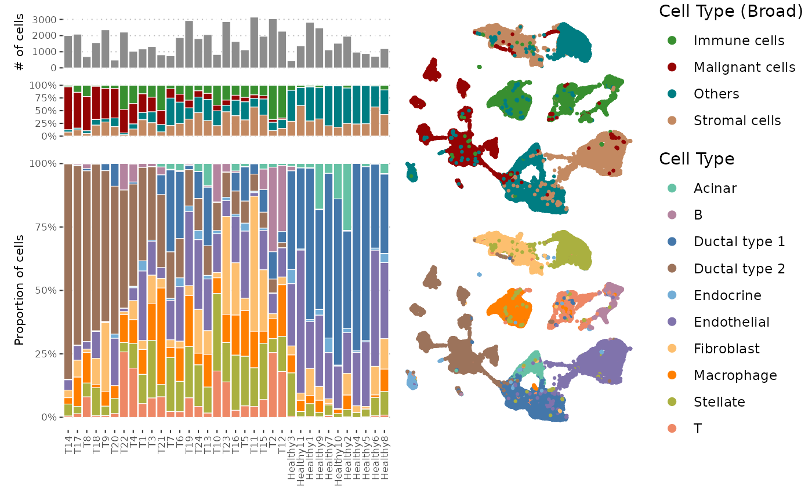
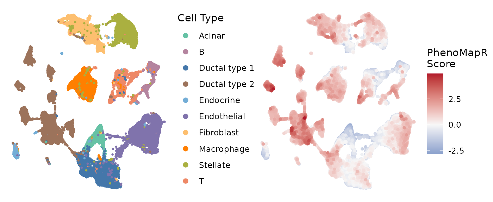
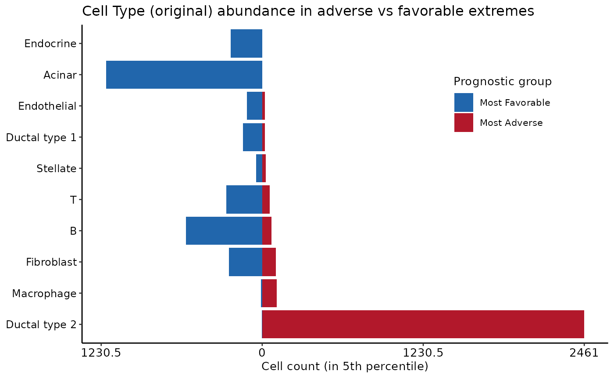
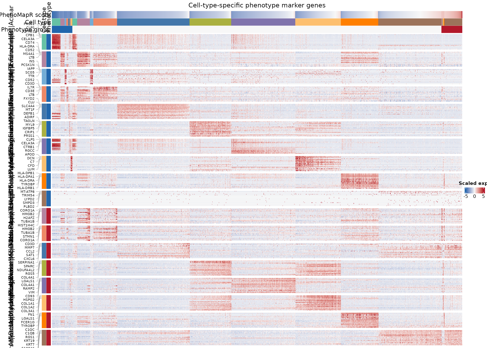

# Scoring single-cell data with PhenoMapR

## Overview

This vignette demonstrates how to use **`PhenoMapR`** on a single-cell
RNA-seq dataset. We use the **CRA001160** pancreatic cancer dataset from
[Peng et al. 2019](https://doi.org/10.1038/s41422-019-0195-y)
[\[1\]](#ref1). This dataset comprises single-cell RNA-seq of 57,530
pancreatic cells from 25 primary PAAD tumors and 9 control pancreases.
Pre-processed expression and metadata were obtained from
[TISCH2](https://tisch.compbio.cn/home/) [\[2\]](#ref2). We score all
samples in the dataset with **TCGA** and **PRECOG** meta-z signatures
[\[3\]](#ref3) then use the metadata and score outputs to visualize cell
types of interest, define prognostic groups of cells, and identify
marker genes for the most phenotype associated cell populations. Results
are compared with those obtained using the **SIDISH** method from
[Jolasun et
al. 2025](https://www.nature.com/articles/s41467-025-66162-4)
[\[4\]](#ref4).

## Load data

We will use pre-processed expression and annotation files from TISCH2
for the CRA001160 dataset. Download the expression matrix and cell
metadata from Google Drive and visualize cell type distributions across
all samples in the dataset.

``` r
suppressPackageStartupMessages(library(PhenoMapR))
suppressPackageStartupMessages(library(googledrive))
suppressPackageStartupMessages(library(ggplot2))
suppressPackageStartupMessages(library(ggpubr))
suppressPackageStartupMessages(library(dplyr))
suppressPackageStartupMessages(library(Seurat))
suppressPackageStartupMessages(library(patchwork))
suppressPackageStartupMessages(library(ComplexHeatmap))
suppressPackageStartupMessages(library(circlize))

options(googledrive_quiet = TRUE)
googledrive::drive_deauth()
googledrive::drive_download(googledrive::as_id("1PolTXggREz8XmhutCLTQJGCfKxFAzqMl"), "PAAD_CRA001160_expression.h5", overwrite = TRUE)
googledrive::drive_download(googledrive::as_id("17mqxnKOZJn0jW2iD9RV0wZeWsilAIwdu"), "PAAD_CRA001160_CellMetainfo_table.tsv", overwrite = TRUE)

# Expression matrix
expr_mat <- Seurat::Read10X_h5("PAAD_CRA001160_expression.h5")

# Cell and sample metadata
meta <- read.delim("PAAD_CRA001160_CellMetainfo_table.tsv", stringsAsFactors = FALSE, check.names = FALSE) %>%
   mutate(`Celltype (original)` = gsub(" cell", "", `Celltype (original)`)) %>%
   dplyr::rename(celltype_malignancy = `Celltype (malignancy)`,
         celltype_original = `Celltype (original)`)

# visuals for cohort
pal_cells <- PhenoMapR::get_celltype_palette(meta$celltype_original)

malignant_colors <- c(
  "Others" = "#007D82FF",
  "Immune cells" = "#388F30FF",
  "Stromal cells" = "#C38961FF",
  "Malignant cells" = "#950404FF"
)

# UMAPS for the cell type clustering

# Broad cell group labels
umap_1 <- ggscatter(meta, 
          x = "UMAP_1", 
          y = "UMAP_2",
          size = .5,
          color = "celltype_malignancy",
          palette = malignant_colors,
          legend = "right"
) + guides(color = guide_legend(override.aes = list(size = 2))) +
    labs(color = "Cell Type (Broad)") +
  theme_void()

# Original cell type labels from the authors
umap_2 <- ggscatter(meta,
          x = "UMAP_1", 
          y = "UMAP_2",
          size = .5,
          color = "celltype_original",
          palette = pal_cells,
          legend = "right"
) + guides(color = guide_legend(override.aes = list(size = 2), legend.spacing.x = unit(0.5, 'cm')))+
  labs(color = "Cell Type") +
  theme_void()


# MALIGNANT PLOT 
target_celltype <- "Malignant cells"

# Calculate proportions
prop_data_mal <- meta %>%
  group_by(Patient, celltype_malignancy) %>%
  summarise(n = n(), .groups = "drop") %>%
  group_by(Patient) %>%
  mutate(proportion = n / sum(n))

# Create a complete list with 0 for missing cell types
sample_order <- prop_data_mal %>%
  ungroup() %>%  # Add this!
  filter(celltype_malignancy == target_celltype) %>%
  tidyr::complete(Patient = unique(prop_data_mal$Patient), fill = list(proportion = 0)) %>%
  arrange(desc(proportion)) %>%
  pull(Patient)

prop_data_mal$Patient <- factor(prop_data_mal$Patient, levels = sample_order)

# Plot
p_mal <- ggplot(prop_data_mal, aes(x = Patient, y = proportion, fill = celltype_malignancy)) +
  geom_bar(stat = "identity", color = "white", linewidth = 0.2) +
  scale_y_continuous(labels = scales::percent) +
  scale_fill_manual(values = malignant_colors) +
  theme_pubclean(base_size = 8) +
    theme(
    axis.title.x = element_blank(),
    axis.text.x = element_blank(), 
    axis.ticks.x = element_blank(),
    legend.position = "none"
  ) +
  labs(x = NULL, y = NULL, fill = "Cell Type (Broad)")


# CELL TYPE PLOT
# Calculate proportions
prop_data <- meta %>%
  group_by(Patient, celltype_original) %>%
  summarise(n = n(), .groups = "drop") %>%
  group_by(Patient) %>%
  mutate(proportion = n / sum(n))

prop_data$Patient <- factor(prop_data$Patient, levels = sample_order)

# Plot
p_cell <- ggplot(prop_data, aes(x = Patient, y = proportion, fill = celltype_original)) +
  geom_bar(stat = "identity", color = "white", linewidth = 0.2) +
  scale_y_continuous(labels = scales::percent) +
    scale_fill_manual(values = pal_cells) +
  theme_pubclean(base_size = 8) +
  theme(
    axis.text.x = element_text(angle = 90, hjust = 1, vjust = 0.5),
        legend.position = "none") +
  labs(x = NULL, 
       y = "Proportion of cells",
       fill = "Cell Type",
       title = NULL)


# NUMBER OF CELLS PER PATIENT
meta$Patient <- factor(meta$Patient, levels = sample_order)

p_num <- ggplot(meta, aes(x = Patient)) +
  geom_bar(fill = "grey55", color = "white", linewidth = 0.2) +
  theme_pubclean(base_size = 8) +
  theme(
    axis.title.x = element_blank(),
    axis.text.x = element_blank(), 
    axis.ticks.x = element_blank() 
  ) +
  labs(x = NULL, 
       y = "# of cells",
       title = NULL)

# Left column with specific heights for each barplot
left_plots <- (p_num / p_mal / p_cell) + 
  plot_layout(heights = c(1, 1, 5), guides = "collect")

# Right column with specific heights for UMAPs
right_plots <- (umap_1 / umap_2) + 
  plot_layout(heights = c(1, 1), guides = "collect")

# Combine
(left_plots | right_plots) + 
  plot_layout(widths = c(1, 0.75))
```



## Score cells with PhenoMapR

Because we have survival meta-z signatures from both TCGA and PRECOG
PAAD resources, we will score the expression matrix with both references
and compare. We then merge score columns into metadata for downstream
analysis.

``` r
# Score all cells against the TCGA PAAD meta-z signature
scores_tcga <- PhenoMap(expression = expr_mat, 
                        reference = "tcga", 
                        cancer_type = "PAAD", 
                        verbose = TRUE)
```

    ## 4844 genes used for scoring against PAAD
    ## Calculating scores...
    ## Completed scoring for PAAD

``` r
# Score all cells against the PRECOG Primary Pancreatic meta-z signature
scores_precog <- PhenoMap(expression = expr_mat, 
                          reference = "precog", 
                          cancer_type = "Pancreatic", 
                          verbose = TRUE)
```

    ## 6556 genes used for scoring against Pancreatic
    ## Calculating scores...
    ## Completed scoring for Pancreatic

``` r
for (col in names(scores_tcga)) meta[[col]] <- scores_tcga[meta$Cell, col]
for (col in names(scores_precog)) meta[[col]] <- scores_precog[meta$Cell, col]

score_tcga_col <- grep("weighted_sum_score.*PAAD", names(meta), value = TRUE, ignore.case = TRUE)[1]
score_precog_col <- grep("weighted_sum_score.*Pancreatic", names(meta), value = TRUE, ignore.case = TRUE)[1]
if (is.na(score_tcga_col)) score_tcga_col <- names(scores_tcga)[1]
if (is.na(score_precog_col)) score_precog_col <- names(scores_precog)[1]
```

## Compare TCGA vs PRECOG PhenoMapR scores

Here, we take the resulting **`PhenoMapR`** scores from using TCGA and
PRECOG as references and check to make sure they are correlated within
each of the four main cell type categories.

``` r
df_scatter <- data.frame(
  x = meta[[score_precog_col]],
  y = meta[[score_tcga_col]],
  Cell_Type = factor(meta$celltype_malignancy)
)

ggpubr::ggscatter(df_scatter, x = "x", y = "y", color = "Cell_Type", palette = malignant_colors,
    add = "reg.line", conf.int = TRUE, size = 0.5, alpha = 0.3) +
    ggpubr::stat_cor(aes(color = Cell_Type), label.x.npc = "left", size = 3.5, show.legend = F) +
  scale_color_manual(values = malignant_colors) +
  scale_fill_manual(values = malignant_colors) +
    scale_x_continuous("PRECOG score") +
    scale_y_continuous("TCGA score") +
    labs(title = "TCGA vs. PRECOG PhenoMapR scores by cell type") +
    theme_pubr(base_size = 10) +
    theme(legend.position = "right", legend.title = element_text(size = 12), legend.text = element_text(size = 10))
```


As expected, **`PhenoMapR`** scores are strongly correlated between TCGA
and PRECOG references across all major cell types.

## PhenoMapR score UMAP

``` r
# PRECOG
meta_ordered <- meta %>%
  arrange(abs(weighted_sum_score_Pancreatic))

# scale the score for easier visualization
meta_ordered$score_scaled <- scale(meta_ordered$weighted_sum_score_Pancreatic)

precog_scaled_umap <- ggscatter(meta_ordered,
          x = "UMAP_1", 
          y = "UMAP_2",
          size = 1,
          color = "score_scaled",
          legend = "right", 
          title = NULL
) + 
  scale_color_gradient2(
    low = "#2166AC",
    mid = "#F7F7F7",
    high = "#B2182B",
    midpoint = 0,  
    name = "PhenoMapR Score"
  ) +
  theme_void() +
    theme(plot.title = element_text(hjust = 0.5)) 

# Let's plot next to the cell type UMAP for comparison
(umap_2 | precog_scaled_umap) + 
  plot_layout(widths = c(1, 1))
```

 It seems like
the most adversely scoring cells are enriched in several of the Ductal
type 2 cell clusters while the most favorable are enriching in the
acinar and endocrine clusters.

## Prognostic score distribution by Cell Type

The qualitative assessment of PhenoMapR score enrichment across UMAP
clusters nominated some cell types as potentially more associated with
the phenotypic signature than others. Here, we plot the absolute
PhenoMapR score (PRECOG and TCGA scores) across all cell types in the
dataset.

``` r
med_precog <- setNames(
  tapply(meta[[score_precog_col]], meta$celltype_malignancy, median, na.rm = TRUE),
  levels(factor(meta$celltype_malignancy))
)
# med_precog <- med_precog[!is.na(med_precog)]
ct_order <- names(sort(med_precog))
meta$celltype_malignancy <- factor(meta$celltype_malignancy, levels = ct_order)

dl <- rbind(
  data.frame(Reference = "TCGA PAAD", Score = meta[[score_tcga_col]], Cell_type = meta$celltype_malignancy, stringsAsFactors = FALSE),
  data.frame(Reference = "PRECOG Pancreatic", Score = meta[[score_precog_col]], Cell_type = meta$celltype_malignancy, stringsAsFactors = FALSE)
)
dl$Reference <- factor(dl$Reference, levels = c("TCGA PAAD", "PRECOG Pancreatic"))
ggplot(dl, aes(x = Cell_type, y = Score, fill = Cell_type)) +
  geom_boxplot(outlier.alpha = 0.2) +
  facet_wrap(~ Reference, ncol = 2) +
  scale_fill_manual(values = malignant_colors, name = "Cell Type (Broad)") +
  theme_pubr(base_size = 10) +
  theme(axis.text.x = element_text(angle = 45, hjust = 1), legend.position = "right", strip.text = element_text(size = 12)) +
  labs(x = NULL, y = "PhenoMapR score", title = "Score distribution by reference and cell type")
```


**`PhenoMapR`** successfully identifies the **Malignant** cell
compartment as most associated with the adverse prognostic signature in
both TCGA and PRECOG.

## Score distribution by refined cell type

To see if the **`PhenoMapR`** score assignment is enriched in more
granular cell types, we use the original cell type labels provided by
the authors (*Peng et al.* 2019).

``` r
med_precog <- setNames(
  tapply(meta[[score_precog_col]], meta$celltype_original, median, na.rm = TRUE),
  levels(factor(meta$celltype_original))
)
# med_precog <- med_precog[!is.na(med_precog)]
ct_order <- names(sort(med_precog))
meta$celltype_original <- factor(meta$celltype_original, levels = ct_order)

dl <- rbind(
  data.frame(Reference = "TCGA PAAD", Score = meta[[score_tcga_col]], Cell_type = meta$celltype_original, stringsAsFactors = FALSE),
  data.frame(Reference = "PRECOG Pancreatic", Score = meta[[score_precog_col]], Cell_type = meta$celltype_original, stringsAsFactors = FALSE)
)
dl$Reference <- factor(dl$Reference, levels = c("TCGA PAAD", "PRECOG Pancreatic"))
ggplot(dl, aes(x = Cell_type, y = Score, fill = Cell_type)) +
  geom_boxplot(outlier.alpha = 0.2) +
  facet_wrap(~ Reference, ncol = 2) +
  scale_fill_manual(values = pal_cells, name = "Cell Type (Original)") +
  theme_pubr(base_size = 10) +
  theme(axis.text.x = element_text(angle = 45, hjust = 1), legend.position = "right", strip.text = element_text(size = 12)) +
  labs(x = NULL, y = "PhenoMapR score", title = "Score distribution by reference and cell type")
```


In both TCGA and PRECOG results, we see that the Ductal cell type 2 is
the most significantly associated cell type with an adverse prognostic
signature in PAAD. This agrees with the results from **SIDISH** [Jolasun
et al.](https://www.nature.com/articles/s41467-025-66162-4/figures/2),
where they find **over 55% of their high-risk cells were Ductal cell
type 2**.

## Cell types in the most prognostic populations

Cell type counts in the top 5% (Most Adverse) and bottom 5% (Most
Favorable) of cells by PRECOG score.

``` r
q_lo <- quantile(meta[[score_precog_col]], 0.05, na.rm = TRUE)
q_hi <- quantile(meta[[score_precog_col]], 0.95, na.rm = TRUE)
pg_tmp <- ifelse(meta[[score_precog_col]] >= q_hi, "Most Adverse", ifelse(meta[[score_precog_col]] <= q_lo, "Most Favorable", NA))
idx_extreme <- !is.na(pg_tmp)
ct_in_extreme <- meta[idx_extreme, ]
ct_in_extreme$pg <- pg_tmp[idx_extreme]
ct_counts <- as.data.frame(table(Cell_type = ct_in_extreme$celltype_malignancy, pg = ct_in_extreme$pg))
ct_wide <- reshape(ct_counts, idvar = "Cell_type", timevar = "pg", direction = "wide")
names(ct_wide) <- gsub("Freq\\.", "", names(ct_wide))
for (c in c("Most Adverse", "Most Favorable")) {
  if (!c %in% names(ct_wide)) ct_wide[[c]] <- 0
}
ct_wide$Cell_type <- factor(ct_wide$Cell_type, levels = ct_wide$Cell_type[order(ct_wide$`Most Adverse`, decreasing = TRUE)])
ct_long <- rbind(
  data.frame(Cell_type = ct_wide$Cell_type, pg = "Most Favorable", n = -ct_wide$`Most Favorable`),
  data.frame(Cell_type = ct_wide$Cell_type, pg = "Most Adverse", n = ct_wide$`Most Adverse`)
)
ct_long$pg <- factor(ct_long$pg, levels = c("Most Favorable", "Most Adverse"))
max_n <- max(abs(ct_long$n), 1)
ggplot(ct_long, aes(x = Cell_type, y = n, fill = pg)) +
  geom_col() +
  coord_flip() +
  scale_fill_manual(values = c(`Most Adverse` = "#B2182B", `Most Favorable` = "#2166AC"), name = "Prognostic group") +
  scale_y_continuous(breaks = seq(-max_n, max_n, length.out = 5), labels = abs(seq(-max_n, max_n, length.out = 5))) +
  theme_pubr(base_size = 10) +
  theme(axis.text.y = element_text(size = 9), legend.position = c(.8,.75)) +
  labs(x = NULL, y = "Cell count (in 5th percentile)", title = "Cell type abundance in adverse vs favorable extremes")
```


At a broad cell type level, PhenoMapR assigns the vast majority of the
top 5% of adverse cells to the malignant compartment, however the
immune, stromal, and other cell types do contain some of the most
adversely scoring cells.

We then use the original cell type annotations from the authors to
provide a more refined understanding of the prognostic score assignment
across cell types.

``` r
  ct_orig_in_extreme <- meta[idx_extreme, ]
  ct_orig_in_extreme$pg <- pg_tmp[idx_extreme]
  ct_orig_counts <- as.data.frame(table(Cell_type_original = ct_orig_in_extreme$celltype_original, pg = ct_orig_in_extreme$pg))
  ct_orig_wide <- reshape(ct_orig_counts, idvar = "Cell_type_original", timevar = "pg", direction = "wide")
  names(ct_orig_wide) <- gsub("Freq\\.", "", names(ct_orig_wide))
  for (c in c("Most Adverse", "Most Favorable")) {
    if (!c %in% names(ct_orig_wide)) ct_orig_wide[[c]] <- 0
  }
  ct_orig_wide$Cell_type_original <- factor(ct_orig_wide$Cell_type_original, levels = ct_orig_wide$Cell_type_original[order(ct_orig_wide$`Most Adverse`, decreasing = TRUE)])
  ct_orig_long <- rbind(
    data.frame(Cell_type_original = ct_orig_wide$Cell_type_original, pg = "Most Favorable", n = -ct_orig_wide$`Most Favorable`),
    data.frame(Cell_type_original = ct_orig_wide$Cell_type_original, pg = "Most Adverse", n = ct_orig_wide$`Most Adverse`)
  )
  ct_orig_long$pg <- factor(ct_orig_long$pg, levels = c("Most Favorable", "Most Adverse"))
  max_n_orig <- max(abs(ct_orig_long$n), 1)
  print(ggplot(ct_orig_long, aes(x = Cell_type_original, y = n, fill = pg)) +
    geom_col() +
    coord_flip() +
    scale_fill_manual(values = c(`Most Adverse` = "#B2182B", `Most Favorable` = "#2166AC"), name = "Prognostic group") +
    scale_y_continuous(breaks = seq(-max_n_orig, max_n_orig, length.out = 5), labels = abs(seq(-max_n_orig, max_n_orig, length.out = 5))) +
  theme_pubr(base_size = 10) +
    theme(axis.text.y = element_text(size = 9), legend.position = c(.8,.75)) +
    labs(x = NULL, y = "Cell count (in 5th percentile)", title = "Cell Type (original) abundance in adverse vs favorable extremes"))
```


Here, we see that the vase majority of the top 5th percentile of adverse
PhenoMapR cells are from the Ductal type 2 cells, in line with the
results of [Jolasun et
al.](https://www.nature.com/articles/s41467-025-66162-4/figures/2). The
majority of favorably scoring cells were Acinar and C cell populations.

## Phenotype groups and marker genes

**`PhenoMapR`** provides some high-level analysis functions to help
characterize the most phenotypically relevant cells. We define the “Most
Adverse” and “Most Favorable” cells from the **PRECOG PhenoMapR** score
(5th/95th percentiles), then run marker identification (adverse vs rest,
favorable vs rest) using the original cell type annotation for context.

``` r
scores_df <- meta[, c(score_tcga_col, score_precog_col), drop = FALSE]
groups <- define_phenotype_groups(scores_df, percentile = 0.05, score_columns = score_precog_col)
group_col <- grep("phenotype_group", names(groups), value = TRUE)[1]
meta[[group_col]] <- groups[rownames(meta), group_col]

  markers <- NULL

  markers <- find_phenotype_markers(
    expr_mat,
    group_labels = meta[[group_col]],
    pval_threshold = 0.05,
    max_cells_per_ident = 5000L
  )
  if (!is.null(markers)) {
    message("Adverse markers (top 5):"); print(head(markers$adverse_markers, 5))
    message("Favorable markers (top 5):"); print(head(markers$favorable_markers, 5))
  }
```

    ##         gene avg_log2FC pct_in_group  pct_rest p_val p_adj
    ## 13     ISG15  1.3634979     93.17786 41.839197     0     0
    ## 34  AURKAIP1  0.8237655     93.83919 52.991236     0     0
    ## 69      RER1  0.7967829     91.01984 41.686778     0     0
    ## 76    PRXL2B  0.4068488     52.94118  9.526229     0     0
    ## 101     ICMT  0.3150654     53.28924 12.282484     0     0

    ##        gene avg_log2FC pct_in_group pct_rest p_val p_adj
    ## 21079 ISG15 -1.2916584     15.97633 70.01143     0     0
    ## 21192  ENO1 -1.6344839     34.63279 85.16449     0     0
    ## 21295 CAPZB -0.9759845     31.56979 80.82053     0     0
    ## 21298  NBL1 -0.7554952      9.64149 55.70939     0     0
    ## 21325 CDC42 -1.1043594     37.66098 84.97396     0     0

## Marker genes heatmap

After identifying marker genes for the adverse and favorable
**`PhenoMapR`** populations, we take up to **20** positive markers per
tail with **FDR \< 0.05** and the **largest `avg_log2FC`** (same
thresholds as the cell-type–specific heatmap). The helper
**[`plot_phenotype_markers()`](https://brooksbenard.github.io/PhenoMapR/reference/plot_phenotype_markers.md)**
subsets the expression matrix to those genes and the ordered cells, then
applies **row-wise `scale`** only to that submatrix. **ComplexHeatmap**
shows favorable-marker rows, then adverse-marker rows, with
**`anno_mark`** for the top five genes in each block.

``` r
  plot_phenotype_markers(
    markers = markers,
    expr_mat = expr_mat,
    meta = meta,
    cell_id_col = "Cell",
    group_col = group_col,
    score_col = score_precog_col,
    celltype_col = "celltype_original",
    celltype_palette = pal_cells,
    heatmap_type = "global",
    top_n_markers = 20L,
    n_mark_labels = 5L,
    p_adj_threshold = 0.05
  )
```

 It’s clear from
the heatmap that the cell type driving the favorable prognostic signal
is the Acinar cell type. Cell-type specific marker identification within
the most prgnostic group would further resolve other cell type markers
associated with favorable outcomes in this dataset.

## Cell-type-specific phenotype marker genes

The
[`find_phenotype_markers()`](https://brooksbenard.github.io/PhenoMapR/reference/find_phenotype_markers.md)
function can also identify marker genes **for each cell type** by
contrasting cells in that type within the phenotype tail (Most Adverse
or Most Favorable) against **all other cells in the dataset** (other
cell types and other phenotype groups). We visualize the top marker
genes per cell type and phenotype bin in a heatmap that includes *all*
cells, ordered by: 1) phenotype bin (Most Favorable, Other, Most
Adverse), then 2) cell type, then 3) phenotype score.

For the heatmap, we take up to **20** positive markers per cell type and
phenotype tail with the **largest `avg_log2FC`**, restricting to genes
that are **FDR-significant** (`p_adj` from Benjamini–Hochberg `< 0.05`).
Rows follow the same column order: **Most Favorable** (each cell type),
**Other** cells, **Most Adverse** (each cell type).
**`plot_phenotype_markers(..., heatmap_type = "cell_type_specific")`**
draws row splits between blocks; **`anno_mark`** labels the **top five**
genes (by log2FC) within each (phenotype tail × cell type) group, with
**cell type** and **phenotype** strips on the left.

``` r
group_df <- data.frame(
  cell_id = meta$Cell,
  phenotype_group = meta[[group_col]],
  cell_type = meta$celltype_original,
  stringsAsFactors = FALSE
)

markers_ct <- find_phenotype_markers(
  expr_mat,
  group_labels = group_df,
  group_column = "phenotype_group",
  cell_id_column = "cell_id",
  cell_type_column = "cell_type",
  marker_scope = "cell_type_specific",
  pval_threshold = 0.05,
  max_cells_per_ident = 5000L,
  verbose = FALSE
)

plot_phenotype_markers(
  markers = markers_ct,
  expr_mat = expr_mat,
  meta = meta,
  cell_id_col = "Cell",
  group_col = group_col,
  score_col = score_precog_col,
  celltype_col = "celltype_original",
  celltype_palette = pal_cells,
  heatmap_type = "cell_type_specific",
  top_n_markers = 20L,
  n_mark_labels = 5L,
  p_adj_threshold = 0.05
)
```



## Dataset summary of PhenoMapR results

Here, we summarize the enrichment of prognostic PhenoMapR scores across
samples and cell types to highlight the difference in signal between
healthy and tumor samples as well as between different cell populations
across the sample groups.

``` r
sample_col <- NULL
for (cand in c("Sample", "sample", "Patient", "patient", "Sample_ID", "orig.ident")) {
  if (cand %in% names(meta)) {
    sample_col <- cand
    break
  }
}
if (is.null(sample_col)) sample_col <- names(meta)[1]

meta_plot <- meta
meta_plot$sample <- meta_plot[[sample_col]]
meta_plot$cell_type <- meta_plot$celltype_malignancy
# meta_plot$cell_type_original <- if (!is.null(celltype_original) && celltype_original %in% names(meta_plot)) meta_plot$celltype_original else NA_character_
meta_plot$cell_type_original <- meta$celltype_original
meta_plot$prognostic_grp <- meta_plot[[group_col]]
sample_lev <- levels(factor(meta[[sample_col]]))
meta_plot$sample <- factor(meta_plot[[sample_col]], levels = sample_lev)
n_per_sample <- setNames(as.numeric(table(meta[[sample_col]])[sample_lev]), sample_lev)
n_per_sample[is.na(n_per_sample)] <- 0

# Per-sample proportion of adverse and favorable (5th percentile) for stacked bar
meta_adv_fav <- meta_plot[meta_plot$prognostic_grp %in% c("Most Adverse", "Most Favorable"), ]
bar_df <- as.data.frame(table(sample = meta_adv_fav$sample, pg = meta_adv_fav$prognostic_grp, useNA = "no"))
bar_df <- bar_df[bar_df$pg %in% c("Most Adverse", "Most Favorable"), ]
bar_df$total <- n_per_sample[as.character(bar_df$sample)]
bar_df$proportion <- ifelse(bar_df$total > 0, bar_df$Freq / bar_df$total, 0)
fav <- bar_df[bar_df$pg == "Most Favorable", c("sample", "proportion")]
adv <- bar_df[bar_df$pg == "Most Adverse", c("sample", "proportion")]
names(fav)[2] <- "p_fav"
names(adv)[2] <- "p_adv"
bar_stack <- merge(data.frame(sample = sample_lev, stringsAsFactors = FALSE), fav, by = "sample", all.x = TRUE)
bar_stack <- merge(bar_stack, adv, by = "sample", all.x = TRUE)
bar_stack$p_fav[is.na(bar_stack$p_fav)] <- 0
bar_stack$p_adv[is.na(bar_stack$p_adv)] <- 0
bar_stack$sample <- factor(bar_stack$sample, levels = sample_lev)

meta_plot <- meta_plot[meta_plot$prognostic_grp %in% c("Most Adverse", "Most Favorable"), ]
meta_plot$cell_type <- factor(meta_plot$cell_type)

if (nrow(meta_plot) > 0) {
  counts <- as.data.frame(table(meta_plot$sample, meta_plot$cell_type, meta_plot$prognostic_grp, dnn = c("sample", "cell_type", "pg")))
  totals <- aggregate(counts$Freq, by = list(sample = counts$sample, pg = counts$pg), FUN = sum)
  names(totals)[3] <- "total"
  counts <- merge(counts, totals, by = c("sample", "pg"))
  counts$proportion <- counts$Freq / counts$total
  counts$proportion[counts$total == 0] <- 0
  counts$x_num <- as.numeric(counts$sample) + ifelse(counts$pg == "Most Adverse", -0.18, 0.18)

  # Stacked bar: adverse + favorable proportion per sample
  bar_long <- rbind(
    data.frame(sample = bar_stack$sample, pg = "Most Favorable", y_min = 0, y_max = bar_stack$p_fav),
    data.frame(sample = bar_stack$sample, pg = "Most Adverse", y_min = bar_stack$p_fav, y_max = bar_stack$p_fav + bar_stack$p_adv)
  )
  bar_long$pg <- factor(bar_long$pg, levels = c("Most Favorable", "Most Adverse"))
  p_bar <- ggplot(bar_long, aes(x = as.numeric(sample), fill = pg)) +
    geom_rect(aes(xmin = as.numeric(sample) - 0.4, xmax = as.numeric(sample) + 0.4, ymin = y_min, ymax = y_max)) +
    scale_fill_manual(values = c(`Most Adverse` = "#B2182B", `Most Favorable` = "#2166AC"), name = "Prognostic group") +
    scale_x_continuous(
      breaks = seq_along(sample_lev),
      labels = sample_lev,
      limits = c(0.5, length(sample_lev) + 0.5),
      expand = c(0, 0)
    ) +
    scale_y_continuous(expand = c(0, 0)) +
    theme_minimal() +
    theme(axis.text.x = element_blank(), axis.ticks.x = element_blank(), axis.title.x = element_blank(), legend.position = "none") +
    labs(y = "Proportion\n(5th percentile)", title = NULL)

  p_dots <- ggplot(counts, aes(x = x_num, y = cell_type, size = proportion, color = pg)) +
    geom_point(alpha = 0.85) +
    scale_color_manual(values = c(`Most Adverse` = "#B2182B", `Most Favorable` = "#2166AC"), name = "Prognostic group") +
    scale_size_continuous(range = c(0, 5), name = "Proportion") +
    scale_x_continuous(
      breaks = seq_along(sample_lev),
      labels = sample_lev,
      limits = c(0.5, length(sample_lev) + 0.5),
      expand = c(0, 0)
    ) +
    theme_minimal() +
    theme(panel.grid.major.y = element_line(color = "grey90"), axis.title = element_text(size = 10), axis.text.x = element_blank(), axis.ticks.x = element_blank(), legend.position = "right") +
    labs(x = NULL, y = "Cell type", title = NULL)

  # Same plot, but using original cell type labels (when available)
  p_dots_orig <- NULL
  if (!all(is.na(meta_plot$cell_type_original))) {
    meta_plot$cell_type_original <- factor(meta_plot$cell_type_original)
    counts_orig <- as.data.frame(table(meta_plot$sample, meta_plot$cell_type_original, meta_plot$prognostic_grp, dnn = c("sample", "cell_type_original", "pg")))
    totals_orig <- aggregate(counts_orig$Freq, by = list(sample = counts_orig$sample, pg = counts_orig$pg), FUN = sum)
    names(totals_orig)[3] <- "total"
    counts_orig <- merge(counts_orig, totals_orig, by = c("sample", "pg"))
    counts_orig$proportion <- counts_orig$Freq / counts_orig$total
    counts_orig$proportion[counts_orig$total == 0] <- 0
    counts_orig$x_num <- as.numeric(counts_orig$sample) + ifelse(counts_orig$pg == "Most Adverse", -0.18, 0.18)

    p_dots_orig <- ggplot(counts_orig, aes(x = x_num, y = cell_type_original, size = proportion, color = pg)) +
      geom_point(alpha = 0.85) +
      scale_color_manual(values = c(`Most Adverse` = "#B2182B", `Most Favorable` = "#2166AC"), name = "Prognostic group") +
      scale_size_continuous(range = c(0, 5), name = "Proportion") +
      scale_x_continuous(
        breaks = seq_along(sample_lev),
        labels = sample_lev,
        limits = c(0.5, length(sample_lev) + 0.5),
        expand = c(0, 0)
      ) +
      theme_minimal() +
      theme(panel.grid.major.y = element_line(color = "grey90"), axis.title = element_text(size = 10), 
            axis.text.x = element_text(angle = 90, hjust = 1, vjust = 0.5),
            legend.position = "none") +
      labs(x = "Sample", y = "Cell type (original)", title = NULL) +
      guides(color = guide_legend(override.aes = list(size = 3)))
  }

  if (requireNamespace("patchwork", quietly = TRUE)) {
    suppressPackageStartupMessages(library(patchwork))
    if (!is.null(p_dots_orig)) {
      print(p_bar / p_dots / p_dots_orig + plot_layout(heights = c(1, 2, 2)))
    } else {
      print(p_bar / p_dots + plot_layout(heights = c(1, 2)))
    }
  } else {
    print(p_bar)
    print(p_dots)
    if (!is.null(p_dots_orig)) print(p_dots_orig)
  }
} else {
  message("No Most Adverse or Most Favorable cells found; proportion plot skipped.")
}
```


## Conclusions

Here, we demonstrate that using **`PhenoMapR`** on single-cell RNAseq
data in a pancreatic cancer dataset successfully identified cells known
to be associated with disease (malignant and ductal type 1). These
results agree with those of Jolasun et al., however our **`PhenoMapR`**
results provide an increased level of granularity compared to other
methods, since we retain absolute and rank-ordered information regarding
all cell’s phenotype association. We also nominate cells most associated
with favorable outcomes in PAAD, highlighting potential areas for
additional therapeutic focus.

## References

**\[1\]** Peng, J. et al. Single-cell RNA-seq highlights intra-tumoral
heterogeneity and malignant progression in pancreatic ductal
adenocarcinoma. *Cell Research* 29, 725–738 (2019).
<https://doi.org/10.1038/s41422-019-0195-y>

**\[2\]** Han, Y. et al. TISCH2: expanded datasets and new tools for
single-cell transcriptome analyses of the tumor microenvironment.
*Nucleic Acids Res* 51, D1425–D1431 (2023).
<https://doi.org/10.1093/nar/gkac959>

**\[3\]** Benard, B. et al. PRECOG update: an augmented resource of
clinical outcome associations with gene expression for adult, pediatric,
and immunotherapy cohorts. *Nucleic Acids Res.* 54, D1579–D1589 (2026).
<https://doi.org/10.1093/nar/gkaf1215>

**\[4\]** Jolasun, Y. et al. SIDISH integrates single-cell and bulk
transcriptomics to identify high-risk cells and guide precision
therapeutics through in silico perturbation. *Nat Commun* 16, 11271
(2025). <https://doi.org/10.1038/s41467-025-66162-4>

## Session Info

``` r
sessionInfo()
```

    ## R version 4.5.3 (2026-03-11)
    ## Platform: x86_64-pc-linux-gnu
    ## Running under: Ubuntu 24.04.3 LTS
    ## 
    ## Matrix products: default
    ## BLAS:   /usr/lib/x86_64-linux-gnu/openblas-pthread/libblas.so.3 
    ## LAPACK: /usr/lib/x86_64-linux-gnu/openblas-pthread/libopenblasp-r0.3.26.so;  LAPACK version 3.12.0
    ## 
    ## locale:
    ##  [1] LC_CTYPE=C.UTF-8       LC_NUMERIC=C           LC_TIME=C.UTF-8       
    ##  [4] LC_COLLATE=C.UTF-8     LC_MONETARY=C.UTF-8    LC_MESSAGES=C.UTF-8   
    ##  [7] LC_PAPER=C.UTF-8       LC_NAME=C              LC_ADDRESS=C          
    ## [10] LC_TELEPHONE=C         LC_MEASUREMENT=C.UTF-8 LC_IDENTIFICATION=C   
    ## 
    ## time zone: UTC
    ## tzcode source: system (glibc)
    ## 
    ## attached base packages:
    ## [1] grid      stats     graphics  grDevices utils     datasets  methods  
    ## [8] base     
    ## 
    ## other attached packages:
    ##  [1] circlize_0.4.17       ComplexHeatmap_2.26.1 patchwork_1.3.2      
    ##  [4] Seurat_5.4.0          SeuratObject_5.3.0    sp_2.2-1             
    ##  [7] dplyr_1.2.0           ggpubr_0.6.3          ggplot2_4.0.2        
    ## [10] googledrive_2.1.2     PhenoMapR_0.1.0      
    ## 
    ## loaded via a namespace (and not attached):
    ##   [1] RcppAnnoy_0.0.23       splines_4.5.3          later_1.4.8           
    ##   [4] tibble_3.3.1           polyclip_1.10-7        fastDummies_1.7.5     
    ##   [7] lifecycle_1.0.5        rstatix_0.7.3          doParallel_1.0.17     
    ##  [10] globals_0.19.1         lattice_0.22-9         hdf5r_1.3.12          
    ##  [13] MASS_7.3-65            backports_1.5.0        magrittr_2.0.4        
    ##  [16] plotly_4.12.0          sass_0.4.10            rmarkdown_2.30        
    ##  [19] jquerylib_0.1.4        yaml_2.3.12            httpuv_1.6.17         
    ##  [22] otel_0.2.0             sctransform_0.4.3      spam_2.11-3           
    ##  [25] spatstat.sparse_3.1-0  reticulate_1.45.0      cowplot_1.2.0         
    ##  [28] pbapply_1.7-4          RColorBrewer_1.1-3     abind_1.4-8           
    ##  [31] Rtsne_0.17             presto_1.0.0           purrr_1.2.1           
    ##  [34] BiocGenerics_0.56.0    IRanges_2.44.0         S4Vectors_0.48.0      
    ##  [37] ggrepel_0.9.8          irlba_2.3.7            listenv_0.10.1        
    ##  [40] spatstat.utils_3.2-2   goftest_1.2-3          RSpectra_0.16-2       
    ##  [43] spatstat.random_3.4-4  fitdistrplus_1.2-6     parallelly_1.46.1     
    ##  [46] pkgdown_2.2.0          codetools_0.2-20       tidyselect_1.2.1      
    ##  [49] shape_1.4.6.1          farver_2.1.2           matrixStats_1.5.0     
    ##  [52] stats4_4.5.3           spatstat.explore_3.7-0 jsonlite_2.0.0        
    ##  [55] GetoptLong_1.1.0       progressr_0.18.0       Formula_1.2-5         
    ##  [58] ggridges_0.5.7         survival_3.8-6         iterators_1.0.14      
    ##  [61] systemfonts_1.3.2      foreach_1.5.2          tools_4.5.3           
    ##  [64] ragg_1.5.1             ica_1.0-3              Rcpp_1.1.1            
    ##  [67] glue_1.8.0             gridExtra_2.3          mgcv_1.9-4            
    ##  [70] xfun_0.56              withr_3.0.2            fastmap_1.2.0         
    ##  [73] digest_0.6.39          R6_2.6.1               mime_0.13             
    ##  [76] textshaping_1.0.5      colorspace_2.1-2       scattermore_1.2       
    ##  [79] tensor_1.5.1           spatstat.data_3.1-9    tidyr_1.3.2           
    ##  [82] generics_0.1.4         data.table_1.18.2.1    httr_1.4.8            
    ##  [85] htmlwidgets_1.6.4      uwot_0.2.4             pkgconfig_2.0.3       
    ##  [88] gtable_0.3.6           lmtest_0.9-40          S7_0.2.1              
    ##  [91] htmltools_0.5.9        carData_3.0-6          dotCall64_1.2         
    ##  [94] clue_0.3-67            scales_1.4.0           png_0.1-9             
    ##  [97] spatstat.univar_3.1-7  knitr_1.51             reshape2_1.4.5        
    ## [100] rjson_0.2.23           nlme_3.1-168           curl_7.0.0            
    ## [103] cachem_1.1.0           zoo_1.8-15             GlobalOptions_0.1.3   
    ## [106] stringr_1.6.0          KernSmooth_2.23-26     parallel_4.5.3        
    ## [109] miniUI_0.1.2           desc_1.4.3             pillar_1.11.1         
    ## [112] vctrs_0.7.1            RANN_2.6.2             promises_1.5.0        
    ## [115] car_3.1-5              xtable_1.8-8           cluster_2.1.8.2       
    ## [118] evaluate_1.0.5         magick_2.9.1           cli_3.6.5             
    ## [121] compiler_4.5.3         rlang_1.1.7            crayon_1.5.3          
    ## [124] future.apply_1.20.2    ggsignif_0.6.4         labeling_0.4.3        
    ## [127] plyr_1.8.9             fs_1.6.7               stringi_1.8.7         
    ## [130] viridisLite_0.4.3      deldir_2.0-4           lazyeval_0.2.2        
    ## [133] spatstat.geom_3.7-0    Matrix_1.7-4           RcppHNSW_0.6.0        
    ## [136] bit64_4.6.0-1          future_1.70.0          shiny_1.13.0          
    ## [139] ROCR_1.0-12            gargle_1.6.1           igraph_2.2.2          
    ## [142] broom_1.0.12           bslib_0.10.0           bit_4.6.0
