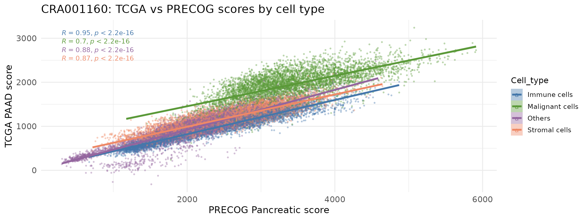
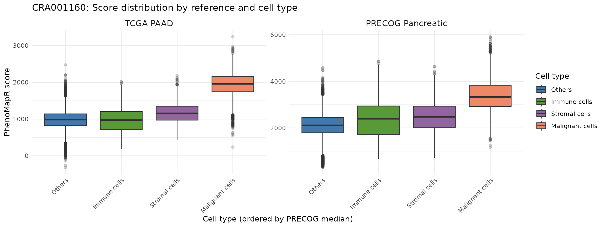
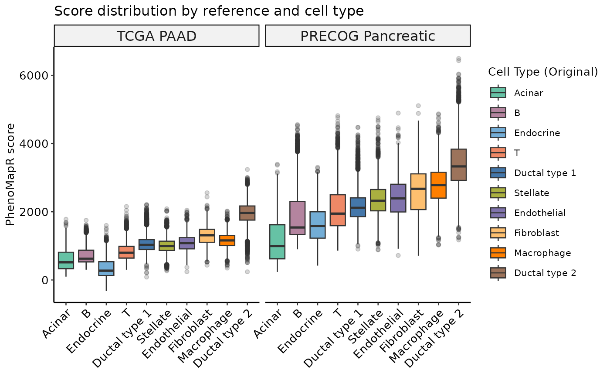
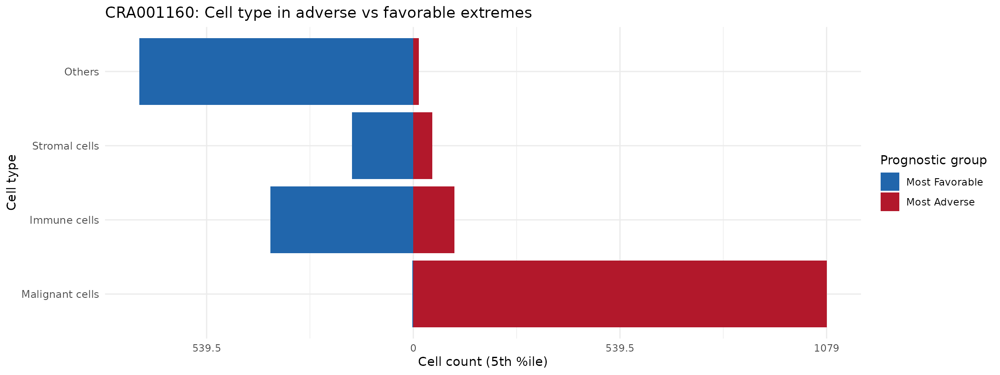
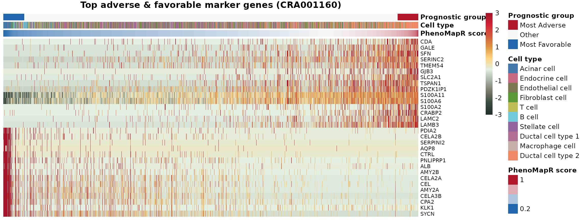
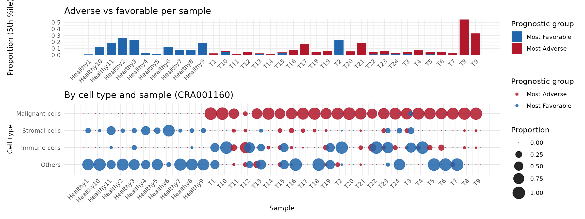

# Scoring single-cell data with PhenoMapR

## Overview

This vignette demonstrates how to use PhenoMapR on a single-cell RNA-seq
dataset. We use the **CRA001160** PDAC dataset from [Peng et al. (*Cell
Research* 2019)](https://doi.org/10.1038/s41422-019-0195-y) (single-cell
RNA-seq of 57,530 pancreatic cells from primary PDAC tumors and control
pancreases; [GSA:
CRA001160](https://ngdc.cncb.ac.cn/gsa/browse/CRA001160)). Pre-processed
expression and metadata were obtained from
[TISCH2](https://tisch.compbio.cn/home/). We score the expression matrix
with **TCGA** and **PRECOG** meta-z signatures (no Seurat required),
then use the metadata and score outputs for visualizations, prognostic
groups, and marker genes. Results are compared with [Jolasun et
al.](https://www.nature.com/articles/s41467-025-66162-4)
[**SIDISH**](https://www.nature.com/articles/s41467-025-66162-4).

## Load data for CRA001160

Download the expression matrix (10X H5) and cell metadata (TSV) from
Google Drive. Align metadata to matrix columns and subsample for
vignette runtime.

``` r
suppressPackageStartupMessages(library(PhenoMapR))
suppressPackageStartupMessages(library(ggplot2))
suppressPackageStartupMessages(library(googledrive))
if (requireNamespace("ggpubr", quietly = TRUE)) suppressPackageStartupMessages(library(ggpubr))
if (requireNamespace("Seurat", quietly = TRUE)) suppressPackageStartupMessages(library(Seurat))

knitr::opts_chunk$set(fig.width = 12, out.width = "100%")

options(googledrive_quiet = TRUE)
googledrive::drive_deauth()
googledrive::drive_download(googledrive::as_id("1PolTXggREz8XmhutCLTQJGCfKxFAzqMl"), "PAAD_CRA001160_expression.h5", overwrite = TRUE)
googledrive::drive_download(googledrive::as_id("17mqxnKOZJn0jW2iD9RV0wZeWsilAIwdu"), "PAAD_CRA001160_CellMetainfo_table.tsv", overwrite = TRUE)

expr_mat <- Seurat::Read10X_h5("PAAD_CRA001160_expression.h5")
meta <- read.delim("PAAD_CRA001160_CellMetainfo_table.tsv", stringsAsFactors = FALSE, check.names = FALSE)

cell_ids <- colnames(expr_mat)
id_col <- NULL
for (cand in c("Barcode", "barcode", "cell_id", "Cell", "cell_barcode", names(meta)[1])) {
  if (cand %in% names(meta) && length(intersect(meta[[cand]], cell_ids)) > 0) {
    id_col <- cand
    break
  }
}
if (is.null(id_col)) id_col <- names(meta)[1]
meta <- meta[meta[[id_col]] %in% cell_ids, , drop = FALSE]
meta <- meta[match(cell_ids, meta[[id_col]]), , drop = FALSE]
rownames(meta) <- colnames(expr_mat)

for (col in names(meta)) {
  if (!(is.character(meta[[col]]) || is.factor(meta[[col]]))) next
  nlev <- length(unique(meta[[col]][!is.na(meta[[col]])]))
  if (nlev >= 2L && nlev <= 500L) {
    celltype_col <- col
    break
  }
}
if (!exists("celltype_col")) celltype_col <- names(meta)[2]
celltype_original_col <- if ("Celltype (original)" %in% names(meta)) "Celltype (original)" else NULL

max_cells <- 25000L
if (ncol(expr_mat) > max_cells) {
  set.seed(1)
  keep_cells <- sample(colnames(expr_mat), max_cells)
  expr_mat <- expr_mat[, keep_cells, drop = FALSE]
  meta <- meta[keep_cells, , drop = FALSE]
  message(sprintf("Subsampled to %d cells for vignette.", ncol(expr_mat)))
}
```

    ## Subsampled to 25000 cells for vignette.

``` r
message(sprintf("Cells: %d | Genes: %d | Cell type: %s", ncol(expr_mat), nrow(expr_mat), celltype_col))
```

    ## Cells: 25000 | Genes: 21066 | Cell type: Celltype (malignancy)

## Score cells with TCGA and PRECOG Pancreatic

Score the expression matrix with both references; merge score columns
into metadata.

``` r
scores_tcga <- PhenoMap(expression = expr_mat, reference = "tcga", cancer_type = "PAAD", verbose = TRUE)
```

    ## Detected input type: matrix

    ## 4844 genes used for scoring against PAADCalculating scores...
    ## Completed scoring for PAAD

``` r
scores_precog <- PhenoMap(expression = expr_mat, reference = "precog", cancer_type = "Pancreatic", verbose = TRUE)
```

    ## Detected input type: matrix

    ## 6556 genes used for scoring against PancreaticCalculating scores...
    ## Completed scoring for Pancreatic

``` r
for (col in names(scores_tcga)) meta[[col]] <- scores_tcga[rownames(meta), col]
for (col in names(scores_precog)) meta[[col]] <- scores_precog[rownames(meta), col]

score_tcga_col <- grep("weighted_sum_score.*PAAD", names(meta), value = TRUE, ignore.case = TRUE)[1]
score_precog_col <- grep("weighted_sum_score.*Pancreatic", names(meta), value = TRUE, ignore.case = TRUE)[1]
if (is.na(score_tcga_col)) score_tcga_col <- names(scores_tcga)[1]
if (is.na(score_precog_col)) score_precog_col <- names(scores_precog)[1]
```

## Scatterplot: TCGA vs PRECOG scores

Comparison of per-cell scores; points colored by cell type with
regression line, 95% CI, and correlation by group.

``` r
df_scatter <- data.frame(
  x = meta[[score_precog_col]],
  y = meta[[score_tcga_col]],
  Cell_type = factor(meta[[celltype_col]])
)
pal_ct <- PhenoMapR::get_celltype_palette(levels(df_scatter$Cell_type))
if (requireNamespace("ggpubr", quietly = TRUE)) {
  p <- ggpubr::ggscatter(df_scatter, x = "x", y = "y", color = "Cell_type", palette = pal_ct,
    add = "reg.line", conf.int = TRUE, size = 0.5, alpha = 0.3) +
    ggpubr::stat_cor(aes(color = Cell_type), label.x.npc = "left", size = 3.5) +
    scale_x_continuous("PRECOG Pancreatic score") +
    scale_y_continuous("TCGA PAAD score") +
    labs(title = "CRA001160: TCGA vs PRECOG scores by cell type") +
    theme_minimal(base_size = 14) +
    theme(legend.position = "right", legend.title = element_text(size = 12), legend.text = element_text(size = 10),
      axis.title = element_text(size = 14), axis.text = element_text(size = 12))
  print(p)
} else {
  print(ggplot(df_scatter, aes(x = x, y = y, color = Cell_type)) +
    geom_point(alpha = 0.3, size = 0.5) +
    geom_smooth(method = "lm", se = TRUE, linewidth = 0.5) +
    scale_color_manual(values = pal_ct, name = "Cell type") +
    theme_minimal(base_size = 14) +
    labs(x = "PRECOG Pancreatic score", y = "TCGA PAAD score", title = "CRA001160: TCGA vs PRECOG scores"))
}
```



PhenoMap scores are correlated between TCGA and PRECOG across cell
types.

## Score distribution: TCGA and PRECOG by cell type (ordered by PRECOG)

Boxplots of score distributions for both references, with cell types
ordered by median PRECOG score so that the most adverse (high PRECOG)
cell types appear toward one side.

``` r
med_precog <- setNames(
  tapply(meta[[score_precog_col]], meta[[celltype_col]], median, na.rm = TRUE),
  levels(factor(meta[[celltype_col]]))
)
med_precog <- med_precog[!is.na(med_precog)]
ct_order <- names(sort(med_precog))
meta[[celltype_col]] <- factor(meta[[celltype_col]], levels = ct_order)

dl <- rbind(
  data.frame(Reference = "TCGA PAAD", Score = meta[[score_tcga_col]], Cell_type = meta[[celltype_col]], stringsAsFactors = FALSE),
  data.frame(Reference = "PRECOG Pancreatic", Score = meta[[score_precog_col]], Cell_type = meta[[celltype_col]], stringsAsFactors = FALSE)
)
dl$Reference <- factor(dl$Reference, levels = c("TCGA PAAD", "PRECOG Pancreatic"))
pal_ct <- PhenoMapR::get_celltype_palette(ct_order)
ggplot(dl, aes(x = Cell_type, y = Score, fill = Cell_type)) +
  geom_boxplot(outlier.alpha = 0.2) +
  facet_wrap(~ Reference, ncol = 2, scales = "free_y") +
  scale_fill_manual(values = pal_ct, name = "Cell type") +
  theme_minimal() +
  theme(axis.text.x = element_text(angle = 45, hjust = 1), legend.position = "right", strip.text = element_text(size = 12)) +
  labs(x = "Cell type (ordered by PRECOG median)", y = "PhenoMapR score", title = "CRA001160: Score distribution by reference and cell type")
```



PhenoMapR successfully identifies the Malignant cell compartment as the
most associated with the adverse prognostic signature in both TCGA and
PRECOG.

## Score distribution by refined cell type

To see if the PhenoMapR score assignment is enriched in more granular
cell types, we use the original cell type labels provided by the authors
(*Peng et al.* 2019).

``` r
if (!is.null(celltype_original_col) && celltype_original_col %in% names(meta)) {
  med_precog_orig <- setNames(
    tapply(meta[[score_precog_col]], meta[[celltype_original_col]], median, na.rm = TRUE),
    levels(factor(meta[[celltype_original_col]]))
  )
  med_precog_orig <- med_precog_orig[!is.na(med_precog_orig)]
  ct_order_orig <- names(sort(med_precog_orig))
  meta$celltype_original <- factor(meta[[celltype_original_col]], levels = ct_order_orig)
  dl_orig <- rbind(
    data.frame(Reference = "TCGA PAAD", Score = meta[[score_tcga_col]], Cell_type = meta$celltype_original, stringsAsFactors = FALSE),
    data.frame(Reference = "PRECOG Pancreatic", Score = meta[[score_precog_col]], Cell_type = meta$celltype_original, stringsAsFactors = FALSE)
  )
  dl_orig$Reference <- factor(dl_orig$Reference, levels = c("TCGA PAAD", "PRECOG Pancreatic"))
  pal_ct_orig <- PhenoMapR::get_celltype_palette(ct_order_orig)
  print(ggplot(dl_orig, aes(x = Cell_type, y = Score, fill = Cell_type)) +
    geom_boxplot(outlier.alpha = 0.2) +
    facet_wrap(~ Reference, ncol = 2, scales = "free_y") +
    scale_fill_manual(values = pal_ct_orig, name = "Celltype (original)") +
    theme_minimal() +
    theme(axis.text.x = element_text(angle = 45, hjust = 1), legend.position = "right", strip.text = element_text(size = 12)) +
    labs(x = "Celltype (original)", y = "PhenoMapR score", title = "CRA001160: Score by reference and Celltype (original)"))
} else {
  message("Celltype (original) not in metadata; skipping boxplots by original annotations.")
}
```



In both TCGA and PRECOG results, we see that the Ductal cell type 2 is
the most significantly associated cell type with an adverse prognostic
signature in PAAD. This agrees with the results from SIDISH [Jolasun et
al.](https://www.nature.com/articles/s41467-025-66162-4/figures/2),
where they find over 55% of their high-risk cells were Ductal cell type
2.

## Cell type representation in the most phenotypically associated populations

Cell type counts in the top 5% (Most Adverse) and bottom 5% (Most
Favorable) of cells by PRECOG score.

``` r
q_lo <- quantile(meta[[score_precog_col]], 0.05, na.rm = TRUE)
q_hi <- quantile(meta[[score_precog_col]], 0.95, na.rm = TRUE)
pg_tmp <- ifelse(meta[[score_precog_col]] >= q_hi, "Most Adverse", ifelse(meta[[score_precog_col]] <= q_lo, "Most Favorable", NA))
idx_extreme <- !is.na(pg_tmp)
ct_in_extreme <- meta[idx_extreme, ]
ct_in_extreme$pg <- pg_tmp[idx_extreme]
ct_counts <- as.data.frame(table(Cell_type = ct_in_extreme[[celltype_col]], pg = ct_in_extreme$pg))
ct_wide <- reshape(ct_counts, idvar = "Cell_type", timevar = "pg", direction = "wide")
names(ct_wide) <- gsub("Freq\\.", "", names(ct_wide))
for (c in c("Most Adverse", "Most Favorable")) {
  if (!c %in% names(ct_wide)) ct_wide[[c]] <- 0
}
ct_wide$Cell_type <- factor(ct_wide$Cell_type, levels = ct_wide$Cell_type[order(ct_wide$`Most Adverse`, decreasing = TRUE)])
ct_long <- rbind(
  data.frame(Cell_type = ct_wide$Cell_type, pg = "Most Favorable", n = -ct_wide$`Most Favorable`),
  data.frame(Cell_type = ct_wide$Cell_type, pg = "Most Adverse", n = ct_wide$`Most Adverse`)
)
ct_long$pg <- factor(ct_long$pg, levels = c("Most Favorable", "Most Adverse"))
max_n <- max(abs(ct_long$n), 1)
ggplot(ct_long, aes(x = Cell_type, y = n, fill = pg)) +
  geom_col() +
  coord_flip() +
  scale_fill_manual(values = c(`Most Adverse` = "#B2182B", `Most Favorable` = "#2166AC"), name = "Prognostic group") +
  scale_y_continuous(breaks = seq(-max_n, max_n, length.out = 5), labels = abs(seq(-max_n, max_n, length.out = 5))) +
  theme_minimal() +
  theme(axis.text.y = element_text(size = 9), legend.position = "right") +
  labs(x = "Cell type", y = "Cell count (5th %ile)", title = "CRA001160: Cell type in adverse vs favorable extremes")
```



## Prognostic groups and marker genes

We define the “Most Adverse” and “Most Favorable” cells from the
**PRECOG** score (5th/95th percentiles), then run marker identification
(adverse vs rest, favorable vs rest) using the original cell type
annotation for context.

``` r
scores_df <- meta[, c(score_tcga_col, score_precog_col), drop = FALSE]
groups <- define_prognostic_groups(scores_df, percentile = 0.05, score_columns = score_precog_col)
group_col <- grep("prognostic_group", names(groups), value = TRUE)[1]
meta[[group_col]] <- groups[rownames(meta), group_col]

markers <- NULL
if (!is.na(group_col)) {
  markers <- find_prognostic_markers(expr_mat, group_labels = meta[[group_col]], max_cells_per_ident = 5000L)
  if (!is.null(markers)) {
    message("Adverse markers (top 5):"); print(head(markers$adverse_markers, 5))
    message("Favorable markers (top 5):"); print(head(markers$favorable_markers, 5))
  }
}
```

    ## Using matrix-based marker detection (no Seurat): Most Adverse n=1250, Most Favorable n=1250

    ## Subsampled Other from 22500 to 5000 cells (memory limit)

    ## Warning in asMethod(object): sparse->dense coercion: allocating vector of size
    ## 1.2 GiB

    ## Adverse markers (top 5):

    ##        gene avg_log2FC pct_in_group pct_rest p_val p_adj
    ## 244     CDA  0.6978046        55.76    8.320     0     0
    ## 284    GALE  0.6063040        68.32   13.632     0     0
    ## 334     SFN  1.1479165        77.04   13.904     0     0
    ## 392 SERINC2  0.9355042        80.32   22.608     0     0
    ## 425  TMEM54  0.8245556        72.32   17.920     0     0

    ## Favorable markers (top 5):

    ##          gene avg_log2FC pct_in_group pct_rest p_val p_adj
    ## 22163 S100A11  -2.495032        60.24   96.096     0     0
    ## 22174  S100A6  -2.864895        71.60   97.472     0     0
    ## 23285  TMSB10  -1.930078        97.28   99.936     0     0
    ## 27479    RAC1  -1.686747        54.00   92.976     0     0
    ## 31246   NEAT1  -2.007018        70.72   96.432     0     0

## Marker heatmap

Top adverse and favorable marker genes; columns ordered by PhenoMapR
score. Annotations: PhenoMapR score (blue \< 0, red \> 0), cell type,
sample type (healthy/tumor), prognostic group.

``` r
if (is.null(markers)) {
  message("Markers not available; skipping heatmap.")
} else {
  n_top <- 15
  adverse_pos <- markers$adverse_markers[markers$adverse_markers$avg_log2FC > 0, ]
  favorable_pos <- markers$favorable_markers[markers$favorable_markers$avg_log2FC > 0, ]
  top_genes <- unique(c(
    head(adverse_pos$gene[order(adverse_pos$p_adj)], n_top),
    head(favorable_pos$gene[order(favorable_pos$p_adj)], n_top)
  ))
  top_genes <- top_genes[top_genes %in% rownames(expr_mat)]
  if (length(top_genes) == 0) top_genes <- head(rownames(expr_mat), 20)

  mat <- as.matrix(expr_mat[top_genes, , drop = FALSE])
  mat_scaled <- t(scale(t(mat)))
  mat_scaled[mat_scaled < -3] <- -3
  mat_scaled[mat_scaled > 3] <- 3

  ord <- order(meta[[score_precog_col]])
  mat_scaled <- mat_scaled[, ord, drop = FALSE]
  meta_ord <- meta[ord, ]

  score_vals <- meta_ord[[score_precog_col]]
  lim <- max(abs(range(score_vals, na.rm = TRUE)), 0.01)
  score_norm <- score_vals / lim
  ct_anno_col <- if (!is.null(celltype_original_col) && celltype_original_col %in% names(meta_ord)) celltype_original_col else celltype_col
  sample_type_col <- NULL
  for (cand in c("Sample type", "Tissue", "Type", "Cancer", "Condition")) {
    if (cand %in% names(meta_ord) && is.character(meta_ord[[cand]])) {
      u <- unique(tolower(meta_ord[[cand]]))
      if (any(grepl("normal|healthy|control", u)) && any(grepl("tumor|tumour|cancer|pdac", u))) {
        sample_type_col <- cand
        break
      }
    }
  }
  if (is.null(sample_type_col) && "Sample type" %in% names(meta_ord)) sample_type_col <- "Sample type"

  ann_col <- data.frame(
    `PhenoMapR score` = score_norm,
    `Cell type` = factor(meta_ord[[ct_anno_col]]),
    `Prognostic group` = factor(meta_ord[[group_col]], levels = c("Most Adverse", "Other", "Most Favorable")),
    check.names = FALSE
  )
  if (!is.null(sample_type_col)) ann_col$`Sample type` <- factor(meta_ord[[sample_type_col]])
  rownames(ann_col) <- colnames(mat_scaled)

  pal_score <- colorRampPalette(c("#2166AC", "#F7F7F7", "#B2182B"))(100)
  pal_group <- c(`Most Adverse` = "#B2182B", Other = "#F7F7F7", `Most Favorable` = "#2166AC")
  pal_celltype <- PhenoMapR::get_celltype_palette(as.character(ann_col$`Cell type`))
  ann_colors <- list(
    `PhenoMapR score` = pal_score,
    `Cell type` = pal_celltype,
    `Prognostic group` = pal_group
  )
  if (!is.null(sample_type_col)) {
    st_lev <- levels(ann_col$`Sample type`)
    ann_colors$`Sample type` <- setNames(PhenoMapR::get_celltype_palette(st_lev), st_lev)
  }
  heatmap_colors <- if (requireNamespace("paletteer", quietly = TRUE)) {
    colorRampPalette(paletteer::paletteer_d("MexBrewer::Vendedora"))(100)
  } else {
    colorRampPalette(c("#2166AC", "#F7F7F7", "#B2182B"))(100)
  }
  if (requireNamespace("pheatmap", quietly = TRUE)) {
    pheatmap::pheatmap(
      mat_scaled,
      scale = "none",
      cluster_cols = FALSE,
      cluster_rows = FALSE,
      show_colnames = FALSE,
      annotation_col = ann_col,
      annotation_colors = ann_colors,
      color = heatmap_colors,
      breaks = seq(-3, 3, length.out = 101),
      main = "Top adverse & favorable marker genes (CRA001160)",
      fontsize_row = 8
    )
  } else {
    heatmap(mat_scaled, scale = "none", Colv = NA, col = heatmap_colors, labCol = FALSE, main = "Top marker genes (CRA001160)")
  }
}
```



PhenoMapR score is normalized to \[-1, 1\] so the bar is blue for
negative, white at 0, and red for positive.

## Proportion of prognostic cells by sample and cell type

Stacked bar (top): proportion of Most Adverse and Most Favorable cells
(5th percentile) per sample. Below: proportion within each sample and
cell type.

``` r
sample_col <- NULL
for (cand in c("Sample", "sample", "Patient", "patient", "Sample_ID", "orig.ident")) {
  if (cand %in% names(meta)) {
    sample_col <- cand
    break
  }
}
if (is.null(sample_col)) sample_col <- names(meta)[1]

meta_plot <- meta
meta_plot$sample <- meta_plot[[sample_col]]
meta_plot$cell_type <- meta_plot[[celltype_col]]
meta_plot$prognostic_grp <- meta_plot[[group_col]]
sample_lev <- levels(factor(meta[[sample_col]]))
meta_plot$sample <- factor(meta_plot[[sample_col]], levels = sample_lev)
n_per_sample <- setNames(as.numeric(table(meta[[sample_col]])[sample_lev]), sample_lev)
n_per_sample[is.na(n_per_sample)] <- 0

# Per-sample proportion of adverse and favorable (5th percentile) for stacked bar
meta_adv_fav <- meta_plot[meta_plot$prognostic_grp %in% c("Most Adverse", "Most Favorable"), ]
bar_df <- as.data.frame(table(sample = meta_adv_fav$sample, pg = meta_adv_fav$prognostic_grp, useNA = "no"))
bar_df <- bar_df[bar_df$pg %in% c("Most Adverse", "Most Favorable"), ]
bar_df$total <- n_per_sample[as.character(bar_df$sample)]
bar_df$proportion <- ifelse(bar_df$total > 0, bar_df$Freq / bar_df$total, 0)
fav <- bar_df[bar_df$pg == "Most Favorable", c("sample", "proportion")]
adv <- bar_df[bar_df$pg == "Most Adverse", c("sample", "proportion")]
names(fav)[2] <- "p_fav"
names(adv)[2] <- "p_adv"
bar_stack <- merge(data.frame(sample = sample_lev, stringsAsFactors = FALSE), fav, by = "sample", all.x = TRUE)
bar_stack <- merge(bar_stack, adv, by = "sample", all.x = TRUE)
bar_stack$p_fav[is.na(bar_stack$p_fav)] <- 0
bar_stack$p_adv[is.na(bar_stack$p_adv)] <- 0
bar_stack$sample <- factor(bar_stack$sample, levels = sample_lev)

meta_plot <- meta_plot[meta_plot$prognostic_grp %in% c("Most Adverse", "Most Favorable"), ]
meta_plot$cell_type <- factor(meta_plot$cell_type)

if (nrow(meta_plot) > 0) {
  counts <- as.data.frame(table(meta_plot$sample, meta_plot$cell_type, meta_plot$prognostic_grp, dnn = c("sample", "cell_type", "pg")))
  totals <- aggregate(counts$Freq, by = list(sample = counts$sample, pg = counts$pg), FUN = sum)
  names(totals)[3] <- "total"
  counts <- merge(counts, totals, by = c("sample", "pg"))
  counts$proportion <- counts$Freq / counts$total
  counts$proportion[counts$total == 0] <- 0
  counts$x_num <- as.numeric(counts$sample) + ifelse(counts$pg == "Most Adverse", -0.18, 0.18)

  # Stacked bar: adverse + favorable proportion per sample
  bar_long <- rbind(
    data.frame(sample = bar_stack$sample, pg = "Most Favorable", y_min = 0, y_max = bar_stack$p_fav),
    data.frame(sample = bar_stack$sample, pg = "Most Adverse", y_min = bar_stack$p_fav, y_max = bar_stack$p_fav + bar_stack$p_adv)
  )
  bar_long$pg <- factor(bar_long$pg, levels = c("Most Favorable", "Most Adverse"))
  p_bar <- ggplot(bar_long, aes(x = as.numeric(sample), fill = pg)) +
    geom_rect(aes(xmin = as.numeric(sample) - 0.4, xmax = as.numeric(sample) + 0.4, ymin = y_min, ymax = y_max)) +
    scale_fill_manual(values = c(`Most Adverse` = "#B2182B", `Most Favorable` = "#2166AC"), name = "Prognostic group") +
    scale_x_continuous(breaks = seq_along(sample_lev), labels = sample_lev) +
    scale_y_continuous(expand = c(0, 0)) +
    theme_minimal() +
    theme(axis.text.x = element_text(angle = 45, hjust = 1), axis.title.x = element_blank(), legend.position = "right") +
    labs(y = "Proportion (5th %ile)", title = "Adverse vs favorable per sample")

  p_dots <- ggplot(counts, aes(x = x_num, y = cell_type, size = proportion, color = pg)) +
    geom_point(alpha = 0.85) +
    scale_color_manual(values = c(`Most Adverse` = "#B2182B", `Most Favorable` = "#2166AC"), name = "Prognostic group") +
    scale_size_continuous(range = c(0, 8), name = "Proportion") +
    scale_x_continuous(breaks = seq_along(sample_lev), labels = sample_lev) +
    theme_minimal() +
    theme(panel.grid.major.y = element_line(color = "grey90"), axis.title = element_text(size = 10), axis.text.x = element_text(angle = 45, hjust = 1), legend.position = "right") +
    labs(x = "Sample", y = "Cell type", title = "By cell type and sample (CRA001160)")

  if (requireNamespace("patchwork", quietly = TRUE)) {
    suppressPackageStartupMessages(library(patchwork))
    print(p_bar / p_dots + plot_layout(heights = c(1, 2)))
  } else {
    print(p_bar)
    print(p_dots)
  }
} else {
  message("No Most Adverse or Most Favorable cells found; proportion plot skipped.")
}
```



## Conclusions

Here, we demonstrate that using PhenoMapR on single-cell RNAseq data in
a pancreatic cancer dataset successfully identified cells known to be
associated with disease (malignant and ductal type 1). These results
agree with those of Jolasun et al., however our PhenoMapR results
provide an increased level of granularity compared to other methods,
since we retain absolute and rank-ordered information regarding all
cell’s phenotype association. We also nominate those most associated
with favorable outcomes in PAAD, highlighting potential areas for
additional therapeutic focus.

## References

- **CRA001160 (single-cell PDAC dataset)**: Peng J, Sun B-F, Chen C-Y,
  Zhou J-Y, Chen Y-S, et al. Single-cell RNA-seq highlights
  intra-tumoral heterogeneity and malignant progression in pancreatic
  ductal adenocarcinoma. *Cell Research* 29, 725–738 (2019).
  <https://doi.org/10.1038/s41422-019-0195-y>. Data: [GSA:
  CRA001160](https://ngdc.cncb.ac.cn/gsa/browse/CRA001160).

- **PRECOG 2.0**: Benard B, Lalgudi S, et al. PRECOG 2.0: an updated
  resource of pan-cancer gene-level prognostic meta-z scores. *Nucleic
  Acids Research*. 2026.

## Session Info

``` r
sessionInfo()
```

    ## R version 4.5.3 (2026-03-11)
    ## Platform: x86_64-pc-linux-gnu
    ## Running under: Ubuntu 24.04.3 LTS
    ## 
    ## Matrix products: default
    ## BLAS:   /usr/lib/x86_64-linux-gnu/openblas-pthread/libblas.so.3 
    ## LAPACK: /usr/lib/x86_64-linux-gnu/openblas-pthread/libopenblasp-r0.3.26.so;  LAPACK version 3.12.0
    ## 
    ## locale:
    ##  [1] LC_CTYPE=C.UTF-8       LC_NUMERIC=C           LC_TIME=C.UTF-8       
    ##  [4] LC_COLLATE=C.UTF-8     LC_MONETARY=C.UTF-8    LC_MESSAGES=C.UTF-8   
    ##  [7] LC_PAPER=C.UTF-8       LC_NAME=C              LC_ADDRESS=C          
    ## [10] LC_TELEPHONE=C         LC_MEASUREMENT=C.UTF-8 LC_IDENTIFICATION=C   
    ## 
    ## time zone: UTC
    ## tzcode source: system (glibc)
    ## 
    ## attached base packages:
    ## [1] stats     graphics  grDevices utils     datasets  methods   base     
    ## 
    ## other attached packages:
    ## [1] patchwork_1.3.2    Seurat_5.4.0       SeuratObject_5.3.0 sp_2.2-1          
    ## [5] ggpubr_0.6.3       googledrive_2.1.2  ggplot2_4.0.2      PhenoMapR_0.1.0   
    ## 
    ## loaded via a namespace (and not attached):
    ##   [1] RColorBrewer_1.1-3     jsonlite_2.0.0         magrittr_2.0.4        
    ##   [4] spatstat.utils_3.2-2   farver_2.1.2           rmarkdown_2.30        
    ##   [7] fs_1.6.7               ragg_1.5.1             vctrs_0.7.1           
    ##  [10] ROCR_1.0-12            spatstat.explore_3.7-0 paletteer_1.7.0       
    ##  [13] rstatix_0.7.3          htmltools_0.5.9        curl_7.0.0            
    ##  [16] broom_1.0.12           Formula_1.2-5          sass_0.4.10           
    ##  [19] sctransform_0.4.3      parallelly_1.46.1      KernSmooth_2.23-26    
    ##  [22] bslib_0.10.0           htmlwidgets_1.6.4      desc_1.4.3            
    ##  [25] ica_1.0-3              plyr_1.8.9             plotly_4.12.0         
    ##  [28] zoo_1.8-15             cachem_1.1.0           igraph_2.2.2          
    ##  [31] mime_0.13              lifecycle_1.0.5        pkgconfig_2.0.3       
    ##  [34] Matrix_1.7-4           R6_2.6.1               fastmap_1.2.0         
    ##  [37] fitdistrplus_1.2-6     future_1.69.0          shiny_1.13.0          
    ##  [40] digest_0.6.39          rematch2_2.1.2         tensor_1.5.1          
    ##  [43] prismatic_1.1.2        RSpectra_0.16-2        irlba_2.3.7           
    ##  [46] textshaping_1.0.5      labeling_0.4.3         progressr_0.18.0      
    ##  [49] spatstat.sparse_3.1-0  mgcv_1.9-4             httr_1.4.8            
    ##  [52] polyclip_1.10-7        abind_1.4-8            compiler_4.5.3        
    ##  [55] gargle_1.6.1           bit64_4.6.0-1          withr_3.0.2           
    ##  [58] S7_0.2.1               backports_1.5.0        carData_3.0-6         
    ##  [61] fastDummies_1.7.5      ggsignif_0.6.4         MASS_7.3-65           
    ##  [64] tools_4.5.3            lmtest_0.9-40          otel_0.2.0            
    ##  [67] httpuv_1.6.16          future.apply_1.20.2    goftest_1.2-3         
    ##  [70] glue_1.8.0             nlme_3.1-168           promises_1.5.0        
    ##  [73] grid_4.5.3             Rtsne_0.17             cluster_2.1.8.2       
    ##  [76] reshape2_1.4.5         generics_0.1.4         hdf5r_1.3.12          
    ##  [79] gtable_0.3.6           spatstat.data_3.1-9    tidyr_1.3.2           
    ##  [82] data.table_1.18.2.1    car_3.1-5              spatstat.geom_3.7-0   
    ##  [85] RcppAnnoy_0.0.23       ggrepel_0.9.7          RANN_2.6.2            
    ##  [88] pillar_1.11.1          stringr_1.6.0          spam_2.11-3           
    ##  [91] RcppHNSW_0.6.0         later_1.4.8            splines_4.5.3         
    ##  [94] dplyr_1.2.0            lattice_0.22-9         bit_4.6.0             
    ##  [97] survival_3.8-6         deldir_2.0-4           tidyselect_1.2.1      
    ## [100] miniUI_0.1.2           pbapply_1.7-4          knitr_1.51            
    ## [103] gridExtra_2.3          scattermore_1.2        xfun_0.56             
    ## [106] matrixStats_1.5.0      pheatmap_1.0.13        stringi_1.8.7         
    ## [109] lazyeval_0.2.2         yaml_2.3.12            evaluate_1.0.5        
    ## [112] codetools_0.2-20       tibble_3.3.1           cli_3.6.5             
    ## [115] uwot_0.2.4             xtable_1.8-8           reticulate_1.45.0     
    ## [118] systemfonts_1.3.2      jquerylib_0.1.4        Rcpp_1.1.1            
    ## [121] spatstat.random_3.4-4  globals_0.19.1         png_0.1-8             
    ## [124] spatstat.univar_3.1-6  parallel_4.5.3         pkgdown_2.2.0         
    ## [127] presto_1.0.0           dotCall64_1.2          listenv_0.10.1        
    ## [130] viridisLite_0.4.3      scales_1.4.0           ggridges_0.5.7        
    ## [133] purrr_1.2.1            rlang_1.1.7            cowplot_1.2.0
