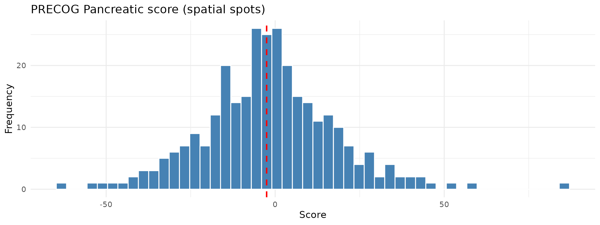
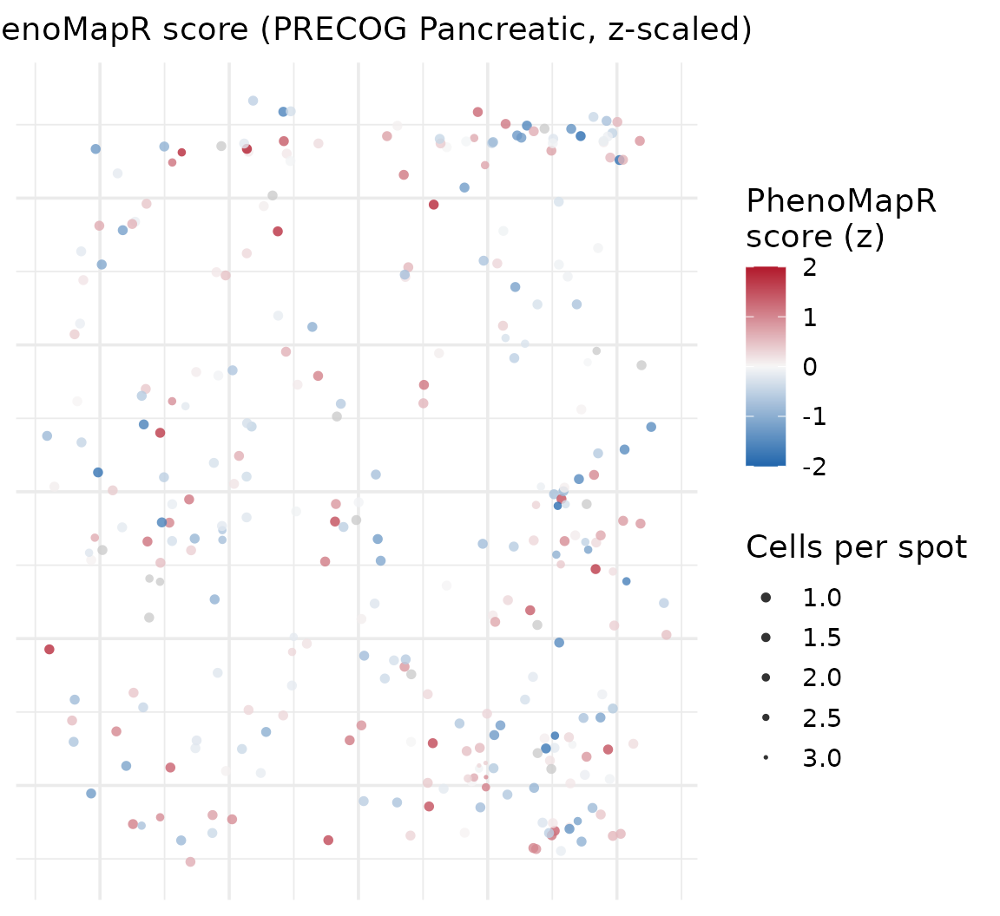
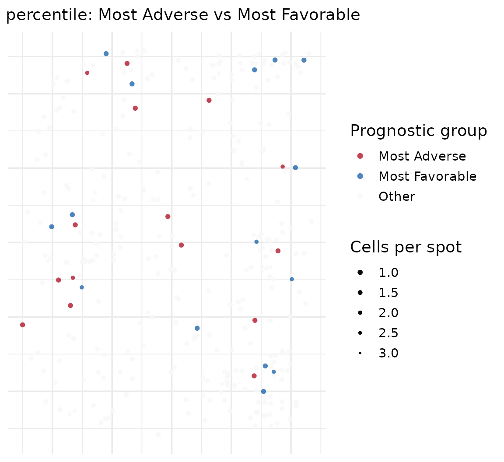
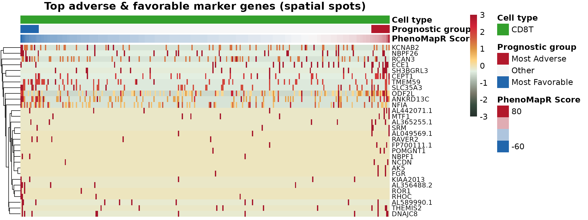
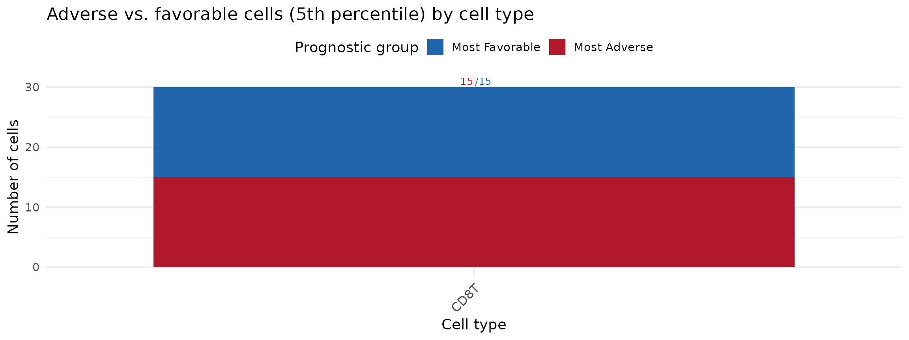

# Scoring spatial transcriptomics with PhenoMapR

## Overview

This vignette demonstrates using PhenoMapR on **spatial
transcriptomics** data. We use the processed spatial object
**HT270P1-S1H2Fc2U1Z1Bs1-H2Bs2-Test_processed**
(`HT270P1-S1H2Fc2U1Z1Bs1-H2Bs2-Test_processed.rds`) to score spots with
the PRECOG **Pancreatic** reference, define adverse vs. favorable
prognostic groups, and visualize both score distributions and **where**
PhenoMapR scores localize on the tissue image. The workflow mirrors the
single-cell vignette but adds spatial plots to show score and prognostic
group across the slide.

## Load and setup

Load PhenoMapR and Seurat, and locate the spatial RDS file. Place
`HT270P1-S1H2Fc2U1Z1Bs1-H2Bs2-Test_processed.rds` in `vignettes/` or the
project root (see
[vignettes/README.md](https://brooksbenard.github.io/PhenoMapR/articles/README.md)).

``` r
suppressPackageStartupMessages(library(PhenoMapR))
suppressPackageStartupMessages(library(Seurat))
suppressPackageStartupMessages(library(ggplot2))
if (!exists("PhenoMap", mode = "function")) {
  stop("PhenoMap not found. Reinstall PhenoMapR from source: devtools::install() or install.packages('.', repos = NULL, type = 'source')")
}
knitr::opts_chunk$set(fig.width = 12, out.width = "100%", warning = FALSE)
theme_set(theme_minimal(base_size = 14))

report_timing <- function(step_name, t0, obj = NULL) {
  elapsed <- as.numeric(difftime(Sys.time(), t0, units = "secs"))
  mem_mb <- if (!is.null(obj)) format(object.size(obj), units = "MB") else "-"
  message(sprintf("[%s] Runtime: %.2f s | Memory: %s", step_name, elapsed, mem_mb))
}

# Vignette data: local paths, then Google Drive (https://drive.google.com/drive/folders/1rKGZBX7sa_Iq8AJb1wcxiRc3oD6v6B5n)
spatial_subset <- system.file("extdata/vignette_subsets/HT270P1_processed_subset.rds", package = "PhenoMapR")
use_subset <- nzchar(Sys.getenv("CI", "")) || nzchar(Sys.getenv("PKGDOWN_DEV_MODE", ""))
rds_path <- if (use_subset && file.exists(spatial_subset)) spatial_subset else "vignettes/HT270P1-S1H2Fc2U1Z1Bs1-H2Bs2-Test_processed.rds"
if (!file.exists(rds_path)) rds_path <- "Vignettes/HT270P1-S1H2Fc2U1Z1Bs1-H2Bs2-Test_processed.rds"
if (!file.exists(rds_path)) rds_path <- "HT270P1-S1H2Fc2U1Z1Bs1-H2Bs2-Test_processed.rds"
if (!file.exists(rds_path) && !nzchar(Sys.getenv("CI", "")) && requireNamespace("googledrive", quietly = TRUE)) {
  googledrive::drive_deauth()
  googledrive::drive_download(googledrive::as_id("1HM0dBrQnaNsdm5mnq23aaQ2ILofJ0_vj"), rds_path, overwrite = TRUE)
}
if (!file.exists(rds_path)) {
  url <- Sys.getenv("PHENOMAPR_SPATIAL_RDS_URL", "")
  if (nzchar(url)) tryCatch({ download.file(url, rds_path, mode = "wb", quiet = TRUE) }, error = function(e) NULL)
}
has_data <- file.exists(rds_path)
knitr::opts_chunk$set(eval = has_data)
if (!has_data) {
  message("HT270P1-S1H2Fc2U1Z1Bs1-H2Bs2-Test_processed.rds not found. See Vignettes/README.md for data instructions.")
} else {
  suppressMessages({
    seurat <- PhenoMapR::load_rds_fast(rds_path)
    update_fn <- tryCatch(
      get("UpdateSeuratObject", envir = asNamespace("SeuratObject")),
      error = function(e) get0("UpdateSeuratObject", envir = asNamespace("Seurat"), mode = "function")
    )
    if (is.function(update_fn)) {
      seurat <- tryCatch(update_fn(seurat), error = function(e) seurat)
    }
  })
  assay_use <- if ("Spatial" %in% names(seurat@assays)) "Spatial" else "RNA"
  n_genes <- nrow(seurat)
  n_spots <- ncol(seurat)
  n_images <- length(seurat@images)
  head(colnames(seurat@meta.data))
}
```

    ## [1] "orig.ident"           "nCount_Spatial"       "nFeature_Spatial"    
    ## [4] "Row.names"            "Cell"                 "precog_score_pearson"

## Score spots with PRECOG Pancreatic

Apply PhenoMapR using the built-in PRECOG primary **Pancreatic**
reference, then add scores to the Seurat object metadata.

``` r
suppressMessages({
  scores_spatial <- PhenoMapR::PhenoMap(
    expression = seurat,
    reference = "precog",
    cancer_type = "Pancreatic",
    assay = assay_use,
    slot = "data",
    verbose = FALSE
  )
  seurat <- PhenoMapR::add_scores_to_seurat(seurat, scores_spatial)
})
score_col <- grep("weighted_sum_score", names(scores_spatial), value = TRUE)[1]
summary(seurat@meta.data[[score_col]])
```

    ##    Min. 1st Qu.  Median    Mean 3rd Qu.    Max. 
    ## -63.235 -13.566  -2.528  -1.761   9.433  85.550

## Score distribution

Distribution of PhenoMapR (PRECOG Pancreatic) scores across spots.

``` r
plot_score_distribution(
  seurat@meta.data[[score_col]],
  main = "PRECOG Pancreatic score (spatial spots)",
  base_size = 14
)
```



## Score by cell type or cluster (if available)

If the object has cell type or cluster annotations (e.g. **CellType**),
we can see how scores vary by group. For
HT270P1-S1H2Fc2U1Z1Bs1-H2Bs2-Test_processed, cell types may be in a
separate file from CytoSpace; we try to load a companion table and add
**CellType** to the object if it is not already in `meta.data`.

``` r
# If CellType is missing, try a companion file (e.g. *_celltypes.csv or *_annotations.csv next to the RDS)
tried <- character(0)
if (!"CellType" %in% names(seurat@meta.data)) {
  rds_dir <- dirname(rds_path)
  rds_base <- sub("\\.rds$", "", basename(rds_path))
  for (suffix in c("_celltypes.csv", "_annotations.csv", "_celltype.csv", "_metadata.csv")) {
    f <- file.path(rds_dir, paste0(rds_base, suffix))
    if (file.exists(f)) {
      tried <- c(tried, f)
      tab <- tryCatch(utils::read.csv(f, stringsAsFactors = FALSE), error = function(e) NULL)
      if (!is.null(tab) && nrow(tab) > 0) {
        # Find a column that looks like cell type (many unique character values) and one for cell/spot ID
        id_col <- NULL
        type_col <- NULL
        for (c in c("CellType", "celltype", "cell_type", "annotation", "celltype_predicted")) {
          if (c %in% names(tab)) { type_col <- c; break }
        }
        if (is.null(type_col)) type_col <- names(tab)[sapply(tab, function(x) is.character(x) || is.factor(x))][1]
        for (c in c("cell", "barcode", "spot", "id", "Cell", "Barcode")) {
          if (any(tolower(names(tab)) == tolower(c))) {
            id_col <- names(tab)[tolower(names(tab)) == tolower(c)][1]
            break
          }
        }
        if (is.null(id_col)) id_col <- names(tab)[1]
        if (!is.null(type_col) && type_col %in% names(tab)) {
          types <- setNames(as.character(tab[[type_col]]), tab[[id_col]])
          cells <- colnames(seurat)
          match_idx <- match(cells, names(types))
          if (sum(!is.na(match_idx)) > 0) {
            seurat$CellType <- types[match_idx]
            NULL
            break
          }
        }
      }
    }
  }
}
if (!"CellType" %in% names(seurat@meta.data) && length(tried) > 0) {
  message("Companion files tried: ", paste(basename(tried), collapse = ", "), "; no match by cell ID.")
}
```

``` r
# Prefer CellType; then any column with 2--100 discrete levels (e.g. orig.ident, clusters)
spatial_celltype_pal <- NULL
spatial_celltype_col <- NULL
meta_names <- names(seurat@meta.data)
celltype_col <- NULL
for (c in c("CellType", "Celltype..major.lineage.", "cell_type", "celltype", "annotation", "seurat_clusters")) {
  if (c %in% meta_names) {
    celltype_col <- c
    break
  }
}
if (is.null(celltype_col)) {
  idx <- grep("celltype|cluster|annotation", meta_names, ignore.case = TRUE)
  if (length(idx) > 0) celltype_col <- meta_names[idx[1]]
}
# Last resort: use first metadata column that has 2--100 unique values (discrete grouping)
if (is.null(celltype_col)) {
  for (c in meta_names) {
    if (c == score_col) next
    raw <- seurat@meta.data[[c]]
    if (is.list(raw)) raw <- vapply(raw, function(x) as.character(x)[1], character(1))
    else raw <- as.character(raw)
    n_u <- length(unique(na.omit(raw)))
    if (n_u >= 2L && n_u <= 100L) {
      celltype_col <- c
      break
    }
  }
}

df <- seurat@meta.data
n_meta <- nrow(df)
ann_vec <- NULL
if (!is.null(celltype_col)) {
  raw <- df[[celltype_col]]
  if (is.list(raw)) {
    ann_vec <- vapply(raw, function(x) if (is.null(x) || length(x) == 0) NA_character_ else as.character(x)[1], character(1))
  } else {
    ann_vec <- as.vector(raw)
  }
  if (length(ann_vec) != n_meta) ann_vec <- NULL
}
if (is.null(ann_vec)) {
  message("No annotation column with 2--100 levels found. To plot score by cell type, add a CellType column to the object (e.g. from a CytoSpace annotation file).")
  df$annotation <- factor(rep("all", n_meta))
  celltype_col <- "annotation"
  seurat$annotation <- df$annotation
} else {
  df$annotation <- factor(ann_vec, exclude = NULL)
}

n_levels <- length(levels(df$annotation))
# Allow 2--100 levels for boxplot (covers 16 cell types and similar datasets)
if (n_levels >= 2L && n_levels <= 100L) {
  pal <- PhenoMapR::get_celltype_palette(levels(df$annotation))
  print(ggplot(df, aes(
    x = reorder(.data$annotation, .data[[score_col]], FUN = median),
    y = .data[[score_col]],
    fill = .data$annotation
  )) +
    geom_boxplot(outlier.alpha = 0.3) +
    scale_fill_manual(values = pal, name = celltype_col) +
    theme_minimal(base_size = 14) +
    theme(
      axis.text.x = element_text(angle = 45, hjust = 1, size = 12),
      legend.position = "right"
    ) +
    labs(y = "PRECOG Pancreatic score", x = celltype_col, title = "Score by annotation (spatial)"))
} else {
  spatial_celltype_pal <- NULL
  spatial_celltype_col <- NULL
  message("Single or too many annotation levels (", n_levels, "); skipping boxplot.")
}
```

    ## Single or too many annotation levels (1); skipping boxplot.

## Define prognostic groups

Label spots as Most Adverse (top 5%), Most Favorable (bottom 5%), or
Other, then attach to metadata for spatial plotting.

``` r
scores_df <- seurat@meta.data[, grep("weighted_sum_score", names(seurat@meta.data)), drop = FALSE]
groups <- PhenoMapR::define_prognostic_groups(scores_df, percentile = 0.05)
suppressMessages(seurat <- AddMetaData(seurat, groups))

group_col <- paste0("prognostic_group_", score_col)
if (!group_col %in% names(seurat@meta.data)) group_col <- grep("prognostic_group", names(seurat@meta.data), value = TRUE)[1]
table(seurat@meta.data[[group_col]], useNA = "ifany")
```

    ## 
    ##   Most Adverse Most Favorable          Other 
    ##             15             15            270

## Spatial plots: where do PhenoMapR scores localize?

We plot **cell type**, **PhenoMapR score** (z-scaled for display), and
**5th percentile prognostic groups** in spatial coordinates. High (red)
scores indicate more adverse prognostic expression; low (blue) indicate
more favorable.

``` r
suppressPackageStartupMessages(library(dplyr))
coords <- tryCatch(
  suppressMessages(Seurat::GetTissueCoordinates(seurat)),
  error = function(e) NULL
)
if (is.null(coords) && length(seurat@images) > 0L) {
  img <- seurat@images[[1]]
  coords <- tryCatch(img@coordinates, error = function(e) NULL)
}
# Fallback: look for row/col or imagerow/imagecol in metadata
if (is.null(coords) || nrow(coords) == 0) {
  meta <- seurat@meta.data
  for (pair in list(
    c("row", "col"),
    c("imagerow", "imagecol"),
    c("x", "y"),
    c("tile", "cell")
  )) {
    if (pair[1] %in% names(meta) && pair[2] %in% names(meta)) {
      coords <- meta[, pair, drop = FALSE]
      names(coords) <- c("row", "col")
      break
    }
  }
}
if (!is.null(coords) && nrow(coords) > 0) {
  if (!"row" %in% names(coords)) coords$row <- coords[[grep("row|imagerow|x", names(coords), ignore.case = TRUE)[1]]]
  if (!"col" %in% names(coords)) coords$col <- coords[[grep("col|imagecol|y", names(coords), ignore.case = TRUE)[1]]]
  spatial_df <- as.data.frame(seurat@meta.data)
  spatial_df$cell_id <- rownames(spatial_df)
  # Align coordinates by cell id (coords rownames match cell barcodes)
  ids <- spatial_df$cell_id
  spatial_df$row <- coords[match(ids, rownames(coords)), "row"]
  spatial_df$col <- coords[match(ids, rownames(coords)), "col"]
  if (!is.null(group_col)) spatial_df$prognostic_group <- spatial_df[[group_col]]
  # Cell type for spatial: use spatial_celltype_col if set, else find CellType or any 2--100 level column
  celltype_plot_col <- NULL
  if (!is.null(spatial_celltype_col) && spatial_celltype_col %in% names(spatial_df)) {
    celltype_plot_col <- spatial_celltype_col
  } else if ("CellType" %in% names(spatial_df)) {
    celltype_plot_col <- "CellType"
  } else {
    idx <- grep("celltype|cell_type|annotation", names(spatial_df), ignore.case = TRUE)
    if (length(idx) > 0) celltype_plot_col <- names(spatial_df)[idx[1]]
  }
  if (is.null(celltype_plot_col)) {
    for (c in setdiff(names(spatial_df), c(score_col, group_col, "cell_id", "row", "col", "prognostic_group"))) {
      raw <- spatial_df[[c]]
      if (is.list(raw)) raw <- vapply(raw, function(x) as.character(x)[1], character(1))
      else raw <- as.character(raw)
      if (length(unique(na.omit(raw))) >= 2L && length(unique(na.omit(raw))) <= 100L) {
        celltype_plot_col <- c
        break
      }
    }
  }
  if (!is.null(celltype_plot_col)) {
    spatial_df$celltype_plot <- factor(spatial_df[[celltype_plot_col]], exclude = NULL)
    spatial_df_celltype_col <- celltype_plot_col
    n_lev <- length(levels(spatial_df$celltype_plot))
    if (n_lev >= 2L && (is.null(spatial_celltype_pal) || length(spatial_celltype_pal) != n_lev)) {
      spatial_celltype_pal <- PhenoMapR::get_celltype_palette(levels(spatial_df$celltype_plot))
      spatial_celltype_col <- celltype_plot_col
    }
  } else {
    spatial_df$celltype_plot <- NULL
    spatial_df_celltype_col <- NULL
  }
  spatial_df <- spatial_df %>%
    group_by(.data$row, .data$col) %>%
    mutate(points_per_location = n()) %>%
    ungroup()
  # Scaled PhenoMapR score (z-score) for gradient plot so colors show variation
  if (score_col %in% names(spatial_df)) {
    raw_score <- as.numeric(spatial_df[[score_col]])
    spatial_df$phenomapr_scaled <- as.numeric(scale(raw_score))
  } else {
    spatial_df$phenomapr_scaled <- NA_real_
  }
  # Shared jitter and point size so all three spatial plots match (multiple cells per spot)
  rng_row <- diff(range(spatial_df$row, na.rm = TRUE))
  rng_col <- diff(range(-spatial_df$col, na.rm = TRUE))
  spatial_jitter_w <- max(0.15, if (rng_row > 0) rng_row * 0.025 else 0.15)
  spatial_jitter_h <- max(0.15, if (rng_col > 0) rng_col * 0.025 else 0.15)
  spatial_point_range <- c(0.5, 1.6)
  has_spatial_coords <- TRUE
} else {
  has_spatial_coords <- FALSE
  message("No spatial coordinates found; skipping spatial plots.")
}
```

### Where cell types are

``` r
if (exists("has_spatial_coords") && has_spatial_coords && !is.null(spatial_df$celltype_plot) &&
    length(levels(spatial_df$celltype_plot)) >= 2L) {
  ct_col <- if (exists("spatial_df_celltype_col") && !is.null(spatial_df_celltype_col)) spatial_df_celltype_col else spatial_celltype_col
  ct_freq <- sort(table(spatial_df$celltype_plot, useNA = "no"), decreasing = TRUE)
  ct_order <- names(ct_freq)
  spatial_df$celltype_zorder <- as.numeric(factor(as.character(spatial_df$celltype_plot), levels = ct_order))
  ct_pal <- if (!is.null(spatial_celltype_pal)) spatial_celltype_pal else PhenoMapR::get_celltype_palette(levels(spatial_df$celltype_plot))
  p3 <- ggplot(spatial_df, aes(x = .data$row, y = -.data$col, color = .data$celltype_plot,
    size = points_per_location, zorder = .data$celltype_zorder)) +
    geom_jitter(alpha = 0.8, width = spatial_jitter_w, height = spatial_jitter_h, shape = 16) +
    ggtitle(paste("Cell type (", ct_col, ")", sep = "")) +
    scale_color_manual(values = ct_pal, name = ct_col, na.value = "grey90") +
    scale_size_continuous(range = spatial_point_range, trans = "reverse", name = "Cells per spot") +
    theme_minimal(base_size = 14) +
    theme(
      plot.title = element_text(hjust = 0.5, size = 14),
      axis.text = element_blank(),
      axis.ticks = element_blank(),
      axis.title = element_blank()
    )
  print(p3)
}
```

### Where raw PhenoMapR scores are

Spatial map of PhenoMapR score (z-scaled for color gradient). Blue =
more favorable, red = more adverse.

``` r
if (exists("has_spatial_coords") && has_spatial_coords) {
  score_vals <- spatial_df$phenomapr_scaled
  p1 <- ggplot(spatial_df, aes(x = .data$row, y = -.data$col, color = score_vals,
    size = points_per_location, zorder = score_vals)) +
    geom_jitter(alpha = 0.8, width = spatial_jitter_w, height = spatial_jitter_h, shape = 16) +
    ggtitle("PhenoMapR score (PRECOG Pancreatic, z-scaled)") +
    scale_color_gradientn(
      colors = colorRampPalette(c("#2166AC", "#F7F7F7", "#B2182B"))(100),
      name = "PhenoMapR\nscore (z)",
      limits = c(-2, 2),
      na.value = "grey80"
    ) +
    scale_size_continuous(range = spatial_point_range, trans = "reverse", name = "Cells per spot") +
    theme_minimal(base_size = 14) +
    theme(
      plot.title = element_text(hjust = 0.5, size = 14),
      axis.text = element_blank(),
      axis.ticks = element_blank(),
      axis.title = element_blank()
    )
  print(p1)
}
```



### Where 5th percentile cells are

Spatial map of prognostic groups: top 5% (Most Adverse), bottom 5% (Most
Favorable), and the rest (Other).

``` r
if (exists("has_spatial_coords") && has_spatial_coords && !is.null(group_col)) {
  pg <- as.character(spatial_df$prognostic_group)
  df_other <- spatial_df[pg == "Other" | is.na(pg), ]
  df_extreme <- spatial_df[pg %in% c("Most Adverse", "Most Favorable"), ]
  p2 <- ggplot() +
    geom_jitter(data = df_other, aes(x = .data$row, y = -.data$col, color = .data$prognostic_group,
      size = points_per_location), alpha = 0.8, width = spatial_jitter_w, height = spatial_jitter_h, shape = 16) +
    geom_jitter(data = df_extreme, aes(x = .data$row, y = -.data$col, color = .data$prognostic_group,
      size = points_per_location), alpha = 0.8, width = spatial_jitter_w, height = spatial_jitter_h, shape = 16) +
    ggtitle("5th percentile: Most Adverse vs Most Favorable") +
    scale_color_manual(
      values = c(`Most Adverse` = "#B2182B", Other = "#f7f7f7", `Most Favorable` = "#2166AC"),
      name = "Prognostic group",
      na.value = "grey90",
      drop = FALSE
    ) +
    scale_size_continuous(range = spatial_point_range, trans = "reverse", name = "Cells per spot") +
    theme_minimal(base_size = 14) +
    theme(
      plot.title = element_text(hjust = 0.5, size = 14),
      axis.text = element_blank(),
      axis.ticks = element_blank(),
      axis.title = element_blank()
    )
  print(p2)
}
```



## Prognostic markers

We first find marker genes for adverse vs. favorable spots, visualize
them in a heatmap (similar to the single-cell vignette), then define
**unique markers for each adverse/favorable cell type combination**
(e.g. adverse ductal, favorable B cell) and visualize those in a second
heatmap.

### Step 1: Markers for adverse vs. favorable spots

``` r
markers <- NULL
assay_markers <- NULL
if (!is.null(group_col)) {
  cells <- colnames(seurat)
  group_vec <- seurat@meta.data[cells, group_col]
  group_df <- data.frame(
    cell_id = cells,
    prognostic_group = as.character(group_vec),
    stringsAsFactors = FALSE
  )
  for (a in unique(c(assay_use, "RNA", "SCT"))) {
    if (!a %in% names(seurat@assays)) next
    markers <- tryCatch(
      PhenoMapR::find_prognostic_markers(
        seurat,
        group_labels = group_df,
        group_column = "prognostic_group",
        cell_id_column = "cell_id",
        assay = a,
        slot = "data",
        max_cells_per_ident = 5000L,
        verbose = FALSE
      ),
      error = function(e) {
        message("find_prognostic_markers (assay ", a, ") error: ", conditionMessage(e))
        NULL
      }
    )
    if (!is.null(markers) && (nrow(markers$adverse_markers) > 0 || nrow(markers$favorable_markers) > 0)) {
      assay_markers <- a
      break
    }
  }
  if (!is.null(markers)) {
    message("Adverse markers (top 5):")
    print(head(markers$adverse_markers, 5))
    message("Favorable markers (top 5):")
    print(head(markers$favorable_markers, 5))
  } else {
    message("Marker analysis returned no results. Check that Most Adverse and Most Favorable groups have enough cells.")
  }
}
```

    ## Adverse markers (top 5):

    ##          p_val avg_log2FC pct_in_group pct_rest gene        p_adj
    ## 1 7.098332e-10  11.319586        0.133    0.000  AK5 1.064750e-06
    ## 2 1.639154e-08   4.340578        0.200    0.007  SRM 2.458731e-05
    ## 3 1.038395e-07   2.416833        0.467    0.063 ECE1 1.557593e-04
    ## 4 1.005341e-06   3.997894        0.133    0.004  FGR 1.508012e-03
    ## 5 1.005341e-06   4.541735        0.133    0.004 NCDN 1.508012e-03

    ## Favorable markers (top 5):

    ##          p_val avg_log2FC pct_in_group pct_rest       gene        p_adj
    ## 1 4.142870e-07   2.962251        0.200    0.011 AL356488.2 0.0006214304
    ## 2 9.186476e-07   4.781275        0.133    0.004       ROR1 0.0013779713
    ## 3 1.005341e-06   3.611003        0.133    0.004      NBPF1 0.0015080122
    ## 4 3.925661e-05   1.663949        0.133    0.007       RHOC 0.0588849122
    ## 5 1.082102e-04   1.609730        0.533    0.137     TMEM59 0.1623153249

### Step 2: Heatmap of adverse vs. favorable markers

``` r
if (exists("markers") && !is.null(markers)) {
  n_top <- 15
  expr <- NULL
  assay_order <- unique(c(
    if (exists("assay_markers") && !is.null(assay_markers)) assay_markers else character(0),
    assay_use, "RNA", "SCT"
  ))
  for (a in assay_order) {
    if (!a %in% names(seurat@assays)) next
    expr <- tryCatch(
      Seurat::GetAssayData(seurat, layer = "data", assay = a),
      error = function(e) tryCatch(Seurat::GetAssayData(seurat, slot = "data", assay = a), error = function(e2) NULL)
    )
    if (!is.null(expr) && nrow(expr) > 0 && ncol(expr) > 0) break
    expr <- tryCatch(
      SeuratObject::LayerData(seurat, layer = "data", assay = a),
      error = function(e) NULL
    )
    if (is.null(expr) || ncol(expr) == 0) {
      expr <- tryCatch(
        SeuratObject::LayerData(seurat, layer = "counts", assay = a),
        error = function(e) tryCatch(SeuratObject::LayerData(seurat, layer = NULL, assay = a), error = function(e2) NULL)
      )
    }
    if (!is.null(expr) && nrow(expr) > 0 && ncol(expr) > 0) break
  }
  if (!is.null(expr) && ncol(expr) > 0) {
  adverse_pos <- markers$adverse_markers
  if (nrow(adverse_pos) > 0 && "avg_log2FC" %in% names(adverse_pos)) adverse_pos <- adverse_pos[adverse_pos$avg_log2FC > 0, ]
  favorable_pos <- markers$favorable_markers
  if (nrow(favorable_pos) > 0 && "avg_log2FC" %in% names(favorable_pos)) favorable_pos <- favorable_pos[favorable_pos$avg_log2FC > 0, ]
  pcol <- if ("p_adj" %in% names(markers$adverse_markers)) "p_adj" else if ("p_val_adj" %in% names(markers$adverse_markers)) "p_val_adj" else "p_val"
  top_genes <- unique(c(
    if (nrow(adverse_pos) > 0 && "gene" %in% names(adverse_pos)) head(adverse_pos$gene[order(adverse_pos[[pcol]])], n_top) else character(0),
    if (nrow(favorable_pos) > 0 && "gene" %in% names(favorable_pos)) head(favorable_pos$gene[order(favorable_pos[[pcol]])], n_top) else character(0)
  ))
  top_genes <- top_genes[top_genes %in% rownames(expr)]
  if (length(top_genes) == 0) top_genes <- head(rownames(expr), 20)

  cells_expr <- colnames(expr)
  if (is.null(cells_expr)) cells_expr <- character(0)
  cells_obj <- colnames(seurat)
  cells_meta <- rownames(seurat@meta.data)
  cells_use <- intersect(cells_expr, cells_obj)
  if (length(cells_use) == 0 && length(cells_meta) > 0) {
    cells_use <- intersect(cells_expr, cells_meta)
  }
  if (length(cells_use) == 0 && length(cells_expr) > 0 && any(grepl("_", cells_expr, fixed = TRUE))) {
    stripped <- sub("^[^_]+_", "", cells_expr)
    cells_use <- intersect(stripped, cells_obj)
    if (length(cells_use) == 0) cells_use <- intersect(stripped, cells_meta)
    if (length(cells_use) > 0) {
      expr_cols <- vapply(cells_use, function(c) cells_expr[which(stripped == c)[1]], character(1))
      expr <- expr[, expr_cols, drop = FALSE]
      colnames(expr) <- cells_use
    }
  }
  if (length(cells_use) == 0) {
    message("No overlapping cells between expression and metadata; skipping heatmap. ",
            "expr ncol=", length(cells_expr), ", obj ncol=", length(cells_obj),
            if (length(cells_expr) > 0) paste0("; expr sample: ", head(cells_expr, 2)) else "")
  } else {
  mat <- as.matrix(expr[top_genes, cells_use, drop = FALSE])
  mat_scaled <- t(scale(t(mat)))
  mat_scaled[mat_scaled < -3] <- -3
  mat_scaled[mat_scaled > 3] <- 3
  meta <- seurat@meta.data[cells_use, , drop = FALSE]
  ord <- order(meta[[score_col]])
  mat_scaled <- mat_scaled[, ord, drop = FALSE]
  meta_ord <- meta[ord, , drop = FALSE]

  group_col_heatmap <- paste0("prognostic_group_", score_col)
  if (!group_col_heatmap %in% names(meta_ord)) group_col_heatmap <- group_col

  if (requireNamespace("pheatmap", quietly = TRUE)) {
    ann_col <- data.frame(
      `PhenoMapR Score` = meta_ord[[score_col]],
      `Prognostic group` = factor(meta_ord[[group_col_heatmap]], levels = c("Most Adverse", "Other", "Most Favorable")),
      check.names = FALSE
    )
    ct_col_ann <- if (exists("spatial_df_celltype_col") && !is.null(spatial_df_celltype_col)) spatial_df_celltype_col else if (exists("celltype_col") && !is.null(celltype_col)) celltype_col else NULL
    if (!is.null(ct_col_ann) && ct_col_ann %in% names(meta_ord)) {
      ann_col$`Cell type` <- factor(meta_ord[[ct_col_ann]])
    }
    rownames(ann_col) <- colnames(mat_scaled)
    pal_score <- colorRampPalette(c("#2166AC", "#F7F7F7", "#B2182B"))(100)
    pal_group <- c(`Most Adverse` = "#B2182B", Other = "#f7f7f7", `Most Favorable` = "#2166AC")
    pal_celltype <- if ("Cell type" %in% names(ann_col)) {
      PhenoMapR::get_celltype_palette(levels(ann_col$`Cell type`))
    } else list()
    ann_colors <- list(
      `PhenoMapR Score` = pal_score,
      `Prognostic group` = pal_group
    )
    if (length(pal_celltype) > 0) ann_colors$`Cell type` <- pal_celltype
    heatmap_colors <- if (requireNamespace("paletteer", quietly = TRUE)) {
      colorRampPalette(paletteer::paletteer_d("MexBrewer::Vendedora"))(100)
    } else {
      colorRampPalette(c("#2166AC", "#F7F7F7", "#B2182B"))(100)
    }
    pheatmap::pheatmap(
      mat_scaled,
      scale = "none",
      cluster_cols = FALSE,
      cluster_rows = TRUE,
      show_colnames = FALSE,
      annotation_col = ann_col,
      annotation_colors = ann_colors,
      color = heatmap_colors,
      breaks = seq(-3, 3, length.out = 101),
      main = "Top adverse & favorable marker genes (spatial spots)",
      fontsize = 12,
      fontsize_row = 10,
      treeheight_row = 25
    )
  }
  }
  } else {
    msg <- "Could not retrieve expression data for heatmap"
    if (!is.null(expr)) {
      msg <- paste0(msg, " (expr nrow=", nrow(expr), ", ncol=", ncol(expr), "; try LayerData for Seurat v5)")
    }
    message(msg, ".")
  }
}
```



### Stacked barplot: adverse vs. favorable by cell type

Each column is a cell type; the height is filled by the number of
adverse (5th percentile) or favorable (5th percentile) cells.

``` r
if (!is.null(group_col)) {
  ct_col_bar <- NULL
  if (exists("spatial_df_celltype_col") && !is.null(spatial_df_celltype_col) && spatial_df_celltype_col %in% names(seurat@meta.data)) {
    ct_col_bar <- spatial_df_celltype_col
  } else if (exists("celltype_col") && !is.null(celltype_col) && celltype_col %in% names(seurat@meta.data)) {
    ct_col_bar <- celltype_col
  } else {
    for (c in c("CellType", "Celltype..major.lineage.", "cell_type", "celltype", "annotation", "seurat_clusters")) {
      if (c %in% names(seurat@meta.data) && length(unique(na.omit(seurat@meta.data[[c]]))) >= 2) {
        ct_col_bar <- c
        break
      }
    }
  }
  if (!is.null(ct_col_bar)) {
    meta <- seurat@meta.data
    meta$pg <- meta[[group_col]]
    meta$ct <- as.character(meta[[ct_col_bar]])
    meta$ct_ok <- !is.na(meta$ct) & nzchar(trimws(meta$ct))
    idx_extreme <- meta$pg %in% c("Most Adverse", "Most Favorable") & meta$ct_ok
    df_bar <- as.data.frame(table(
      CellType = meta$ct[idx_extreme],
      Prognostic_group = meta$pg[idx_extreme],
      useNA = "no"
    ))
    if (nrow(df_bar) > 0) {
      df_bar$Prognostic_group <- factor(df_bar$Prognostic_group, levels = c("Most Favorable", "Most Adverse"))
      pal_bar <- c(`Most Adverse` = "#B2182B", `Most Favorable` = "#2166AC")
      adverse <- df_bar[df_bar$Prognostic_group == "Most Adverse", c("CellType", "Freq")]
      fav <- df_bar[df_bar$Prognostic_group == "Most Favorable", c("CellType", "Freq")]
      names(adverse)[2] <- "n_adverse"
      names(fav)[2] <- "n_fav"
      df_labels <- merge(adverse, fav, by = "CellType", all = TRUE)
      df_labels$n_adverse[is.na(df_labels$n_adverse)] <- 0
      df_labels$n_fav[is.na(df_labels$n_fav)] <- 0
      df_labels$label <- paste0(df_labels$n_adverse, "/", df_labels$n_fav)
      df_labels$total <- df_labels$n_adverse + df_labels$n_fav
      ct_ord <- levels(reorder(df_bar$CellType, df_bar$Freq, function(x) -sum(x)))
      df_labels$CellType <- factor(df_labels$CellType, levels = ct_ord)
      p_bar <- ggplot(df_bar, aes(x = reorder(.data$CellType, .data$Freq, function(x) -sum(x)), y = .data$Freq, fill = .data$Prognostic_group)) +
        geom_col(position = "stack") +
        geom_text(data = df_labels, aes(x = .data$CellType, y = .data$total, label = .data$n_adverse),
                  inherit.aes = FALSE, vjust = -0.3, size = 3.5, color = "#B2182B", hjust = 1.05) +
        geom_text(data = df_labels, aes(x = .data$CellType, y = .data$total, label = paste0("/", .data$n_fav)),
                  inherit.aes = FALSE, vjust = -0.3, size = 3.5, color = "#2166AC", hjust = -0.05) +
        scale_fill_manual(values = pal_bar) +
        labs(x = "Cell type", y = "Number of cells", fill = "Prognostic group",
             title = "Adverse vs. favorable cells (5th percentile) by cell type") +
        theme_minimal(base_size = 14) +
        theme(axis.text.x = element_text(angle = 45, hjust = 1, size = 12), legend.position = "top")
      print(p_bar)
    }
  }
}
```



### Step 3: Unique markers for adverse/favorable cell types

For each combination of prognostic group and cell type (e.g. adverse
ductal, favorable B cell), we find genes that are uniquely upregulated
in that group vs. all other spots.

``` r
markers_by_ct <- NULL
ct_col_markers <- NULL
cat("Step 3: Finding unique markers for adverse/favorable cell types...\n")
```

    ## Step 3: Finding unique markers for adverse/favorable cell types...

``` r
if (is.null(group_col)) {
  cat("Skipping: prognostic groups not defined (group_col is NULL).\n")
} else {
  celltype_for_markers <- NULL
  if (exists("spatial_df_celltype_col") && !is.null(spatial_df_celltype_col) && spatial_df_celltype_col %in% names(seurat@meta.data)) {
    celltype_for_markers <- spatial_df_celltype_col
  } else if (exists("celltype_col") && !is.null(celltype_col) && celltype_col %in% names(seurat@meta.data)) {
    celltype_for_markers <- celltype_col
  } else {
    for (c in c("CellType", "Celltype..major.lineage.", "cell_type", "celltype", "annotation", "seurat_clusters")) {
      if (c %in% names(seurat@meta.data) && length(unique(na.omit(seurat@meta.data[[c]]))) >= 2) {
        celltype_for_markers <- c
        break
      }
    }
  }
  if (is.null(celltype_for_markers)) {
    cat("Skipping: no cell type column found in metadata.\n")
  } else {
    cat("Using cell type column:", celltype_for_markers, "\n")
    meta <- seurat@meta.data
    meta$pg <- meta[[group_col]]
    meta$ct <- as.character(meta[[celltype_for_markers]])
    meta$ct_ok <- !is.na(meta$ct) & nzchar(trimws(meta$ct))
    meta$combined_group <- "Other"
    meta$combined_group[meta$pg == "Most Adverse" & meta$ct_ok] <- paste0("Adverse_", gsub(" ", "_", meta$ct[meta$pg == "Most Adverse" & meta$ct_ok]))
    meta$combined_group[meta$pg == "Most Favorable" & meta$ct_ok] <- paste0("Favorable_", gsub(" ", "_", meta$ct[meta$pg == "Most Favorable" & meta$ct_ok]))
    idx_keep <- meta$pg %in% c("Most Adverse", "Most Favorable") & meta$ct_ok
    combined_tab <- table(meta$combined_group[idx_keep], useNA = "no")
    min_cells <- 10L
    combined_lev <- names(combined_tab)[combined_tab >= min_cells]
    if (length(combined_lev) >= 1L) {
      cat("Groups with >=", min_cells, " cells:", paste(combined_lev, collapse = ", "), "\n")
      seurat$PhenoMapR_combined_group <- meta$combined_group
      all_lev <- c(combined_lev, "Other")
      seurat$PhenoMapR_combined_group <- factor(seurat$PhenoMapR_combined_group, levels = all_lev)
      assay_fa <- if (exists("assay_markers") && !is.null(assay_markers) && assay_markers %in% names(seurat@assays)) {
        assay_markers
      } else if (assay_use %in% names(seurat@assays)) {
        assay_use
      } else {
        "RNA"
      }
      cat("Using assay for FindAllMarkers:", assay_fa, "(full object, ncol=", ncol(seurat), ")\n")
      find_args <- list(
        seurat,
        assay = assay_fa,
        group.by = "PhenoMapR_combined_group",
        test.use = "wilcox",
        min.pct = 0.05,
        logfc.threshold = 0.1,
        max.cells.per.ident = 3000,
        verbose = FALSE,
        only.pos = TRUE,
        return.thresh = 0.05
      )
      if ("layer" %in% names(formals(Seurat::FindAllMarkers))) {
        find_args$layer <- "data"
      } else {
        find_args$slot <- "data"
      }
      markers_by_ct <- tryCatch(
        do.call(Seurat::FindAllMarkers, find_args),
        error = function(e) {
          cat("FindAllMarkers (cell-type-specific) failed:", conditionMessage(e), "\n")
          NULL
        }
      )
      if (!is.null(markers_by_ct) && nrow(markers_by_ct) == 0) {
        cat("No markers with min.pct=0.05, logfc.threshold=0.1, return.thresh=0.05; retrying with relaxed thresholds...\n")
        find_args$min.pct <- 0
        find_args$logfc.threshold <- 0
        markers_by_ct <- tryCatch(
          do.call(Seurat::FindAllMarkers, find_args),
          error = function(e) NULL
        )
      }
      if (!is.null(markers_by_ct) && nrow(markers_by_ct) == 0) {
        cat("Retrying with return.thresh=1 (return all genes regardless of p-value)...\n")
        find_args$return.thresh <- 1
        markers_by_ct <- tryCatch(
          do.call(Seurat::FindAllMarkers, find_args),
          error = function(e) NULL
        )
        if (!is.null(markers_by_ct) && nrow(markers_by_ct) > 0) {
          markers_by_ct <- markers_by_ct[markers_by_ct$p_val_adj < 0.05, , drop = FALSE]
          cat("Filtered to p_val_adj < 0.05:", nrow(markers_by_ct), "markers.\n")
        }
      }
      if (!is.null(markers_by_ct) && nrow(markers_by_ct) > 0) {
        markers_by_ct <- markers_by_ct[markers_by_ct$cluster %in% combined_lev, , drop = FALSE]
        if (nrow(markers_by_ct) > 0) {
          ct_col_markers <- celltype_for_markers
          cat("Found markers for", length(unique(markers_by_ct$cluster)), "adverse/favorable cell type groups.\n")
          print(head(markers_by_ct[, c("gene", "cluster", "avg_log2FC", "p_val_adj")], 10))
        } else {
          cat("FindAllMarkers returned markers only for excluded groups (after filtering to adverse/favorable).\n")
        }
      } else {
        if (is.null(markers_by_ct)) {
          cat("FindAllMarkers failed or returned NULL.\n")
        } else {
          cat("FindAllMarkers returned 0 marker genes.\n")
        }
        tab_ct <- table(seurat$PhenoMapR_combined_group, useNA = "no")
        cat("Diagnostic: cells per group:", paste(names(tab_ct), "=", tab_ct, collapse = ", "), "\n")
        cat("Diagnostic: assay", assay_fa, "\n")
      }
    } else {
      cat("Insufficient cells in adverse/favorable cell type combinations (need >=", min_cells, " per group).\n")
      cat("Group counts:", paste(names(combined_tab), "=", combined_tab, collapse = ", "), "\n")
    }
  }
}
```

    ## Using cell type column: CellType 
    ## Groups with >= 10  cells: Adverse_CD8T, Favorable_CD8T 
    ## Using assay for FindAllMarkers: Spatial (full object, ncol= 300 )

    ## No markers with min.pct=0.05, logfc.threshold=0.1, return.thresh=0.05; retrying with relaxed thresholds...

    ## Retrying with return.thresh=1 (return all genes regardless of p-value)...

    ## FindAllMarkers returned 0 marker genes.
    ## Diagnostic: cells per group: Adverse_CD8T = 15, Favorable_CD8T = 15, Other = 270 
    ## Diagnostic: assay Spatial

### Step 4: Heatmap of cell-type-specific markers

``` r
cat("Step 4: Heatmap of cell-type-specific markers...\n")
```

    ## Step 4: Heatmap of cell-type-specific markers...

``` r
if (exists("markers_by_ct") && !is.null(markers_by_ct) && nrow(markers_by_ct) > 0 && exists("ct_col_markers") && !is.null(ct_col_markers)) {
  suppressPackageStartupMessages(library(dplyr))
  n_top_per_group <- 5
  top_genes_ct <- markers_by_ct %>%
    group_by(.data$cluster) %>%
    slice_min(.data$p_val_adj, n = n_top_per_group) %>%
    pull(.data$gene) %>%
    unique()
  top_genes_ct <- top_genes_ct[top_genes_ct %in% rownames(seurat)]
  if (length(top_genes_ct) > 0) {
    expr <- tryCatch(
      Seurat::GetAssayData(seurat, layer = "data", assay = assay_use),
      error = function(e) Seurat::GetAssayData(seurat, slot = "data", assay = assay_use)
    )
    if (is.null(expr) || ncol(expr) == 0) {
      expr <- tryCatch(
        SeuratObject::LayerData(seurat, layer = "data", assay = assay_use),
        error = function(e) tryCatch(SeuratObject::LayerData(seurat, layer = "counts", assay = assay_use), error = function(e2) NULL)
      )
    }
    if (!is.null(expr) && ncol(expr) > 0) {
    mat <- as.matrix(expr[top_genes_ct, , drop = FALSE])
    mat_scaled <- t(scale(t(mat)))
    mat_scaled[mat_scaled < -3] <- -3
    mat_scaled[mat_scaled > 3] <- 3
    meta <- seurat@meta.data
    meta$pg <- meta[[group_col]]
    meta$ct <- as.character(meta[[ct_col_markers]])
    meta$ct_ok <- !is.na(meta$ct) & nzchar(trimws(meta$ct))
    meta$combined_group <- "Other"
    meta$combined_group[meta$pg == "Most Adverse" & meta$ct_ok] <- paste0("Adverse_", gsub(" ", "_", meta$ct[meta$pg == "Most Adverse" & meta$ct_ok]))
    meta$combined_group[meta$pg == "Most Favorable" & meta$ct_ok] <- paste0("Favorable_", gsub(" ", "_", meta$ct[meta$pg == "Most Favorable" & meta$ct_ok]))
    ord <- order(meta$combined_group, meta[[score_col]])
    mat_scaled <- mat_scaled[, ord, drop = FALSE]
    meta_ord <- meta[ord, ]
    if (requireNamespace("pheatmap", quietly = TRUE)) {
      ann_col <- data.frame(
        `Prognostic × Cell type` = factor(meta_ord$combined_group),
        `PhenoMapR Score` = meta_ord[[score_col]],
        check.names = FALSE
      )
      rownames(ann_col) <- colnames(mat_scaled)
      pal_score <- colorRampPalette(c("#2166AC", "#F7F7F7", "#B2182B"))(100)
      heatmap_colors <- if (requireNamespace("paletteer", quietly = TRUE)) {
        colorRampPalette(paletteer::paletteer_d("MexBrewer::Vendedora"))(100)
      } else {
        colorRampPalette(c("#2166AC", "#F7F7F7", "#B2182B"))(100)
      }
      ann_colors <- list(
        `PhenoMapR Score` = pal_score
      )
      pheatmap::pheatmap(
        mat_scaled,
        scale = "none",
        cluster_cols = FALSE,
        cluster_rows = TRUE,
        show_colnames = FALSE,
        annotation_col = ann_col,
        annotation_colors = ann_colors,
        color = heatmap_colors,
        breaks = seq(-3, 3, length.out = 101),
        main = "Unique markers by adverse/favorable cell type (spatial spots)",
        fontsize = 12,
        fontsize_row = 10,
        treeheight_row = 25
      )
    }
    } else {
      cat("Could not retrieve expression data for cell-type heatmap.\n")
    }
  }
} else {
  cat("Skipping heatmap: no cell-type-specific markers found in Step 3.\n")
}
```

    ## Skipping heatmap: no cell-type-specific markers found in Step 3.

## Summary

- **Data**: Processed spatial object
  (`HT270P1-S1H2Fc2U1Z1Bs1-H2Bs2-Test_processed.rds`).
- **Scoring**: PhenoMapR with PRECOG **Pancreatic**; scores added to
  Seurat metadata.
- **Plots**: Score distribution, score by annotation (if present),
  prognostic groups, and **spatial maps** of cell type, continuous
  score, and prognostic group (points ordered so less frequent groups
  are drawn on top for visibility).
- **Markers**: (1) Adverse vs. favorable markers with heatmap; (2)
  unique markers for each adverse/favorable cell type combination
  (e.g. adverse ductal, favorable B cell) with a second heatmap.

## References

- **PRECOG 2.0**: Benard B, Lalgudi S, et al. PRECOG 2.0: an updated
  resource of pan-cancer gene-level prognostic meta-z scores. *Nucleic
  Acids Research*. 2026.

## Session Info

``` r
sessionInfo()
```

    ## R version 4.5.3 (2026-03-11)
    ## Platform: x86_64-pc-linux-gnu
    ## Running under: Ubuntu 24.04.3 LTS
    ## 
    ## Matrix products: default
    ## BLAS:   /usr/lib/x86_64-linux-gnu/openblas-pthread/libblas.so.3 
    ## LAPACK: /usr/lib/x86_64-linux-gnu/openblas-pthread/libopenblasp-r0.3.26.so;  LAPACK version 3.12.0
    ## 
    ## locale:
    ##  [1] LC_CTYPE=C.UTF-8       LC_NUMERIC=C           LC_TIME=C.UTF-8       
    ##  [4] LC_COLLATE=C.UTF-8     LC_MONETARY=C.UTF-8    LC_MESSAGES=C.UTF-8   
    ##  [7] LC_PAPER=C.UTF-8       LC_NAME=C              LC_ADDRESS=C          
    ## [10] LC_TELEPHONE=C         LC_MEASUREMENT=C.UTF-8 LC_IDENTIFICATION=C   
    ## 
    ## time zone: UTC
    ## tzcode source: system (glibc)
    ## 
    ## attached base packages:
    ## [1] stats     graphics  grDevices utils     datasets  methods   base     
    ## 
    ## other attached packages:
    ## [1] dplyr_1.2.0        ggplot2_4.0.2      Seurat_5.4.0       SeuratObject_5.3.0
    ## [5] sp_2.2-1           PhenoMapR_0.1.0   
    ## 
    ## loaded via a namespace (and not attached):
    ##   [1] deldir_2.0-4           pbapply_1.7-4          gridExtra_2.3         
    ##   [4] rematch2_2.1.2         rlang_1.1.7            magrittr_2.0.4        
    ##   [7] RcppAnnoy_0.0.23       otel_0.2.0             spatstat.geom_3.7-0   
    ##  [10] matrixStats_1.5.0      ggridges_0.5.7         compiler_4.5.3        
    ##  [13] png_0.1-8              systemfonts_1.3.2      vctrs_0.7.1           
    ##  [16] reshape2_1.4.5         stringr_1.6.0          pkgconfig_2.0.3       
    ##  [19] fastmap_1.2.0          labeling_0.4.3         promises_1.5.0        
    ##  [22] rmarkdown_2.30         ragg_1.5.1             fastSave_0.1.0        
    ##  [25] purrr_1.2.1            xfun_0.56              cachem_1.1.0          
    ##  [28] jsonlite_2.0.0         goftest_1.2-3          later_1.4.8           
    ##  [31] spatstat.utils_3.2-2   irlba_2.3.7            parallel_4.5.3        
    ##  [34] cluster_2.1.8.2        R6_2.6.1               ica_1.0-3             
    ##  [37] spatstat.data_3.1-9    bslib_0.10.0           stringi_1.8.7         
    ##  [40] RColorBrewer_1.1-3     reticulate_1.45.0      spatstat.univar_3.1-6 
    ##  [43] parallelly_1.46.1      lmtest_0.9-40          jquerylib_0.1.4       
    ##  [46] scattermore_1.2        Rcpp_1.1.1             knitr_1.51            
    ##  [49] tensor_1.5.1           future.apply_1.20.2    zoo_1.8-15            
    ##  [52] sctransform_0.4.3      httpuv_1.6.16          Matrix_1.7-4          
    ##  [55] splines_4.5.3          igraph_2.2.2           tidyselect_1.2.1      
    ##  [58] abind_1.4-8            yaml_2.3.12            spatstat.random_3.4-4 
    ##  [61] spatstat.explore_3.7-0 codetools_0.2-20       miniUI_0.1.2          
    ##  [64] listenv_0.10.1         lattice_0.22-9         tibble_3.3.1          
    ##  [67] plyr_1.8.9             withr_3.0.2            shiny_1.13.0          
    ##  [70] S7_0.2.1               ROCR_1.0-12            evaluate_1.0.5        
    ##  [73] Rtsne_0.17             future_1.69.0          fastDummies_1.7.5     
    ##  [76] desc_1.4.3             survival_3.8-6         polyclip_1.10-7       
    ##  [79] fitdistrplus_1.2-6     pillar_1.11.1          KernSmooth_2.23-26    
    ##  [82] plotly_4.12.0          generics_0.1.4         RcppHNSW_0.6.0        
    ##  [85] paletteer_1.7.0        scales_1.4.0           globals_0.19.0        
    ##  [88] xtable_1.8-8           glue_1.8.0             pheatmap_1.0.13       
    ##  [91] lazyeval_0.2.2         tools_4.5.3            data.table_1.18.2.1   
    ##  [94] RSpectra_0.16-2        RANN_2.6.2             fs_1.6.7              
    ##  [97] dotCall64_1.2          cowplot_1.2.0          grid_4.5.3            
    ## [100] tidyr_1.3.2            nlme_3.1-168           patchwork_1.3.2       
    ## [103] presto_1.0.0           cli_3.6.5              spatstat.sparse_3.1-0 
    ## [106] textshaping_1.0.5      spam_2.11-3            viridisLite_0.4.3     
    ## [109] uwot_0.2.4             gtable_0.3.6           sass_0.4.10           
    ## [112] digest_0.6.39          prismatic_1.1.2        progressr_0.18.0      
    ## [115] ggrepel_0.9.7          htmlwidgets_1.6.4      farver_2.1.2          
    ## [118] htmltools_0.5.9        pkgdown_2.2.0          lifecycle_1.0.5       
    ## [121] httr_1.4.8             mime_0.13              MASS_7.3-65
