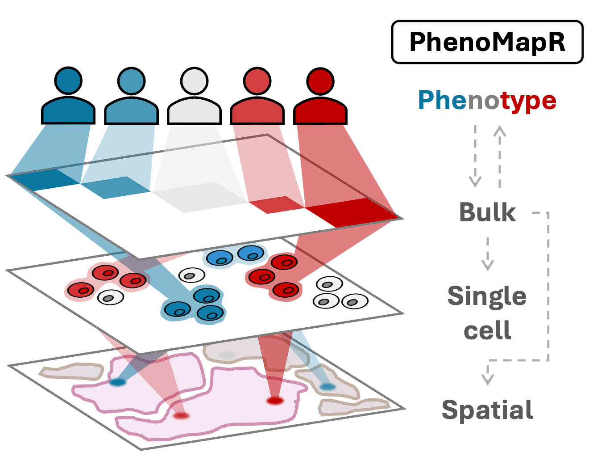
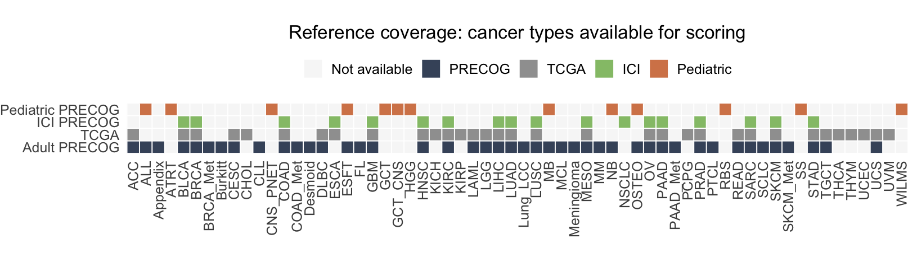

## Introduction



Single-cell and spatial transcriptomics methods provide an improved resolution and understanding of the cell types and spatial organization underlying healthy and malignant biology. However, many single-cell and spatial studies lack sufficient sample size for robust associations between a sample phenotype (e.g. overall survival) and cell types or spatial locations. In contrast, lower resolution methods such as bulk gene expression profiling have been applied at scale in large, clinically-annotated datasets, providing robust signatures for phenotype associations such as outcomes across cancers (e.g. [PRECOG 2.0](https://precog.stanford.edu/)). **PhenoMapR bridges this gap between the improved resolution of single-cell/spatial approaches and the phenotype signals identified across bulk expression studies** by mapping the phenotypic signal directly onto individual cells and spatial locations. Although developed with a cancer-centric focus, PhenoMapR can be used to map any phenotypic signal associated with bulk expression datasets across transcriptomic data modalities.

--- 


## Features

PhenoMapR is intended to be a flexible framework for mapping phenotypic signal between gene expression data acquired and stored in different formats. Some of the main features of PhenoMapR are:

| Feature | Description |
|:----------|:-------------|
| **Works with Multiple Input Formats** | Supports matrices, data.frames, Seurat, SingleCellExperiment, SpatialExperiment, and AnnData objects |
| **Built-in Bulk Cancer Phenotype References** | Pre-calculated gene expression meta-z scores for outcomes across TCGA & Adult/Pediatric/Immunotherapy PRECOG datasets |
| **Flexible Scoring** | Score bulk, single-cell, and spatial inputs. For single-cell and spatial data, pseudobulk scoring can also be performed |
| **Custom Signatures** | Not interested in cancer? Generate and/or use your own z-score phenotype references |
| **Marker Gene Identification** | Automated marker gene identification of phenotype associated cells/spots |
| **Efficient** | Optimized approach for ultra-fast scoring |

--- 

## Getting Started

The primary function of PhenoMapR is **`PhenoMap()`**. The basic use of this function takes a gene expression file **+** a reference phenotype signature and generates a dataframe of PhenoMapR score per sample/cell/spot. For single-cell and spatial inputs, a sample-level PhenoMapR score can be generated using the pseudobulk argument.

**`PhenoMap()` arguments:**

| Argument | Description |
|----------|-------------|
| **expression** | Expression data (matrix, Seurat, SCE, etc.) |
| **reference** | Reference dataset name or custom data.frame |
| **cancer_type** | Cancer type label (required for built-in references) |
| **z_score_cutoff** | Absolute z-score threshold (default: 2) |
| **pseudobulk** | Aggregate samples/slices before scoring? (default: FALSE) |
| **group_by** | Grouping variable for pseudobulk |
| **assay** | Assay name for Seurat/SCE objects |
| **slot** | Seurat slot ("data", "counts", "scale.data") |
| **verbose** | Print progress messages |

For the simplest use case of PhenoMapR, impliment the following:

```r
# Load PhenoMapR in your R session using:
library(PhenoMapR)

# Score samples in a bulk expression matrix
scores <- PhenoMap(
  expression = bulk_matrix,     # genes (rownames) x samples (colnames)
  reference = "precog",         # can be one of precog, pediatric_precog, ici_precog, or tcga
  cancer_type = "BRCA"          # use list_cancer_types(reference) to see avaliable options
)

# Score single-cell/spatial data
scores <- PhenoMap(
  expression = seurat_obj,
  reference = "tcga",
  cancer_type = "LUAD",
  assay = if ("Spatial" %in% names(seurat_obj@assays)) "Spatial" else "RNA",
  slot = if ("Spatial" %in% names(seurat_obj@assays)) "counts" else "data"
)
```

## Supported Input Types

Each input type is summarized below; expand a section to see example code.

<details>
<summary><strong> Matrix/Data.frame</strong></summary>

Expression matrix: genes (rows) x samples/cells (columns).

```r
expression_matrix <- matrix(...)
rownames(expression_matrix) <- gene_names
colnames(expression_matrix) <- cell_names

scores <- PhenoMap(expression_matrix, reference = "precog", cancer_type = "BRCA")
```

</details>

<details>
<summary><strong> Seurat Objects</strong></summary>

Single-cell and spatial Seurat objects; use `assay` and `slot` to match your data.

```r
library(Seurat)

# Single-cell
scores <- PhenoMap(
  seurat_obj,
  reference = "tcga",
  cancer_type = "LUAD",
  assay = "RNA",
  slot = "data"
)

# Add scores back to Seurat object
seurat_obj <- add_scores_to_seurat(seurat_obj, scores)

# Spatial
scores <- PhenoMap(
  spatial_seurat,
  reference = "precog",
  cancer_type = "BRCA",
  assay = "Spatial",
  slot = "counts"
)
```

</details>

<details>
<summary><strong> SingleCellExperiment Objects</strong></summary>

Use the assay name that holds your (e.g. log-normalized) expression.

```r
library(SingleCellExperiment)

scores <- PhenoMap(
  sce_obj,
  reference = "pediatric_precog",
  cancer_type = "Neuroblastoma",
  assay = "logcounts"
)

# Add scores to colData
sce_obj <- add_scores_to_sce(sce_obj, scores)
```

</details>

<details>
<summary><strong> AnnData Objects</strong></summary>

PhenoMapR can score AnnData objects via `reticulate` (e.g. from Scanpy).

```r
library(reticulate)

adata <- import("scanpy")$read_h5ad("data.h5ad")

scores <- PhenoMap(
  adata,
  reference = "precog",
  cancer_type = "BRCA"
)
```

</details>

## Built-in Reference Datasets

Prognostic meta-z scores for adult, pediatric, and immunotherapy references in PhenoMapR are sourced from **PRECOG 2.0** ([Benard et al., *Nucleic Acids Research* 2026](https://academic.oup.com/nar/article/54/D1/D1579/8324954)).

**Reference coverage** — Cancer types available for scoring in each built-in database (TCGA, Adult PRECOG, Pediatric PRECOG, ICI PRECOG). Use `list_cancer_types("precog")` (or `"tcga"`, `"pediatric_precog"`, `"ici_precog"`) to see labels for your reference of choice.

<div class="reference-coverage-plot">



</div>

## Under the hood
At a high level, PhenoMapR:

- **Processes the input gene expression data** into a cleaned format by updating gene IDs and normalizing the expression.
- **Selects pan-cancer prognostic meta-z scores** from PRECOG/TCGA based on input cancer type.
- **Filters to strongly prognostic genes** (by |z-score|) and keeps intersecting genes between reference and query data.
- **Computes weighted-sum scores** per sample/cell/spot, where weights are prognostic z-scores. Scores are computed almost instantly by taking the cross product of the expression matrix and z-score signature vector.
- **Optionally defines prognostic groups and markers**, by slicing the score distribution (e.g. top/bottom 5%) and running differential expression.


## Vignettes

Detailed walkthroughs for the main uses of PhenoMapR (on the [pkgdown site](https://brooksbenard.github.io/PhenoMapR/articles/index.html) and in the repo under `vignettes/` [here](https://github.com/brooksbenard/PhenoMapR/tree/main/vignettes)):

| Vignette | Description |
|----------|-------------|
| **[Score Single-cell data](gse111672-single-cell.html)** | Score PAAD single cells with PRECOG **Pancreatic** using the included `PAAD_GSE111672_seurat.rds`; cell type score distributions and prognostic group marker analysis. Data: [GEO GSE111672](https://www.ncbi.nlm.nih.gov/geo/query/acc.cgi?acc=GSE111672). |
| **[Score Spatial transcriptomics data](spatial-transcriptomics.html)** | Score spatial transcriptomics spots with PRECOG **Pancreatic**; score distributions, prognostic groups, and spatial maps of score and group on the tissue image. |
| **[Score bulk expression samples](gse205154-bulk-survival.html)** | Score 289 primary/metastatic bulk samples with PhenoMapR PRECOG references; stratify by primary vs metastatic; **Kaplan–Meier** survival by prognostic score. Data: [GEO GSE205154](https://www.ncbi.nlm.nih.gov/geo/query/acc.cgi?acc=GSE205154). |
| **[Generate and use a custom reference signature](gse205154-custom-reference.html)** | Build a custom gene z-score reference from GSE205154 expression and survival using `derive_reference_from_bulk()`, then score samples with that reference. |

<!-- **Vignette data:** The article datasets are hosted on [Google Drive](https://drive.google.com/drive/folders/1rKGZBX7sa_Iq8AJb1wcxiRc3oD6v6B5n) (too large for the repo). When you run or knit an article, missing files are downloaded automatically if the **googledrive** package is installed (e.g. `install.packages("PhenoMapR", dependencies = TRUE)`). You can also [download the files manually](https://drive.google.com/drive/folders/1rKGZBX7sa_Iq8AJb1wcxiRc3oD6v6B5n) into `vignettes/` and run from the package root. See `vignettes/README.md` in the repo for all options. -->

## Advanced Usage

Although developed to provide a cancer-centric focus, PhenoMapR has some broad functionality that can be applied outside of cancer. 

### Custom Reference Data
Maybe you have a specific gene signature or pre-computed z-score phenotype reference you would like to score against. Simply upload your custom reference signature (rownames are HUGO IDs and columns are z-scores).
```r
# Create custom z-score reference
custom_ref <- data.frame(
  row.names = c("TP53", "MYC", "EGFR", "BRCA1"),
  my_signature = c(3.2, -2.5, 2.8, 1.9)
)

scores <- PhenoMap(
  expression = my_data,
  reference = custom_ref,
  z_score_cutoff = 1.5
)
```

### Derive reference from bulk expression and phenotype
If you have bulk expression (samples × genes) and a phenotype (e.g. clinical response (R/NR), time-to-survival (with censor), or any other continuous phenotype, the PhenoMapR **`derive_reference_from_bulk()`** function allows you to derive gene-level z-scores and use them as the reference for scoring bulk, single-cell, or spatial input data. The function cleans gene names to currently approved HUGO symbols, checks/normalizes expression, then computes association z-scores (Cox for survival, logistic regression for binary, correlation for continuous).
```r
# Bulk: samples in rows, genes in columns
bulk_expr <- matrix(...)   # e.g. 50 samples × 5000 genes
pheno <- data.frame(
  sample_id = rownames(bulk_expr),
  response = c("R", "NR", ...)  # or time + event for survival
)

# Derive reference z-scores
ref <- derive_reference_from_bulk(
  bulk_expression = bulk_expr,
  phenotype = pheno,
  sample_id_column = "sample_id",
  phenotype_column = "response",
  phenotype_type = "binary"   # or "survival", "continuous", "auto"
)

# Score single-cell or spatial data with the derived reference
scores <- PhenoMap(expression = my_seurat, reference = ref)
```

For survival, provide `survival_time` and `survival_event` column names and set `phenotype_type = "survival"`. Optional: install `HGNChelper` for HUGO symbol cleaning and `survival` for Cox models.

### Pseudobulk Aggregation
Many single-cell and spatial datasets include multiple samples. It is fair to assume that the cell/spot score distribution might be heavily weighted by the sample from which they came. To rank samples in a dataset based on their overall phenotype score, setting **`pseudobulk = TRUE`** and selecting the sample/patient metadata label will perform pseudobulking of cells/spots and perform the **`PhenoMap()**` function on the aggregate expression profile of each sample in the dataset. This may help identify if the most phenotypically relevant cells/spots in the dataset are enriched in samples with a phenotype skew (e.g. more adverse cells being enriched in more adversely prognostic patients).
```r
# Aggregate single cells by patient before scoring
scores <- PhenoMap(
  seurat_obj,
  reference = "tcga",
  cancer_type = "LUAD",
  pseudobulk = TRUE,
  group_by = "patient_id"
)
```

### Normalize Scores
The weighted-sum scoring approach generates absolute values as output. The **`normalize_scores()`** function converts scores to a z-score for sample-level relative comparisons.
```r
scores_df <- PhenoMap(...)

# Convert to z-scores
scores_df$score_zscore <- normalize_scores(scores_df[, 1])
```

### Prognostic Groups and Marker Genes
Define the top and bottom 5% prognostic cells per dataset (adverse = highest scores, favorable = lowest) and find unique marker genes using **Seurat's FindMarkers** (requires Seurat):
```r
# Score and define groups (top 5% = adverse, bottom 5% = favorable)
scores <- PhenoMap(seurat_obj, reference = "precog", cancer_type = "BRCA")
groups <- define_prognostic_groups(scores, percentile = 0.05)

# One group column per score; values: "adverse", "favorable", "middle"
table(groups$prognostic_group_weighted_sum_score_precog_BRCA)

# Find marker genes via Seurat::FindMarkers (adverse vs rest, favorable vs rest)
markers <- find_prognostic_markers(
  seurat_obj,
  group_labels = groups,
  group_column = "prognostic_group_weighted_sum_score_precog_BRCA",
  cell_id_column = "cell_id"
)
head(markers$adverse_markers)   # genes enriched in top 5% (worst prognosis)
head(markers$favorable_markers) # genes enriched in bottom 5% (best prognosis)
```

## Citation

If you use PhenoMapR, please cite the software and the reference datasets you use.

**PhenoMapR (software)**  
Benard B. PhenoMapR: map phenotypes from bulk gene expression onto single cell, spatial, and bulk transcriptomics. *R package*. https://github.com/brooksbenard/PhenoMapR. See also `CITATION.cff` in the repository for machine-readable citation.

**Reference datasets**

- **PRECOG 2.0 (meta-z scores)**: Benard B et al. PRECOG 2.0: an updated resource of pan-cancer gene-level prognostic meta-z scores. *Nucleic Acids Research* (2026). [https://academic.oup.com/nar/article/54/D1/D1579/8324954](https://academic.oup.com/nar/article/54/D1/D1579/8324954)
- **PRECOG / TCGA**: Gentles AJ et al. The prognostic landscape of genes and infiltrating immune cells across human cancers. *Nature Medicine* 21, 938–945 (2015). [https://www.nature.com/articles/nm.3909](https://www.nature.com/articles/nm.3909)
- **Pediatric PRECOG**: Stahl et al. *Cancers* 13(4), 854 (2021). [https://www.mdpi.com/2072-6694/13/4/854](https://www.mdpi.com/2072-6694/13/4/854)
